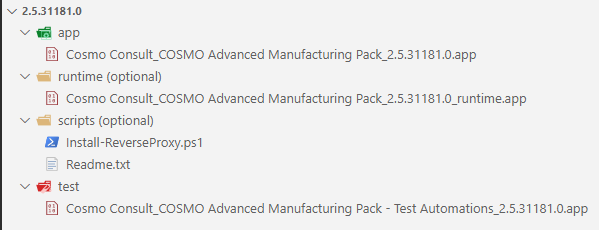

# Administration of the Self-Service

## Setting up licenses

Licenses are made available to the Self-Service through secrets. Those secrets contain anonymously accessible URLs to the `*.flf` or `*.bclicense` files and must be named after the following format:

- `devlic-<version>-<language>` for `.flf` files. Examples: `devlic-bc19-de`, `devlic-bc18-fr-es`, `devlic-nav2018-de`, `devlic-nav2018-hu-w1`
- `dbclic-<version>-<language>` for `.bclicense` files. Examples: `dbclic-bc19-de`, `dbclic-bc18-fr-es`

Secrets created with a different convention will not show up in the list of available configurations but you can still [reference them in your `cosmo.json`](../containers/setup-cosmo-json.md) for example as `licenseFile` or as `customerLicense`. This is handy when you have a project-specific license that you don't want to make available to all users.

## IP Artifacts

The idea for the IP artifacts is to enable pipelines and the self-service to consume artifacts from a pre-configured Azure DevOps feed without the need to now where to find this feed or how to access it. This eases handling of regularly used packages and [referencing those artifacts](../containers/setup-artifacts.md#artifacts-from-a-product-feed) is simplified.

The name, organization and PAT must be stored as secrets:

|Name|Value|
|-|-|
|`"ip-feed-name"`|The name of you feed|
|`"ip-feed-org"`|The name of the organization|
|`"ip-feed-pat"`|The PAT of a dummy user that has read access to the feed|

A package in the artifact feed must have the following folder structure:

|Folder|Content|
|-|-|
|`"app"`|app file of the main app|
|`"test"`|app file of the test app|
|`"runtime"`|app file of the runtime package|
|`"rapidstart"`|the rapidstart package belonging to the app|



> [!IMPORTANT]
> For now, you only get the full app with type "app", but in the future test apps, rapidstart packages or runtime packages might follow.

## Configuring your backend for AAD authentication

If you want to use AAD authentication, so that e.g. users can log in to Business Central using their Microsoft work account, you need to create the required [app registrations](https://docs.microsoft.com/en-us/azure/active-directory/develop/app-objects-and-service-principals). As this is a quite complex process that also changes more or less frequently, we suggest to use the BcContainerHelper PowerShell cmdlets for the setup. To make the configuration of your backend easier, we provide the following script for your convenience, which sets up the app registrations through BcContainerHelper and puts them in the right place in your backend:

```powershell
# the default name of the AD tenant with the app registration, which might be "yourcompany.onmicrosoft.com" or "yourcompany.com"
$tenantName = "<your tenant name>"

# the base URL of your backend
$backendUrl = "https://<your backend id>.<your region>.cloudapp.azure.com"

# prefix for the appIdUri. You only need to change this if you have multiple backends for your AD tenant. In that case, each one needs a different prefix
$appIdUriPrefix = "selfservice"

# if you need to switch users between creating / changing app registrations, set this to $true. This could also be needed, if you create the app registrations in a different tenant
$switchUsers = $true

################################
# no changes required after this
################################

$appIdUri = "https://$appIdUriPrefix.$tenantName"

Set-ExecutionPolicy -ExecutionPolicy Unrestricted -Scope Process
Import-Module bccontainerhelper -ArgumentList $true

if ($switchUsers) {
    Write-Host "Log in to Azure with credentials that have permissions to create app registrations in Azure AD for $tenantName"
    Connect-AzureAD
} else {
    Write-Host "Log in to Azure with credentials that have permissions to create app registrations in Azure AD for $tenantName"
    az login
    $adtoken_container = (az account get-access-token --resource-type aad-graph | ConvertFrom-Json)
    $adtoken = $adtoken_container.accessToken
    if ($adtoken.Contains(".") -and $adtoken.StartsWith("eyJ")) {
        $tokenPayload = $adtoken.Split(".")[1].Replace('-', '+').Replace('_', '/')
        while ($tokenPayload.Length % 4) { $tokenPayload += "=" }
        $jwtToken = [System.Text.Encoding]::UTF8.GetString([System.Convert]::FromBase64String($tokenPayload)) | ConvertFrom-Json
        Connect-AzureAD -AadAccessToken $adtoken -AccountId $jwtToken.upn | Out-Null
        Get-AzureADCurrentSessionInfo | Out-Null
    } else {
        Write-Error "Authentication failed"
        return
    }
}

# create AAD apps
$ids = Create-AadAppsForBC -appIdUri $appIdUri -publicWebBaseUrl "$backendUrl/BC" -useCurrentAzureAdConnection -SingleTenant -IncludeExcelAadApp -IncludePowerBiAadApp -IncludeEmailAadApp -IncludeApiAccess

# add the created app ids
foreach ($key in $ids.Keys) 
{
    $secretName = "AAD-Auth--$key"
    Write-Host "Secret $secretName=$($ids[$key])"
}
Write-Host "Secret AAD-Auth--AppIdUri=$appIdUri"
Write-Host "Secret AAD-Auth--AppIdUriPrefix=$appIdUriPrefix"
Write-Host "Secret AAD-Auth--AadTenantName=$tenantName"

# add wildcard reply URLs
if ($switchUsers) {
    Write-Host "Log in to Azure with credentials that have permissions to change app registrations in Azure AD for $tenantName"
    az logout
    az login
}
az ad app update --id "$($ids.ApiAdAppId)" --add replyUrls "$backendUrl/*"
az ad app update --id "$($ids.EMailAdAppId)" --add replyUrls "$backendUrl/*"
az ad app update --id "$($ids.ExcelAdAppId)" --add replyUrls "$backendUrl/*"
az ad app update --id "$($ids.PowerBiAdAppId)" --add replyUrls "$backendUrl/*"
az ad app update --id "$($ids.SsoAdAppId)" --add replyUrls "$backendUrl/*"
```

Please note that you need to adapt the first couple of lines to your backend and can run it afterwards. Please also note that you will need permissions to create and modify app registrations.

If everything works as expected, then you will see 13 new secrets that need to be synced to your backend, all starting with `AAD-Auth--` as well as 5 new app registrations in your Azure Portal, all ending with `for https://<your-backend>/BC/`. The backend services will take some minutes to pick up the change. 

If you want to better understand which app registrations exactly are generated, you can check the [sources](https://github.com/microsoft/navcontainerhelper/blob/master/AzureAD/Create-AadAppsForNav.ps1). This script only adds wildcard reply URLs which is not strictly recommended, but the app registrations are limited to users from your own tenant, we deemed it an acceptable risk. The alternative would have been to create a Service Principal with the necessary permissions to create potentially those five app registrations for every container, which also isn't a great solution.
