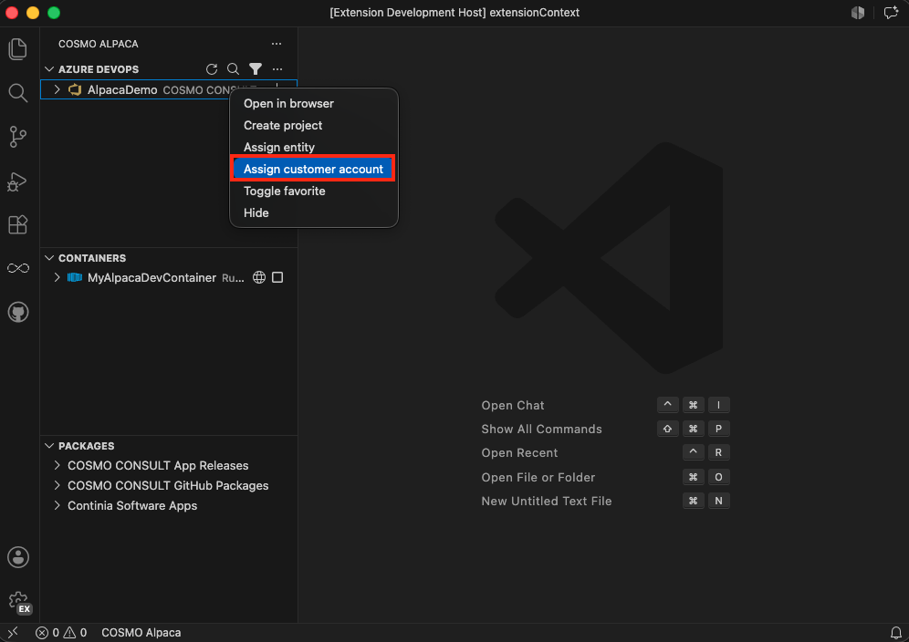

# Assign Organization to Customer

> [!IMPORTANT]
> This is currently only available for **COSMO**

It is important to assign an organization to its COSMO customer in order to be able to establish a connection between the DevOps organization and the customer´s data, which is processed/used by other COSMO services.

To assign an organization to a customer:
1. Right-click on the organization and select **Assign customer account**
1. Select the customer to which the organization should be assigned from the list of customers shown
1. Wait until the assignment is successful and the organization list reloads showing the newly assigned customer next to the organization

