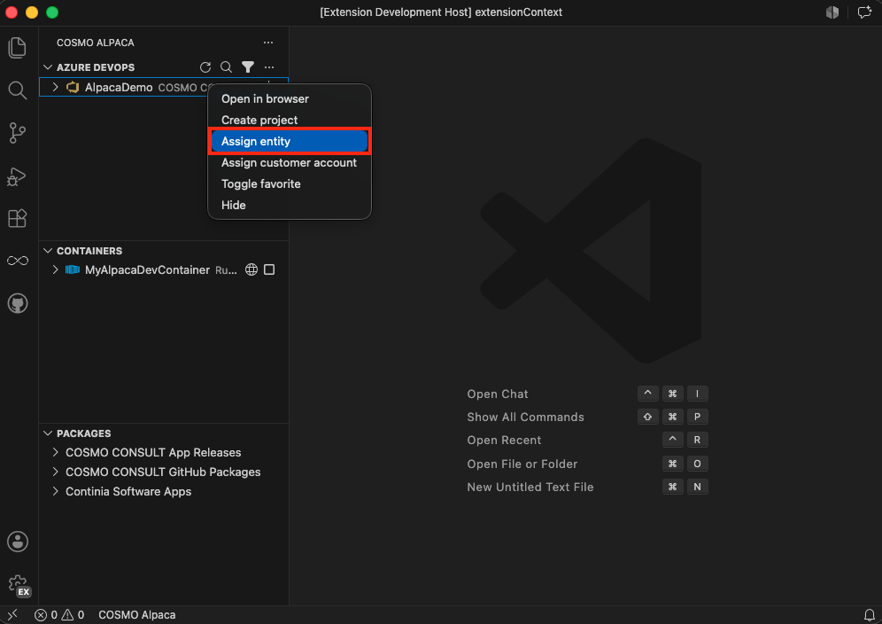

# Assign Organization to Entity

> [!IMPORTANT]
> This is currently only available for **COSMO**

For a couple of reasons it is important to know to which entity an organization belongs, e.g.:

- To which entity the container costs are billed
- Which [project customizations](customize-project.md) are available for this organization?
- Make sure the entity administrators have access to the organization

To assign an organization to an entity:
1. Right-click on the organization and select **Assign entity**
1. Select the entity to which the organization should be assigned from the list of entities shown
1. Wait until the assignment is successful and the organization list reloads showing the newly assigned entity next to the organization

 When you select the entity, the local Azure DevOps administrators group will be added to the project collection (old name for "organization") administrators, which is also used as mechanism to later read the organization assignment.

