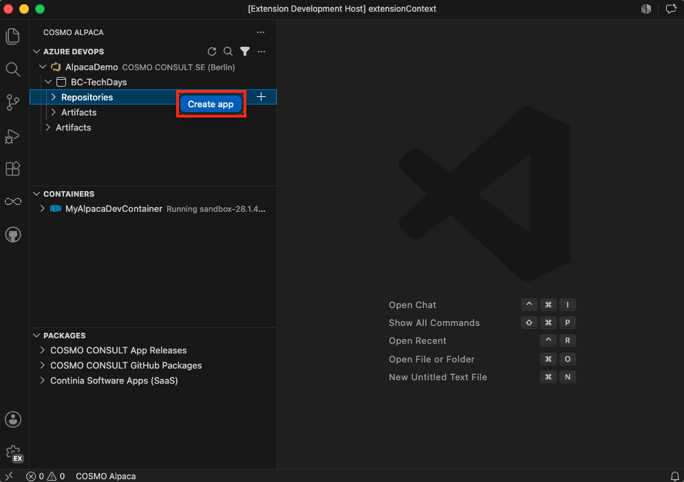
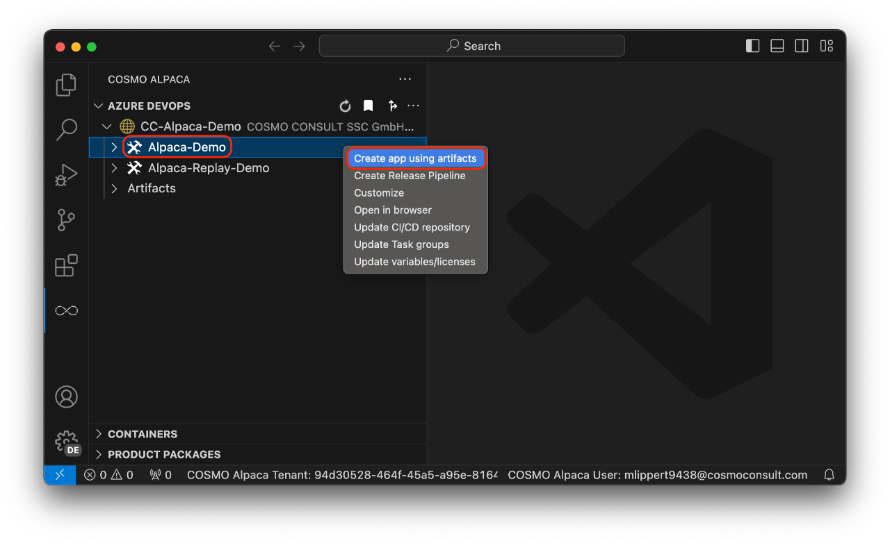

# Create Repository & App

When creating a BC app using COSMO Alpaca and Azure DevOps, you need an [organization](create-org.md) and a [project](create-project.md). To create a repository for a BC app with a connected pipeline follow these steps:

## [**Extension**](#tab/extension)

1. Navigate to your organization and project in the tree view of the extension
1. Right-click on **Repositories** and select **Create app** or use the `+` action next to it:

## [**Legacy Extension**](#tab/legacy)

1. Navigate to your organization and project in the tree view of the extension
1. Right-click on the project and select **Create app using artifacts**:

---

Now follow the wizard:
1. Enter a name for the new app (the repository will have the same name)
1. Select the BC version that you want to use
1. Select the country that you want to use
1. Select the license that you want to use
1. Select the auth mechanism (see param `auth` described [here](setup-cosmo-json.md#common-parameters))

With that, the new repository and pipeline will be created. It has all the basic setup and preparation needed to start working on a Business Central project including e.g. a branch policy and automatic setup of artifacts in your pipeline. After creation has finished, you will see your new repository and the new pipeline, both with the name of the app that you entered.