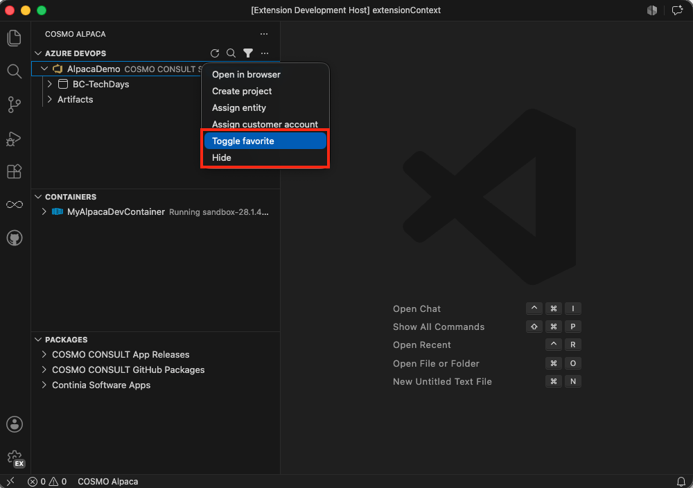
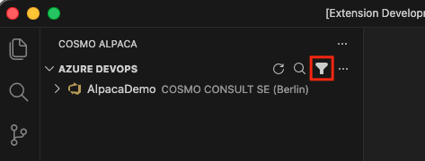

# Favorite or Hide Organizations & Projects

In the list of organizations and projects, you may over time see a lot of them and not all are relevant in your daily work anymore. To help with that, you can mark relevant ones as favorites or hide irrelevant ones. Favorites will have golden icons and hidden items will not be shown in the list, but you can always switch back to showing them.

## [**Extension**](#tab/extension)

If you want to favorite or hide an organization or project, you can do that directly in the UI by right-clicking the organization or project and selecting **Toggle favorite** or **Hide**:



This will add the organization or project to the list of favorites or hidden items in the extension settings. If you want to edit the settings directly, you can do that in the extension settings as well:

1. Open the extension settings
1. Find the relevant setting under **COSMO Alpaca** and click on **Edit in settings.json** (as the settings are arrays, they need to be configured manually in the settings file)
   - **Visibility › Azure Devops › Organizations: Favorites**
   - **Visibility › Azure Devops › Projects: Favorites**
   - **Visibility › Azure Devops › Organizations: Hidden**
   - **Visibility › Azure Devops › Projects: Hidden**

## Setting Examples

```json
    "cosmo-alpaca.visibility.azureDevops.organizations.favorites": [
        "AlpacaDemoOrg1",
        "AlpacaDemoOrg2"
    ]
```

```json
    "cosmo-alpaca.visibility.azureDevops.projects.favorites": [
        "AlpacaDemoProject1",
        "AlpacaDemoProject2"
    ]
```

```json
    "cosmo-alpaca.visibility.azureDevops.organizations.hidden": [
        "AlpacaDemoHidden",
        "AlpacaDemoHidden"
```

```json
    "cosmo-alpaca.visibility.azureDevops.projects.hidden": [
        "AlpacaDemoHiddenProject",
        "AlpacaDemoHiddenProject"
```

You can additionally configure that only your favorites are visible. To do that either toggle the filter icon above the list view or configure the setting **COSMO Alpaca: Visibility › Azure Devops › Organizations: Only Show Favorites** accordingly.



```json
    "cosmo-alpaca.visibility.azureDevops.organizations.onlyShowFavorites": true
```

> [!NOTE]
> This will also affect the visibility of projects, if you have configured favorite projects then only those will be shown as well, otherwise all projects will be shown.

## [**Legacy Extension**](#tab/legacy)

> [!WARNING]
> The legacy extension does not support the feature to favorite projects and to hide organizations and projects but only to favorite organizations.

<video width="1280px" height="720px" controls>
  <source src="../media/vsce-favorite-orgs.mp4" type="video/mp4">
  Your browser does not support the video tag.
</video>

## Setting Example

```json
    "cc-azdevops.favoriteOrganizations": [
        "AlpacaDemoOrg1",
        "AlpacaDemoOrg2"
    ]
```

---

If you change the settings manually, make sure to reload the window to see the changes reflected in the UI.