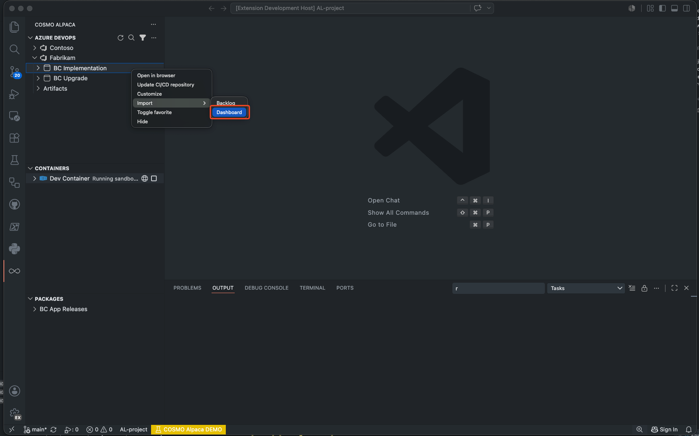
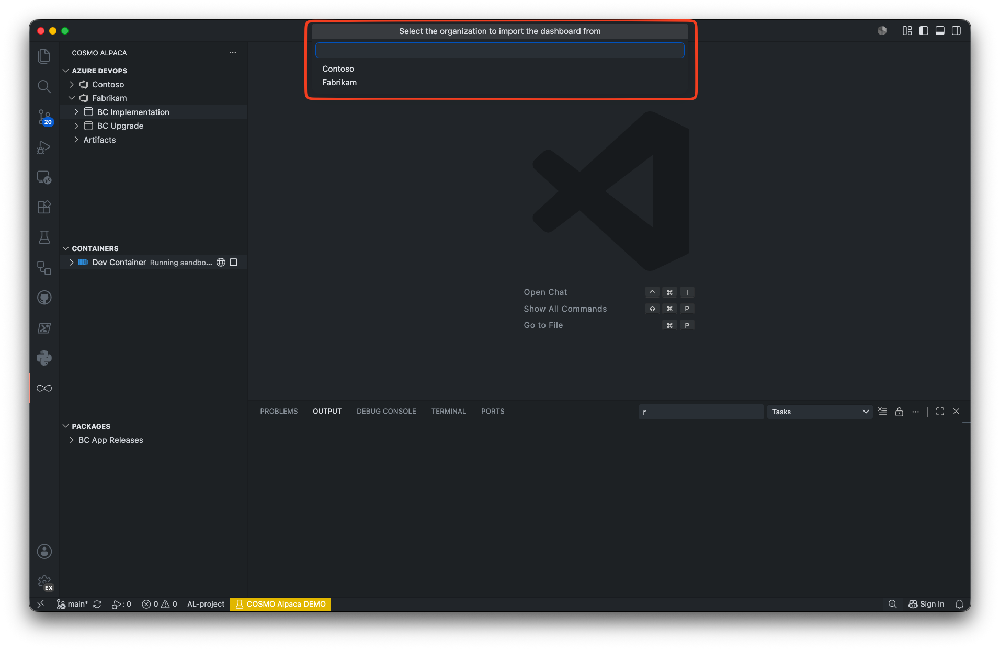
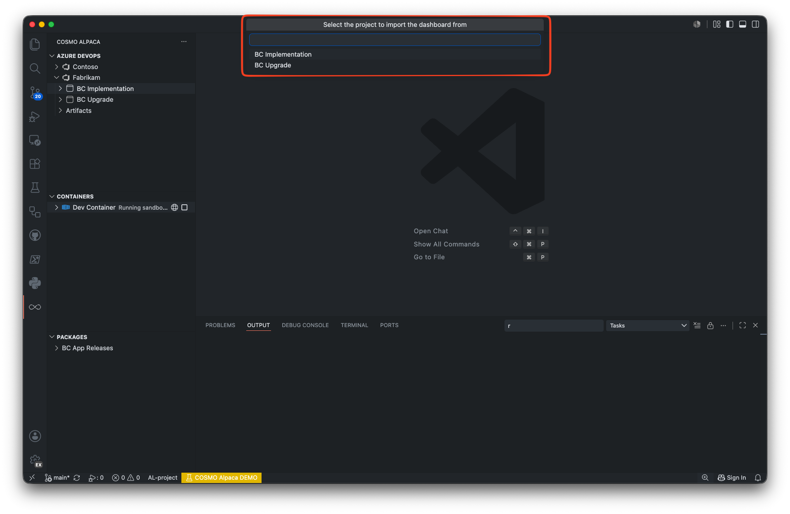
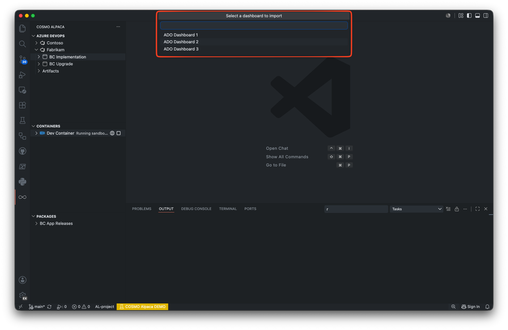

# Importing a Dashboard from Another Azure DevOps Project

The extension provides a convenient way to import an existing dashboard from one Azure DevOps project into another. This feature allows you to quickly replicate dashboard configurations and widget setups across projects without manual re-entry.

> [!IMPORTANT]
> The source and target projects must use the same process customization for a successful dashboard import ([customize project](customize-project.md)).

---

## How to Import a Dashboard

### 1. Open the Import Dashboard Dialog

Right-click on the target project in the **Azure DevOps** view where you want to import the dashboard.  
Select **Import Dashboard** from the context menu.

**Step 1:** Right-click on the target project and select Import Dashboard

### 2. Select the Source Organization

A dialog will appear asking you to select the organization that contains the dashboard you want to import.  
Choose the appropriate organization from the list.

**Step 2:** Select the source organization

### 3. Select the Source Project

After selecting the organization, the extension will prompt you to select a project within that organization.  
Choose the project that contains the dashboard you wish to import.

**Step 3:** Select the source project

### 4. Select the Source Team

Select the team within the source project that contains the dashboard.  
Only teams with existing dashboards will be displayed.

**Step 4:** Select the source team

### 5. Select the Dashboard

Choose the specific dashboard from the source team that you want to import.

**Step 5:** Select the dashboard to import

### 6. Import Complete

Once you confirm your selection, the extension will begin the import process. A progress notification will be displayed in VS Code.

The import process includes:
- **Validation**: Source and target projects are validated to ensure they use the same process
- **Team Mapping**: If the target team doesn't exist, it will be automatically created with the same name as the source team
- **Widget Query Remapping**: All widget queries are automatically adjusted to work with the target project
- **Dashboard Creation**: The dashboard is created or updated in the target team

After the process finishes, the dashboard from the source project is transferred into your target project.  
You can now browse and work with the imported dashboard as part of your project.