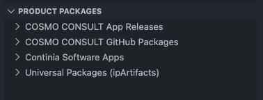
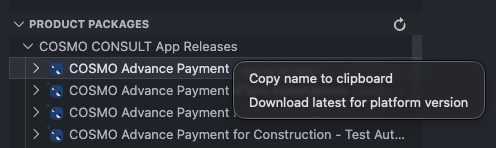
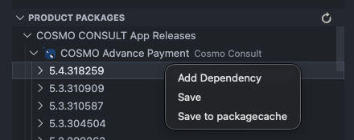

# Packages View

[!INCLUDE [Packages View Intro](../includes/packages-view/intro.md)]

All the feeds visible in the Packages View are also available in Alpaca containers as a source of dependency [artifacts](../azure-devops/setup-artifacts.md#nuget-feed).

## [**Extension**](#tab/extension)

### Custom NuGet feeds

[!INCLUDE [Packages View Custom Feeds](../includes/packages-view/custom-feeds.md)]

### Actions

[!INCLUDE [Packages View Actions](../includes/packages-view/actions.md)]

## [**Legacy Extension**](#tab/legacy)

Additionally in the Legacy Extension, the Packages View also supports browsing a configured Azure DevOps Universal Package feed. We call them [`ipArtifacts`](../azure-devops/setup-artifacts.md#product-feed) and our COSMO users can also find product releases there.



### Custom NuGet feeds

You can also add custom NuGet feeds locally using the VS Code extension setting `cc-azdevops.customNuGetFeeds`. These custom feeds will then appear under the dedicated "Custom NuGet Feeds" node in the tree.

```json
"cc-azdevops.customNuGetFeeds": [
    {
        "feedUrl": "https://...index.json",
        "pat": "",
        "filter": ""
    }
]
```

#### Parameters

[!INCLUDE [Packages View Custom Feeds Parameters](../includes/packages-view/custom-feeds-parameters.md)]

### Actions

- Package level:
  - Copy name to clipboard
  - Download for platform: Download the latest package build compatible with a specific BC platform version.
- Version level:
  - Add dependency: Add the specific version as a dependency to the current workspace's [`cosmo.json`](setup-artifacts.md) and `app.json` files.
  - Save: Save the specific version
  - Save to packagecache: Extract directly into the AL package cache directory to make it available for immediate use in AL development, eliminating the need to download symbols.




