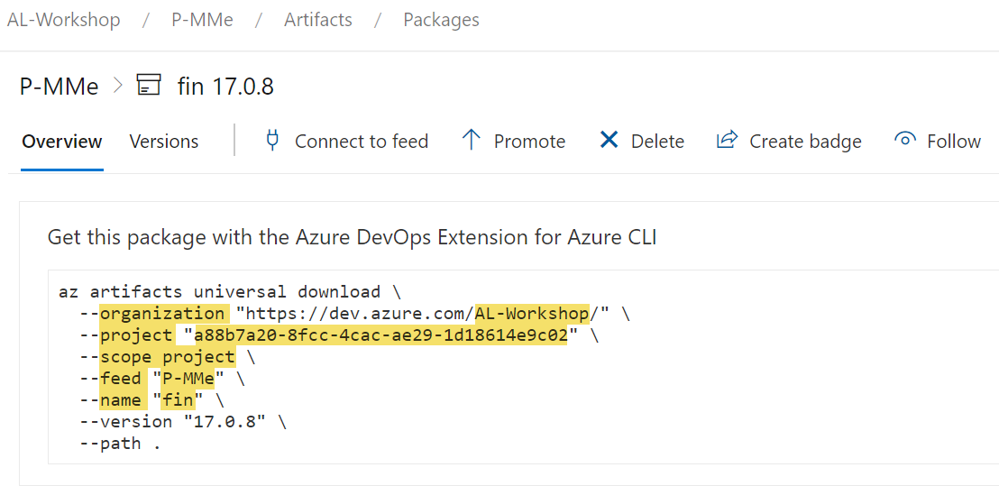

# Setup Artifacts to Import on Startup

Artifacts are configured in [`bcArtifacts.artifacts` in `cosmo.json` config file](setup-cosmo-json.md). The defined artifacts are automatically installed in the dev containers during the container startup. Artifacts defined in the `current`, `nextMajor` or `nextMinor` `bcArtifacts` sections are also automatically installed for build containers started from the respective Azure DevOps pipelines.

Four types of artifacts are supported:

1. Artifacts from a URL or the Alpaca fileshare
1. Artifacts from a NuGet feed
1. Artifacts from an Azure DevOps Artifact feed
1. Artifacts from a product feed

## URL or Alpaca fileshare

1. Open the Alpaca fileshare. Please contact the Alpaca support if you don't have access yet.
1. Copy your artifact to the fileshare. One option to organize your folder structure could look like this, but if you have some other structure already in place in your organization, it also might be a good idea to use that:
   * product-artifacts used by multiple projects: `/common/<product>`
   * artifacts related to a customer project: `/<customer-name>/<project-name>`
1. Add the artifact to `artifacts` in your cosmo.json configuration:

```json
{
    "artifacts": [
        {
            "name": "gbedv GmbH & Co. KG_OPplus Extension",
            "version": "17.0.201002.0",
            // fileshare paths can reference a file or ZIP file
            "url": "C:\\azurefileshare\\customer-acme\\bc-implementation\\OPplus_17.0.201002.0.runtime.app",
            "target": "app"
        },
        {
            "name": "For NAV DLL",
            // URLs MUST reference a ZIP file
            "url": "https://my.blob.core.windows.net/test/ForNAV/ForNav.Reports.5.2.0.1924.dll.zip?sv=2019-...",
            "target": "dll",
            "targetFolder": "ReportsForNAV_5_2_0_1924"
        },
        {
            "name": "For NAV App",
            // URLs MUST reference a ZIP file
            "url": "https://my.blob.core.windows.net/test/ForNAV/ForNAV%20Report%20Pack%205.2.0.0%20for%20BC15ONPREM%20(5.2.0.1924).app.zip?sv=2019-02-02&...",
            "target": "app"
        }
    ]
}
```

> [!NOTE]
> You need to escape the folder separator `\` by using `\\` because the value must be a JSON-String.
> The fileshare path always is `c:\azurefileshare` inside of a container. That means that if you place a file `fantastic-app.app` in the root of your fileshare, you need to reference it as `c:\\azurefileshare\\fantastic-app.app`.
> Fileshare artifacts can be a "normal" files or an archive (`.zip` extension) which will be extracted during the container startup.

### Parameters

|Element|Type||Value|
|-|-|-|-|
|`name`             |string  |**mandatory**|The name of the artifact. Informational only.|
|`version`          |string  |optional     |The version of the artifact. Informational only.|
|`url`              |string  |**mandatory**|The path or url to download the artifact.|
|`target`           |string  |optional     |Specify the [Artifact Target](#artifact-target) folder in the container file system and import action.|
|`targetFolder`     |string  |optional     |This folder is used for `"target": "dll"` as optional subfolder: `<serviceTierFolder>/Add-Ins/<targetFolder>`|
|`appImportScope`   |string  |optional     |Specify the import scope for apps. The value can be `Global` (default) or `Tenant`.|
|`appImportSyncMode`|string  |optional     |Specify the import sync mode for apps. The value can be `Add` (default), `Clean`, `Development` or `ForceSync`.|
|`ignoreIn`         |string[]|optional     |Specify in which container setup this artifact should be ignored. The value is an array of: `dev` and/or `build`. *(see also [cosmo.json](setup-cosmo-json.md))*|
|`dependsOn`        |string  |optional     |Specify the dependency of an artifact. The value can be missing (default) or `App`.<br/><br/>Artifacts with a dependency will still be downloaded on container start but only installed by the build pipeline after the dependency *(e.g. `App`)* was installed.|

## NuGet feed

By default all Microsoft NuGet feeds are available. Custom nuget feeds can either be configured globally, per-project or per-user by specifying custom nuget feeds in the Alpaca settings in VS Code.

1. Find out the name and version of the NuGet package you want to use (e.g. from the [Packages View](packages-view.md)).
2. Add the artifact to `devOpsArtifacts` in your `cosmo.json`:

```json
{
    "devOpsArtifacts": [
        {
            "type": "nuget",
            "name": "CosmoConsult.COSMORental.b945e3cd-da15-4575-990e-37ff46875f27",
            "version": "5.2.270944.0"
        }
    ]
}
```

### Parameters

|Element|Type||Value|
|-|-|-|-|
|`type`   |string|**mandatory**|Type of the artifact, use `nuget`.|
|`name`   |string|**mandatory**|The name of the artifact.|
|`version`|string|optional     |The version of the artifact. (latest - when not specified)|

You can use the VS Code extension to create the required entries for a NuGet package.

1. Open the workspace of the repository in Visual Studio Code
2. Open **COSMO Alpaca** extension
3. Expand/Update the ["Packages" view](packages-view.md)
4. Expand the entry of the required package (e.g. "COSMO Advanced Manufacturing Pack")
5. Expand the version and its dependencies to find a valid version for your case *(e.g. version installed in the customer environment)*
6. Right click on the wanted version and click [**Add Dependency**](packages-view.md#actions-1)
7. Repeat from 4. for each required product
8. *(Optional) Remove version of added artifacts in the cosmo.json to always use the latest versions*
9. Commit/push the changed `cosmo.json`

## Azure DevOps Artifact feed

> [!IMPORTANT]
> This is only available for Alpaca on **Azure DevOps**

1. [Grant read access](https://learn.microsoft.com/en-us/azure/devops/artifacts/feeds/feed-permissions?view=azure-devops&tabs=nuget%2Cnugetserver22%2Cnugetserver#feed-settings) to the feed for the respective users as well as the pipelines by adding the `Project Collection Build Service (<org-name>)` group in Azure DevOps. This group has access to all feeds in the organization.
1. Get the needed information for your artifact feed
   
1. Add the Artifact to `artifacts` in your configuration file:

   ```json
    {
        // ...
        "devopsArtifacts": [
            {
                "organization": "AL-Workshop",
                "project": "a88b7a20-8fcc-4cac-ae29-1d18614e9c02",
                "scope": "project",
                "feed": "P-MMe",
                "name": "fin"
            }
        ],          
        // ...
    }
   ```

> [!NOTE]
> Only `upack` artifacts are supported.
> The `upack` artifact name is always lower case.
> Use the project ID for `project`
> When you have a project-scoped feed in a different project of the same organization, follow [the instructions here](https://learn.microsoft.com/en-us/azure/devops/artifacts/feeds/project-scoped-feeds?view=azure-devops#q-how-can-i-access-a-project-scoped-feed-in-another-project-from-my-pipeline).

### Parameters

|Element|Type||Value|
|-|-|-|-|
|`organization`     |string  |**mandatory**      |The organization name of the feed.|
|`project`          |string  |optional, mandatory|The project id of the artifact feed (**mandatory** for project scoped feeds).|
|`feed`             |string  |**mandatory**      |The name of the artifact feed.|
|`name`             |string  |**mandatory**      |The name of the artifact.|
|`scope`            |string  |optional           |The scope of the feed can be `organization` or `project` (default).|
|`version`          |string  |optional           |The version of the artifact. (latest - when not specified)|
|`view`             |string  |optional           |The view (promotion-level) of the artifact determines which version is used.|
|`type`             |string  |optional           |Specify the type of the artifact feed. COSMO uses `upack` (default).|
|`target`           |string  |optional           |Specify the [Artifact Target](#artifact-target) folder in the container file system and import action.|
|`appImportScope`   |string  |optional           |Specify the import scope for apps. The value can be `Global` (default) or `Tenant`.|
|`appImportSyncMode`|string  |optional           |Specify the import sync mode for apps. The value can be `Add` (default), `Clean`, `Development` or `ForceSync`.|
|`ignoreIn`         |string[]|optional           |Specify in which container setup this artifact should be ignored. The value is an array of: `dev` and/or `build`. *(see [cosmo.json](setup-cosmo-json.md)*|
|`dependsOn`        |string  |optional           |Specify the dependency of an artifact. The value can be **missing (default)** or `App`.<br/><br/>Artifacts with a dependecy will still be downloaded on container start but only installed by the build pipeline after the dependency *(e.g. `App`)* was installed.|

## Product feed

The use case for the product feed is to enable users and pipelines/workflows to consume artifacts managed in a central feed. This is mainly used for feeds hosting intelectual property. As a bonus you can use the version overview in the VS Code Extension to browse your regularly used artifacts.

> [!IMPORTANT]
> Before using product feeds, you need to [configure the feed](../admin/index.md#ip-artifacts).

1. Find out which name the IP artifact has and which version you want to use
2. Add the Artifact to `ipArtifacts` in your cosmo.json configuration:

```json
{
    "ipArtifacts": [
        {
            "name": "advanced-manufacturing-pack",
            "version": "2.8.12341",
            "type": ["app"] // optional, default is "app"
        },
        {
            "name": "alloy-management",
            "version": "2.2.*"
        },
        {
            "name": "commision",
            "version": "2.1.36626"
        }
    ]
}
```

### Parameters

|Element|Type||Value|
|-|-|-|-|
|`name`|string|**mandatory**|The name of the artifact.|
|`version`|string|optional|The version of the artifact. (Latest - when not specified). The version can include wildcards ("*") at the end, e.g. `2.*` or `2.1.*`|
|`type`|string[]|optional|Specify the type of the artifact you want to use as an array. For now, you only get the full app with type "app", but in the future test apps, rapidstart packages or runtime packages might follow.|
|`ignoreIn`|string[]|optional|Specify in which container setup this artifact should be ignored. The value is an array of: `dev` and/or `build`. *(see also [cosmo.json](setup-cosmo-json.md))*|
|`dependsOn`|string|optional|Specify the dependency of an artifact. The value can be **missing (default)** or `App`.<br/><br/>Artifacts with a dependecy will still be downloaded on container start but only installed by the build pipeline after the dependency *(e.g. `App`)* was installed.|

You can use the VS Code extension to create the required entries for a product package.

1. Open the workspace of the repository in Visual Studio Code
2. Open **COSMO Alpaca** extension
3. Expand/Update ["Packages" view](packages-view.md)
4. Expand **Universal Packages (ipArtifacts)**
5. Expand the entry of the required product (e.g. "COSMO Advanced Manufacturing Pack")
6. Expand the version and its dependencies to find a valid version for your case *(e.g. version installed in the customer environment)*
7. Right click on the wanted version and click [**Add Dependency**](packages-view.md#actions-1)
8. Repeat from 5. for each required product
9. *(Optional) Remove version of added artifacts in the cosmo.json to always use the latest versions*
10. Commit/push the changed `cosmo.json`

---

## Artifact Target

[!INCLUDE [Artifact Target](../includes/artifact-target.md)]

```json
{
    "artifacts": [
        {
            "name": "Default-Fonts",
            "url": "c:\\azurefileshare\\common\\default-fonts.zip",
            "target": "fonts",
            "ignoreIn": ["build"]
        },
        {
            "name": "Additional Fonts for Barcode Printing",
            "url": "c:\\azurefileshare\\myProject\\my-additional-fonts.zip",
            "target": "fonts",
            "ignoreIn": ["build"]
        }
    ]
}
```
