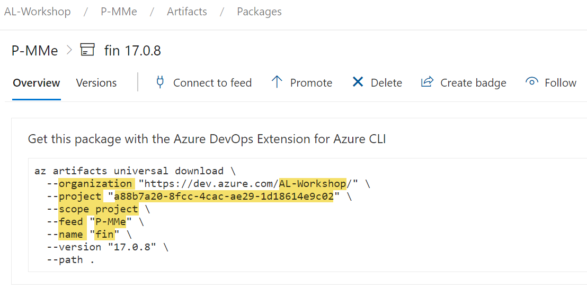

# Setup Artifacts

# [**GitHub (AL-Go)**](#tab/github)
WIP

# [**Azure DevOps**](#tab/azdevops)

There are 2 ways to setup artifacts for your container.

1. Setup [Artifacts from Container File-Share](#Artifacts-from-Container-File-Share)
1. Setup [Artifacts from Azure DevOps Artifact Feed](#Artifacts-from-Azure-DevOps-Artifact-Feed)

**See also:**

* [cosmo.json][cosmo-json]
* [Artifact][artifact]
* [Artifact Target][artifact-target]

## Artifacts from Container File-Share

**Prerequisites:**

You need write-access to the File-Share which is attached to your target Swarm-Environment were your container will be created. If you don't have that or don't know what that is, get in contact with the person in your region who is responsible for managing the self-service backend.

**Setup:**

1. Copy your Artifact to File-Share. One option to organize your folder structure could look like this, but if you have some other structure already in place in your organization, it also might be a good idea to use that:
   * product-artifacts used by multiple projects: `<Share>/common/<product>`
   * artifacts related to a customer project: `<Share>/<customer-name>/<project-name>`
1. Add the Artifact to `artifacts` in your `.devops/cosmo.json` in your related project repository

    ```json
    {
        // ...
        "artifacts": [
            {
                "name": "gbedv GmbH & Co. KG_OPplus Extension",
                "version": "17.0.201002.0",
                // File share url can reference a file or ZIP-File
                "url": "C:\\azurefileshare\\customer-acme\\bc-implementation\\OPplus_17.0.201002.0.runtime.app",
                "target": "app"
            },
            {
                "name": "For NAV DLL",
                // Download-Url MUST reference a ZIP-File
                "url": "https://my.blob.core.windows.net/test/ForNAV/ForNav.Reports.5.2.0.1924.dll.zip?sv=2019-...",
                "target": "dll",
                "targetFolder": "ReportsForNAV_5_2_0_1924"
            },
            {
                "name": "For NAV App",
                // Download-Url MUST reference a ZIP-File
                "url": "https://my.blob.core.windows.net/test/ForNAV/ForNAV%20Report%20Pack%205.2.0.0%20for%20BC15ONPREM%20(5.2.0.1924).app.zip?sv=2019-02-02&...",
                "target": "app"
            }
            
        ],
        // ...
    }
    ```

**Note:**

* You need to escape the folder separator `\` by using `\\` because the value must be a JSON-String.
* While the file share might be something like `v:\` on your machine, it is `c:\azurefileshare` inside of a container. That means that if you have e.g. a file `v:\common\fantastic-app.app`, you need to reference it as `c:\\azurefileshare\\common\\fantastic-app.app`.
* Artifacts added by file share can be a "normal" file or an archive (`.zip` extension) which wil be extracted during "Additional-Setup" of the container.
* **Artifacts added by Download-URL** such as Azure Blob Storage `"url": "https://my.blob.../app.zip?sv=2019-02-02&..."` **are only supported as ZIP-Archive** and are downloaded and extracted during "Additional-Setup" of the container.

### File-Share Artifact

|Element|Type||Value|
|-|-|-|-|
|`"name"`|string|optional|The name of the artifact.|
|`"version"`|string|optional|The version of the artifact.|
|`"url"`|string|**mandatory**|The path or url to download the artifact.|
|`"target"`|string|**mandatory**|Specify the [Artifact Target][artifact-target] folder in the container file system and import action.|
|`"targetFolder"`|string|optional|This folder is used for `"target": "dll"` as optional subfolder: `<serviceTierFolder>/Add-Ins/<targetFolder>`|
|`"appImportScope"`|string|optional|Specify the import scope for apps. The value can be **`Global` (default)** or `Tenant`.|
|`"appImportSyncMode"`|string|optional|Specify the import sync mode for apps. The value can be **`Add` (default)**, `Clean`, `Development` or `ForceSync`.|
|`"ignoreIn"`|string[]|optional|Specify in which container setup this artifact should be ignored. The value is an array of: `dev` and/or `build`. *(see also [cosmo.json][cosmo-json])*|

## Artifacts from Azure DevOps Artifact Feed

**Prerequisites:**

You / your Build Agent need **anonymous** read access at the used artifact feed(s).

**Setup:**

1. Get the needed [Feed Artifact](#Feed-Artifact) information for your artifact feed
   
  
1. Add the Artifact to `artifacts` in your `.devops/cosmo.json` in your related project repository

   ```json
    {
        // ...
        "devopsArtifacts": [
            {
                "organization": "AL-Workshop",
                "project": "a88b7a20-8fcc-4cac-ae29-1d18614e9c02",
                "scope": "project",
                "feed": "P-MMe",
                "name": "fin"
            }
        ],          
        // ...
    }
   ```

**Note:**

* The `upack` artifact name is always lower case.
* Use the project-id for `"project"`

### Feed Artifact

|Element|Type||Value|
|-|-|-|-|
|`"organization"`|string|**mandatory**|The organization name of the feed.|
|`"project"`|string|optional, mandatory|The project id of the artifact feed (**mandatory** for project scoped feeds).|
|`"feed"`|string|**mandatory**|The name of the artifact feed.|
|`"name"`|string|**mandatory**|The name of the artifact.|
|`"scope"`|string|optional|The scope of the feed can be `organization` and **`project` (default)**.|
|`"version"`|string|optional|The version of the artifact. (Latest - when not specified)|
|`"view"`|string|optional|The view (promotion-level) of the artifact determines which version is used.|
|`"type"`|string|optional|Specify the type of the artifact feed. COSMO uses **`upack` (default)**.|
|`"target"`|string|optional|Specify the [Artifact Target][artifact-target] folder in the container file system and import action.|
|`"appImportScope"`|string|optional|Specify the import scope for apps. The value can be **`Global` (default)** or `Tenant`.|
|`"appImportSyncMode"`|string|optional|Specify the import sync mode for apps. The value can be **`Add` (default)** , `Clean`, `Development` or `ForceSync`.|
|`"ignoreIn"`|string[]|optional|Specify in which container setup this artifact should be ignored. The value is an array of: `dev` and/or `build`. *(see also [cosmo.json][cosmo-json])*|

**Note:**
When your Pipeline needs to connect to a project-scoped feed in a different project of the same organization, follow this instruction: **[read more](https://docs.microsoft.com/en-us/azure/devops/artifacts/how-to/project-scoped-feeds-pipeline-project-permissions?view=azure-devops)**

## Artifacts from a product feed

The use case for the product feed is to enable pipelines and the self-service consume DevOps artifacts managed in a feed that is not part of your Devops organization. This is mainly used for protected feeds hosting intelectual property. As a bonus you can use the version overview in the VS Code Extension to browse your regularly used artifacts.

1. Find out which name the IP artifact has and which version you want to use
  
1. Add the Artifact to `ipArtifacts` in your `.devops/cosmo.json` in your related project repository

   ```json
    {
        // ...
        "ipArtifacts": [
                {
                    "name": "advanced-manufacturing-pack",
                    "version": "2.8.12341",
                    "type": ["app"]
                },
                {
                    "name": "alloy-management",
                    "version": "2.2.*"
                },
                {
                    "name": "commision",
                    "version": "2.1.36626"
                }
        ],          
        // ...
    }
   ```

### IP Artifact

|Element|Type||Value|
|-|-|-|-|
|`"name"`|string|**mandatory**|The name of the artifact.|
|`"version"`|string|optional|The version of the artifact. (Latest - when not specified). The version can include wildcards ("*") at the end, e.g. `2.*` or `2.1.*`|
|`"type"`|string[]|optional|Specify the type of the artifact you want to use as an array. For now, you only get the full app with type "app", but in the future test apps, rapidstart packages or runtime packages might follow.|
|`"ignoreIn"`|string[]|optional|Specify in which container setup this artifact should be ignored. The value is an array of: `dev` and/or `build`. *(see also [cosmo.json][cosmo-json])*|

## Examples

### Add Fonts as Artifacts

Adding an additional font to a container **require** you **to add also the default fonts as an additional artifact**. This is because there are not fonts installed in the container and your Business Central Reports might use your additional font as default font for your reports.

Here is an example how to add additional fonts as artifacts. Please note the `"ignoreIn"` setting as you probably won't need the fonts in a build pipeline and as they require a restart of the service tier, they make the pipeline slower and can cause issues with symbol loading in hybrid dev setups

```json
{
    // ...

    "artifacts": [
        {
            "name": "Default-Fonts",
            "url": "c:\\azurefileshare\\common\\default-fonts.zip",
            "target": "fonts",
            "ignoreIn": ["build"]
        },
        {
            "name": "Additional Fonts for Barcode Printing",
            "url": "c:\\azurefileshare\\myProject\\my-additional-fonts.zip",
            "target": "fonts",
            "ignoreIn": ["build"]
        }
    ]

    // ...
}
```

---

[cosmo-json]:      setup-cosmo-json.md
[artifact]:        setup-cosmo-json.md#artifact
[artifact-target]: setup-cosmo-json.md#artifact-target
