# VS Code Extension Setup

One of the clients that give you access to COSMO Alpaca is the VS Code Extension. Before setting it up you might want to [create an organization](create-org.md) beforehand.

# [**vscode.dev (Browser Version)**](#tab/vscode.dev)

## COSMO Alpaca – Browser Edition

With the **browser-based version** of Visual Studio Code available at [vscode.dev](https://vscode.dev), you can use **COSMO Alpaca** without installing VS Code locally. This is particularly useful for:

1. **Developers** – a lightweight, fast environment.
2. **Consultants** – no local setup required.
3. **Project Managers** – focus on functionality without technical overhead.

> **New Feature:** The well-known **PowerApps functions** are now fully integrated into the extension. You can directly manage projects and entities in COSMO Alpaca: *Customize Project, Create Project, Assign Entity.*
> This ensures both technical and non-technical users can work seamlessly in one tool.

---

## Extension Setup

1. Open [**vscode.dev**](https://vscode.dev).
   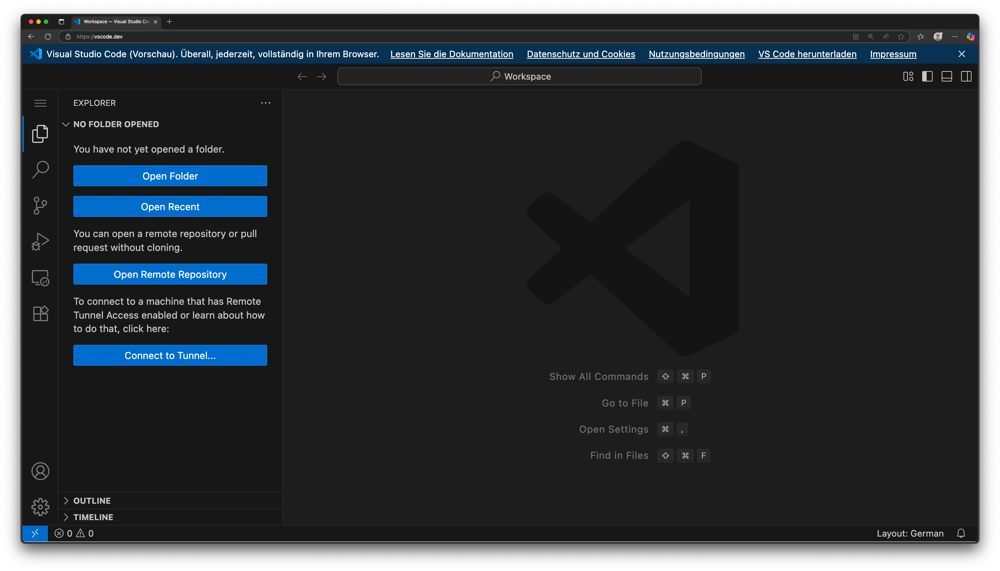

2. Install the **COSMO Alpaca Extension** from the Marketplace.
   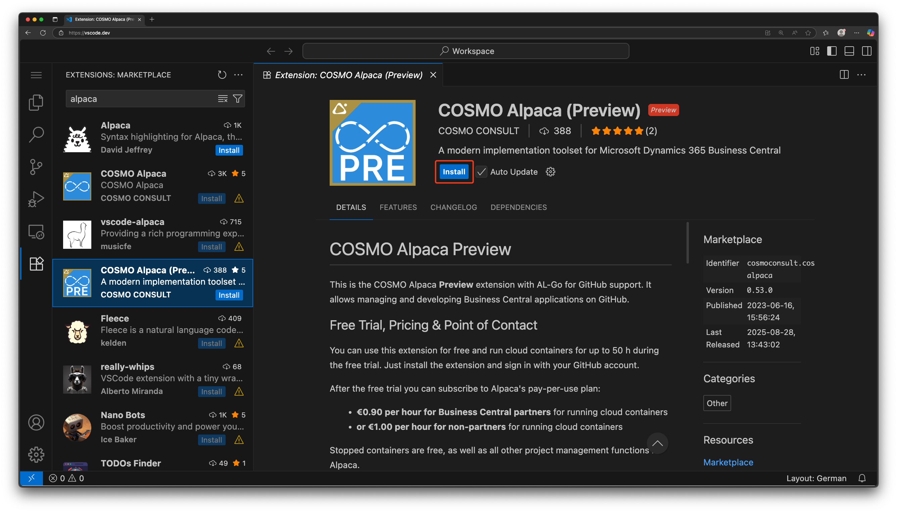

3. Trust the publisher and confirm installation. 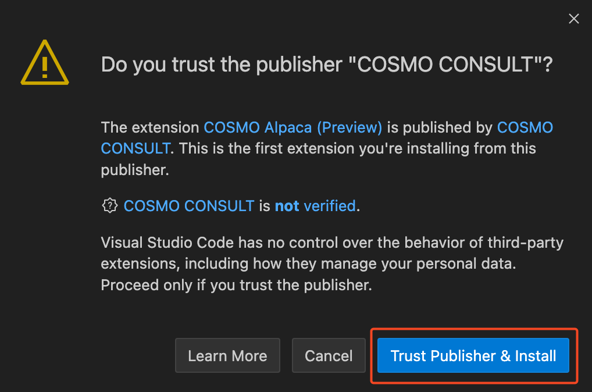 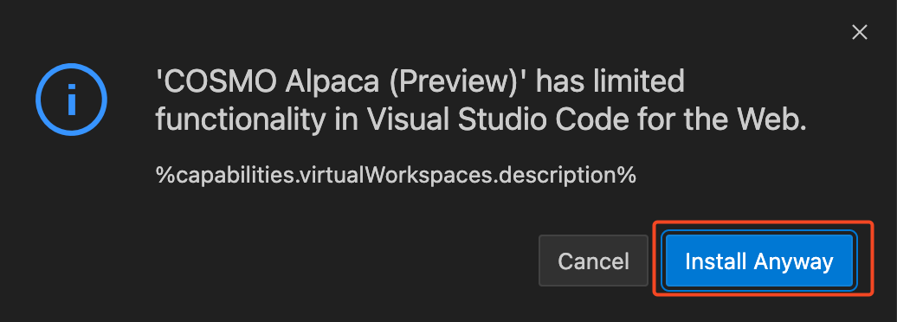

4. Open the extension and choose your **role-based view**:

   * **Technical View** – the full integrated version of the existing VS Code extension.
   * **Functional View** – a simplified interface focused on the core features.

   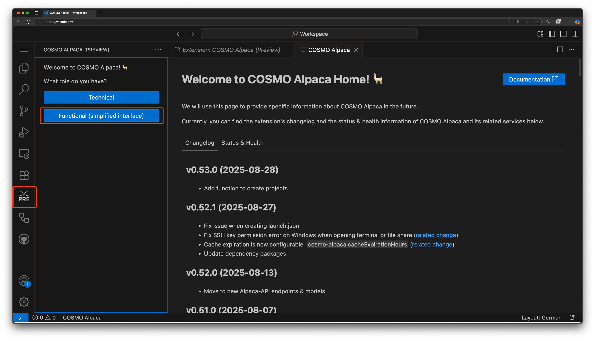

5. Select your working environment: **Azure DevOps** or **GitHub**.
   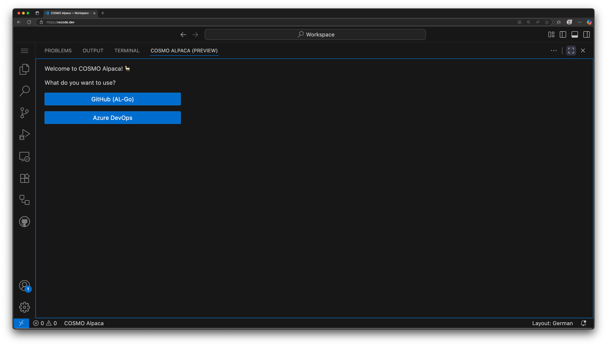

6. Sign in to the selected environment (e.g., Azure DevOps).
   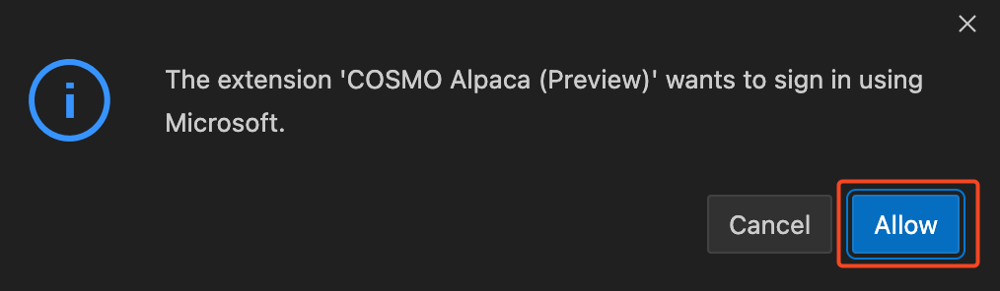
   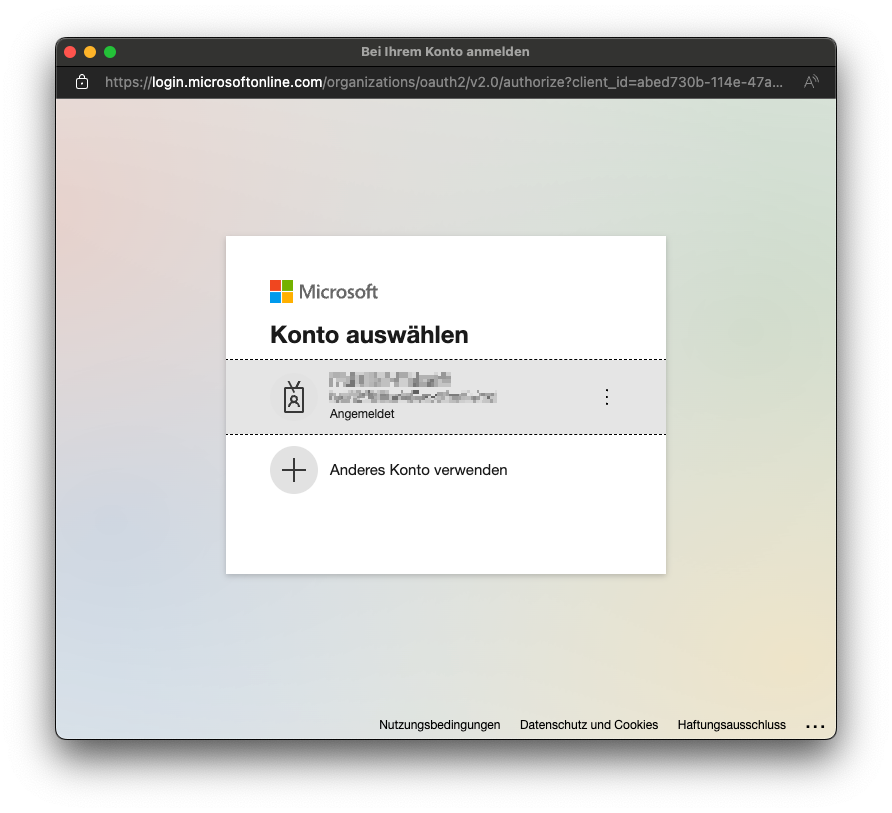

---

## Functional View Overview

The **Functional View** is divided into two main sections: **Organizations** and **Containers**.

* In the **Organizations** section, all organizations are listed.
  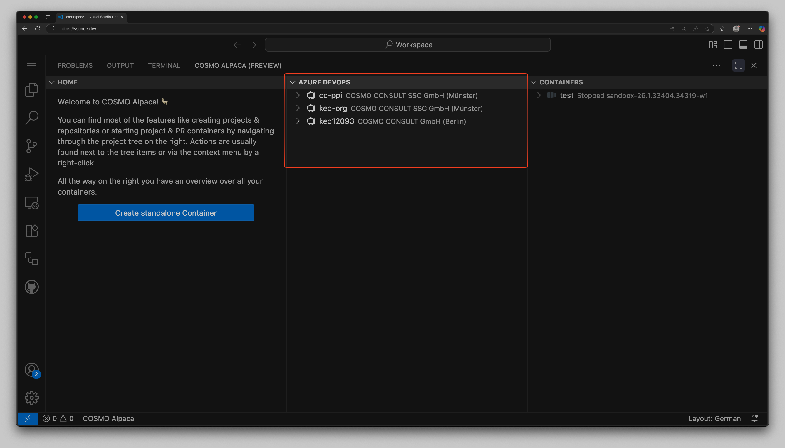

* Right-click an organization to access available functions (e.g., *Create Project*, *Assign Entity*).
  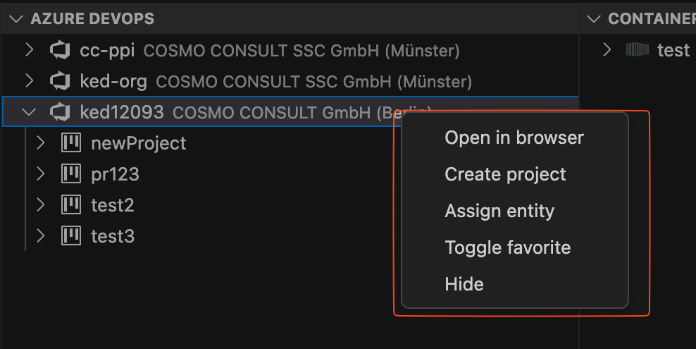

* Projects are listed under each organization. Right-clicking on a project displays its available functions.
  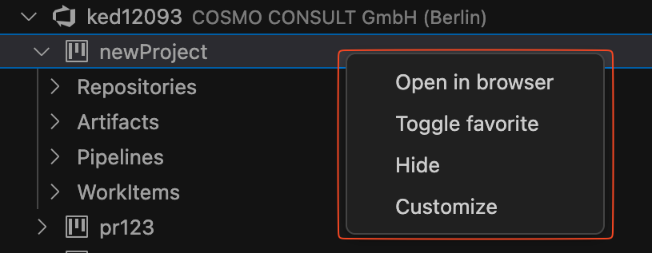

# [**GitHub (AL-Go)**](#tab/github)

## Installation

1. Open Visual Studio Code. If you don't have it installed, you can get it for free [here][vsc-install]
1. Go to the extensions view in the activity bar
1. Search for and install the **COSMO Alpaca Preview** extension
1. Wait until the installation has finished, you might have to reload the VS Code window
1. Afterwards you should see the extension in the list of installed extensions

## First Use

To open the COSMO Alpaca Preview extension, click the respective icon in the activity bar. On the first use you're asked for your role and whether you want to use Azure DevOps or GitHub as a platform.

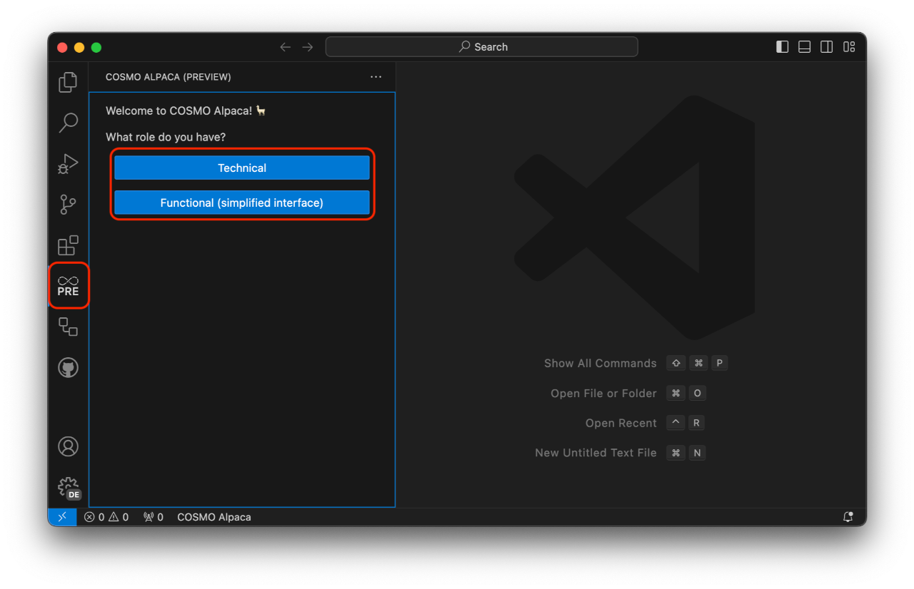

Depending on what platform you choose you'll be asked to sign in with your GitHub or Microsoft account. Check the other tab in the documentation for Azure DevOps, we'll go with GitHub here.

Now you can make yourself familiar with the interface:

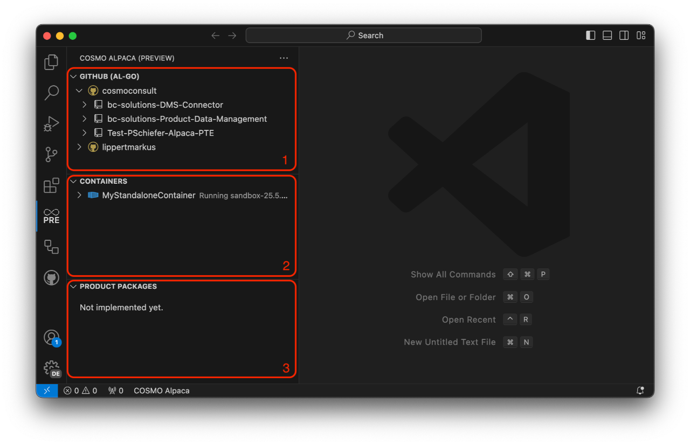

1. The **GitHub** View let's you navigate through your Azure GitHub organizations, accounts, repositories and more.
1. The **Containers** View shows you all your containers across all your organizations and accounts along with their state and details.
1. The **Product Packages** View isn't currently implemented. In the future it will show shows product packages that you often need during development. The feed from which the packages are fetched will be configurable.

# [**Azure DevOps**](#tab/azdevops)

## Installation

To get access, you need to:

1. Open Visual Studio Code. If you don't have it installed, you can get it for free [here][vsc-install]
1. Go to the extensions view in the activity bar
1. Search for and install the **COSMO Alpaca** extension
1. Wait until the installation has finished, you might have to reload the VS Code window
1. Afterwards you should see the extension in the list of installed extensions

## First Use

If you never used Azure DevOps before you need to [sign up first and create your first organization](create-org.md). After that please **wait for 5min** until your first Azure DevOps sign-up has been synchronized, else you'll get an error during the following step.

When you use the extension for the first time by clicking on the COSMO Alpaca icon in the activity bar, you might be asked to log in with your Microsoft Account for up to 2 times:

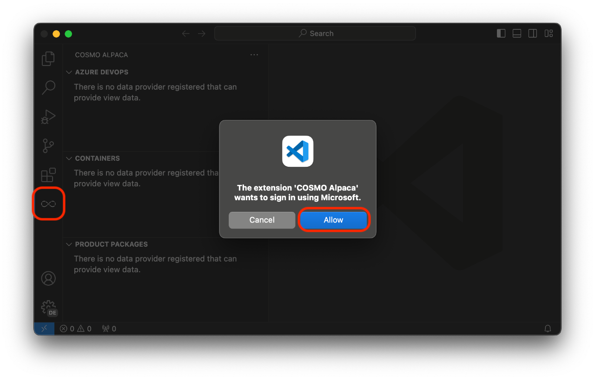

Now you can make yourself familiar with the interface:

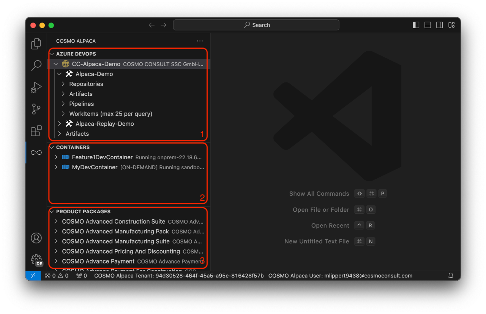

1. The **Azure DevOps** View let's you navigate through your Azure DevOps organizations, projects, repositories, artifacts, pipelines, WorkItems and more.
1. The **Containers** View shows you all your containers across all your organizations along with their state and details.
1. The **Product Packages** View shows product packages that you often need during development. The feed from which the packages are fetched [can be configured](../admin/index.md) by your administrator.

---

You now may want to go through the [walkthrough](walkthrough.md) to get a first impression of COSMO Alpaca.

[vsc-install]: https://code.visualstudio.com/download
