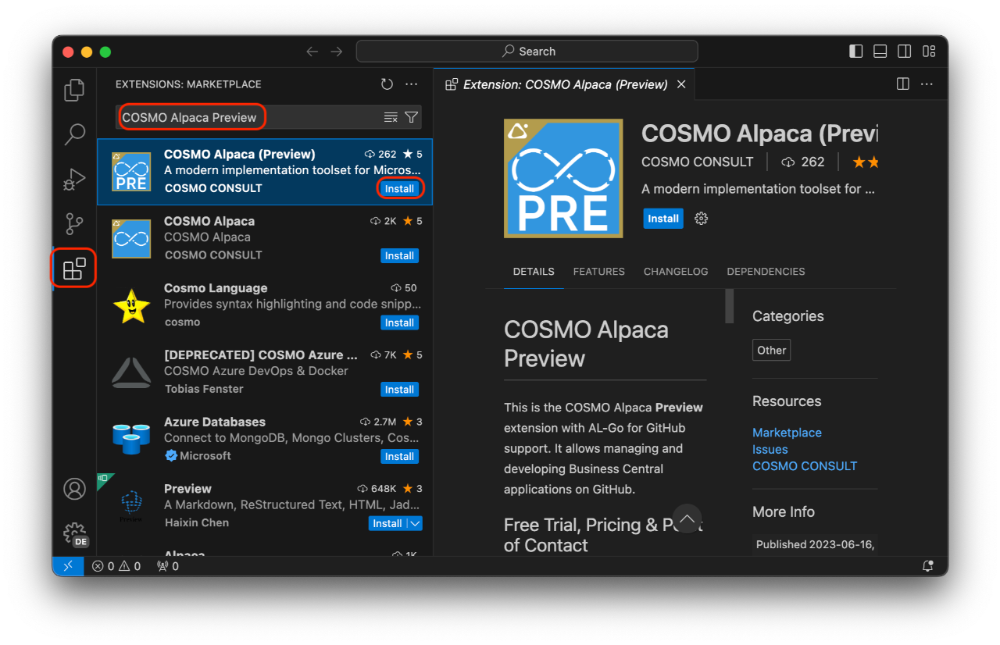
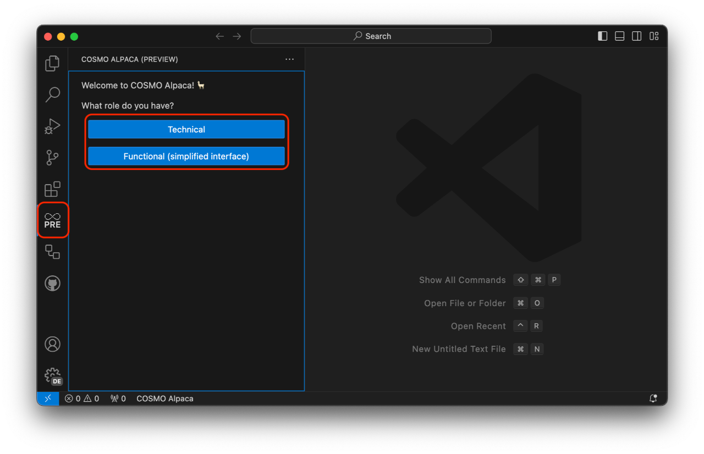
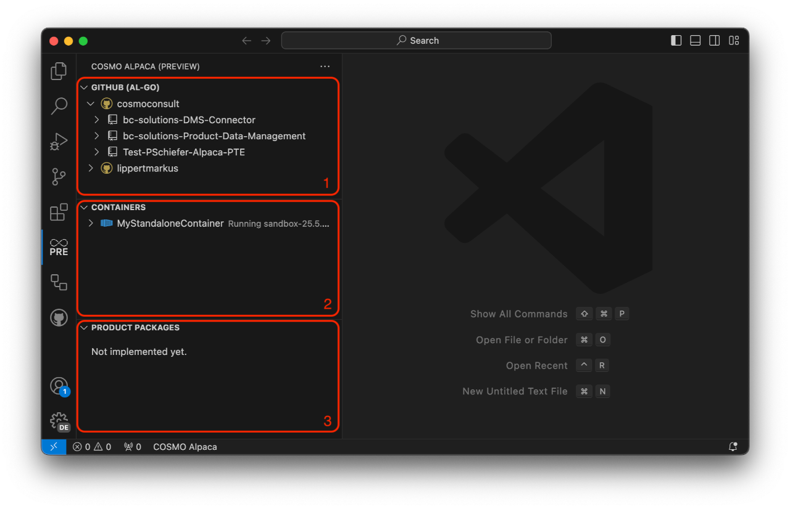
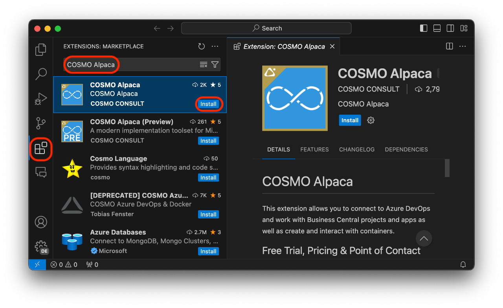
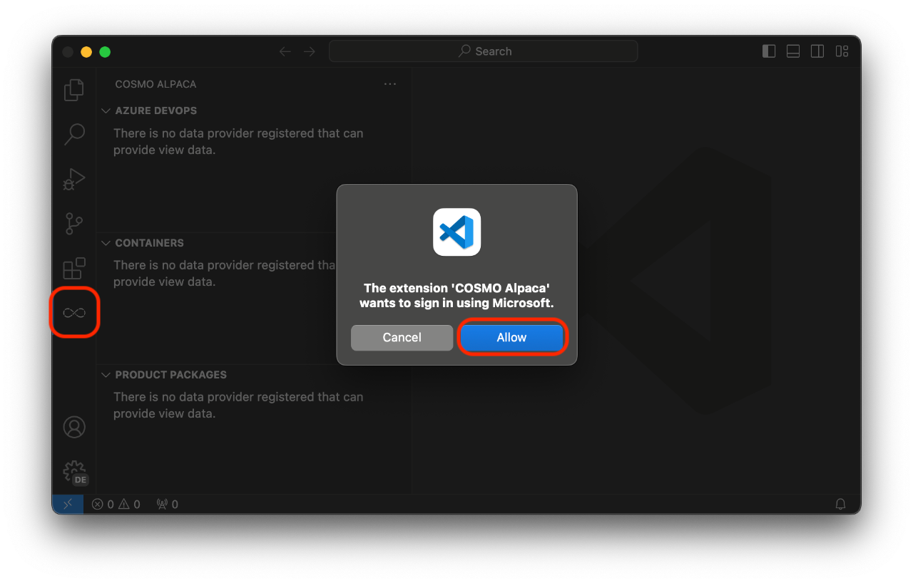

# Access and setup the VS Code Extension

One of the clients that give you access to COSMO Alpaca is the VS Code Extension. Before setting it up you might want to [create an organization](create-org.md) beforehand.

# [**GitHub (AL-Go)**](#tab/github)

## Installation

1. Open Visual Studio Code. If you don't have it installed, you can get it for free [here][vsc-install]
1. Go to the extensions view in the activity bar
1. Search for and install the **COSMO Alpaca Preview** extension
1. Wait until the installation has finished, you might have to reload the VS Code window
1. Afterwards you should see the extension in the list of installed extensions

## First Use

To open the COSMO Alpaca Preview extension, click the respective icon in the activity bar. On the first use you're asked for your role and whether you want to use Azure DevOps or GitHub as a platform.

Depending on what platform you choose you'll be asked to sign in with your GitHub or Microsoft account. Check the other tab in the documentation for Azure DevOps, we'll go with GitHub here.

Now you can make yourself familiar with the interface:

1. The **GitHub** View let's you navigate through your Azure GitHub organizations, accounts, repositories and more.
1. The **Containers** View shows you all your containers across all your organizations and accounts along with their state and details.
1. The **Product Packages** View isn't currently implemented. In the future it will show shows product packages that you often need during development. The feed from which the packages are fetched will be configurable.

# [**Azure DevOps**](#tab/azdevops)

## Installation

To get access, you need to:

1. Open Visual Studio Code. If you don't have it installed, you can get it for free [here][vsc-install]
1. Go to the extensions view in the activity bar
1. Search for and install the **COSMO Alpaca** extension
1. Wait until the installation has finished, you might have to reload the VS Code window
1. Afterwards you should see the extension in the list of installed extensions

## First Use

If you never used Azure DevOps before you need to [sign up first and create your first organization](create-org.md). After that please **wait for 5min** until your first Azure DevOps sign-up has been synchronized, else you'll get an error during the following step.

When you use the extension for the first time by clicking on the COSMO Alpaca icon in the activity bar, you might be asked to log in with your Microsoft Account for up to 2 times:

Now you can make yourself familiar with the interface:

1. The **Azure DevOps** View let's you navigate through your Azure DevOps organizations, projects, repositories, artifacts, pipelines, WorkItems and more.
1. The **Containers** View shows you all your containers across all your organizations along with their state and details.
1. The **Product Packages** View shows product packages that you often need during development. The feed from which the packages are fetched [can be configured](../admin/index.md) by your administrator.

---

You now may want to go through the [walkthrough](../walkthrough.md) to get a first impression of COSMO Alpaca or change some of the default [configuration]() in VS Code.

[vsc-install]: https://code.visualstudio.com/download
