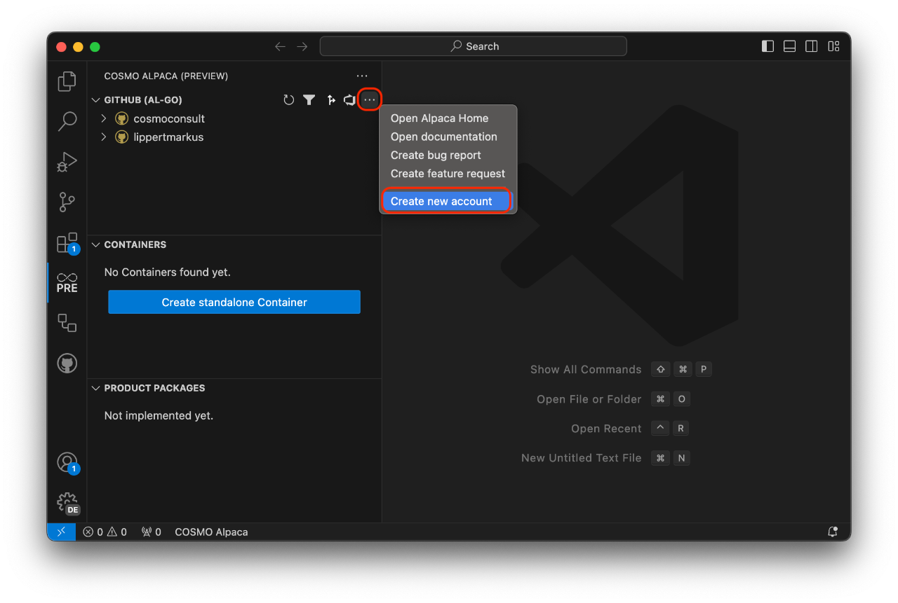
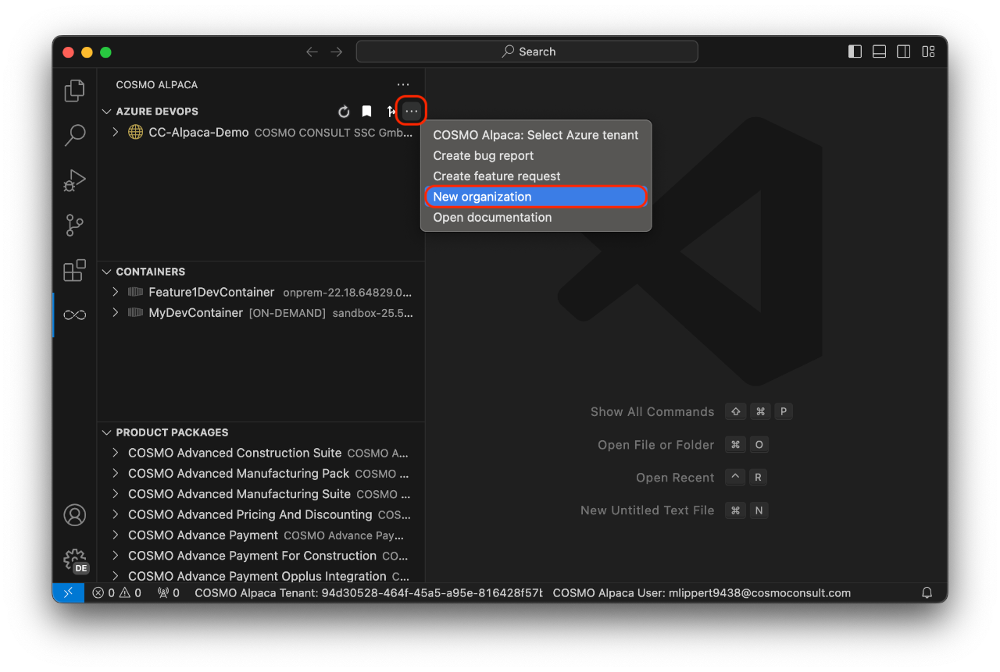

# Create Organization

# [**GitHub (AL-Go)**](#tab/github)

If you haven't already, please [sign up for a GitHub account](https://github.com/join). Afterwards you can [sign in to the Alpaca VSC extension](access-and-setup-vsce.md).

We recommend that you use a GitHub organization to group all your repositories together. If you don't have an organization yet, you can use the action in COSMO Alpaca to create one or alternatively click [here](https://github.com/organizations/plan). 

The free plan is sufficient to use COSMO Alpaca.

After setting up the GitHub organization, it should be visible within the VS Code extension after reloading the list. You can now continue and [create a repository and an app](../vsc-extension/create-app.md).

# [**Azure DevOps**](#tab/azdevops)

The top-level entity in Azure DevOps is an organization (or *project collection* as it was named in earlier iterations of the product) and you need to have one if you want to be able to work. To get one, you need to do one of the following:

If you are using the COSMO Alpaca VS Code Extension ([setup instructions](access-and-setup-vsce.md)), then you need to go to the Azure DevOps view, click the three dots on the top right and select **New organization**. Alternatively you can directly go to the [signup page](https://aex.dev.azure.com/go/signup?account=true).

In both cases, a web site comes up and you need need to follow the steps outlined in the [Azure DevOps documentation](https://learn.microsoft.com/en-US/azure/devops/organizations/accounts/create-organization?view=azure-devops#create-an-organization-1).

After waiting for a couple of seconds, you have your Azure DevOps organization. **Do not create a project here**, but instead [use the Alpaca feature](../vsc-extension/create-project.md) to create a new project. If you create a project manually in the browser, then the self-service environment will work only partially or not at all.

---