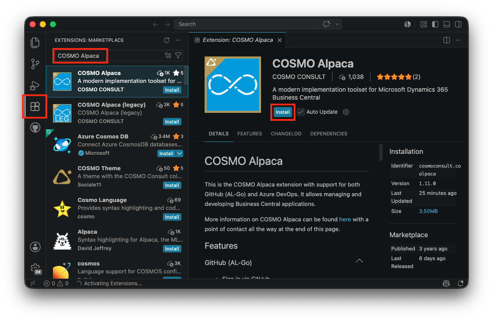
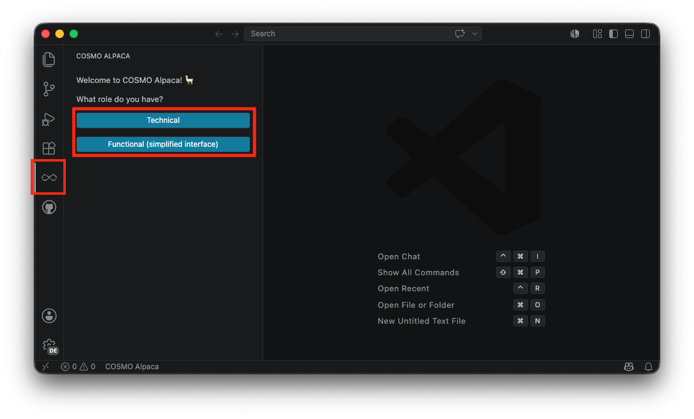
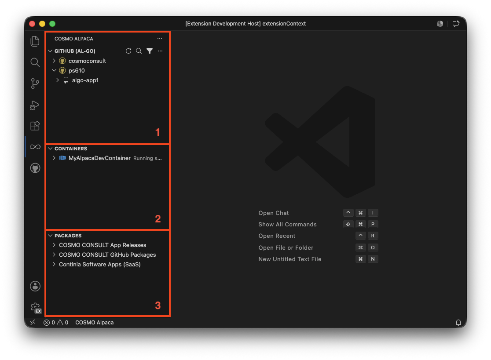
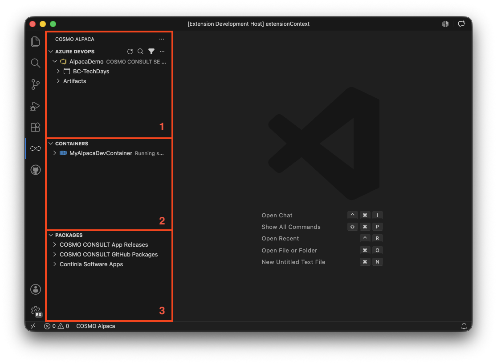

# VS Code Extension Setup

The client to access COSMO Alpaca is a Visual Studio Code Extension.

## Installation

1. Open Visual Studio Code. If you don't have it installed, you can get it for free [here](https://code.visualstudio.com/download)
1. Go to the "Extensions" view in the activity bar
1. Search and install the **COSMO Alpaca** extension
1. Wait until the installation has finished, you might have to reload the VS Code window
1. Afterwards you should see the extension in the list of installed extensions

## First Use

To open the **COSMO Alpaca** extension, click the respective icon in the activity bar. On the first use you'll see welcome screen and before you can start, you'll be asked for your role. The extensions offers two view modes:
[!INCLUDE [View Mode List](../includes/view-mode-list.md)]

After selecting your role, you will be asked to select the platform you want to use COSMO Alpaca with: **GitHub (AL-Go)** or  **Azure DevOps**. Depending on what platform you choose you'll be asked to sign in with your GitHub or Microsoft account.

> [!TIP]
> You can [switch](switch-view.md) between platforms and views at any time.

Now you can make yourself familiar with the interface:

### [**GitHub (AL-Go)**](#tab/github)

1. The **GitHub** view let's you navigate through your GitHub organizations, accounts, repositories and more.
1. The **Containers** view shows you all your containers across all your organizations and accounts along with their state and details.
1. The **Packages** view allows you to browse Business Central NuGet feeds and view package and version information.

### [**Azure DevOps**](#tab/azuredevops)

1. The **Azure DevOps** view let's you navigate through your Azure DevOps organizations, projects, repositories and more.
1. The **Containers** view shows you all your containers across all your organizations and accounts along with their state and details.
1. The **Packages** view allows you to browse Business Central NuGet feeds and view package and version information.

---

You now may want to get your first impressions of COSMO Alpaca:

- [Walkthrough GitHub](../github/walkthrough.md)
- [Walkthrough Azure DevOps](../azure-devops/walkthrough.md)