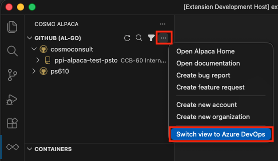
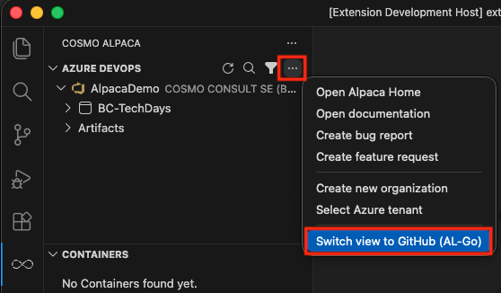
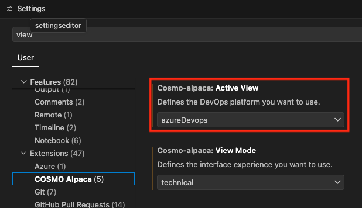
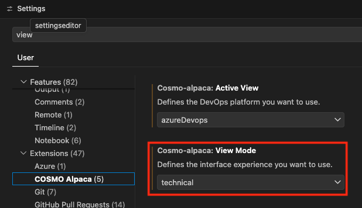

# Switch Platform View

The COSMO Alpaca extension supports both Azure DevOps and GitHub (AL-Go). You can select your preferred platform during the initial setup of the extension ([locally in VS Code](setup-vsce.md) or [in the browser](vscode-dev.md)).

If you want to switch your platform view later on, you can do so directly in the UI:

And in the settings of the extension:

## Switch View Mode

The extension also offers two view modes:
[!INCLUDE [View Mode List](../includes/view-mode-list.md)]

You can select your preferred view mode during the initial setup of the extension ([locally in VS Code](setup-vsce.md) or [in the browser](vscode-dev.md)).

If you want to switch your view mode later on, you can do so in the settings of the extension:

