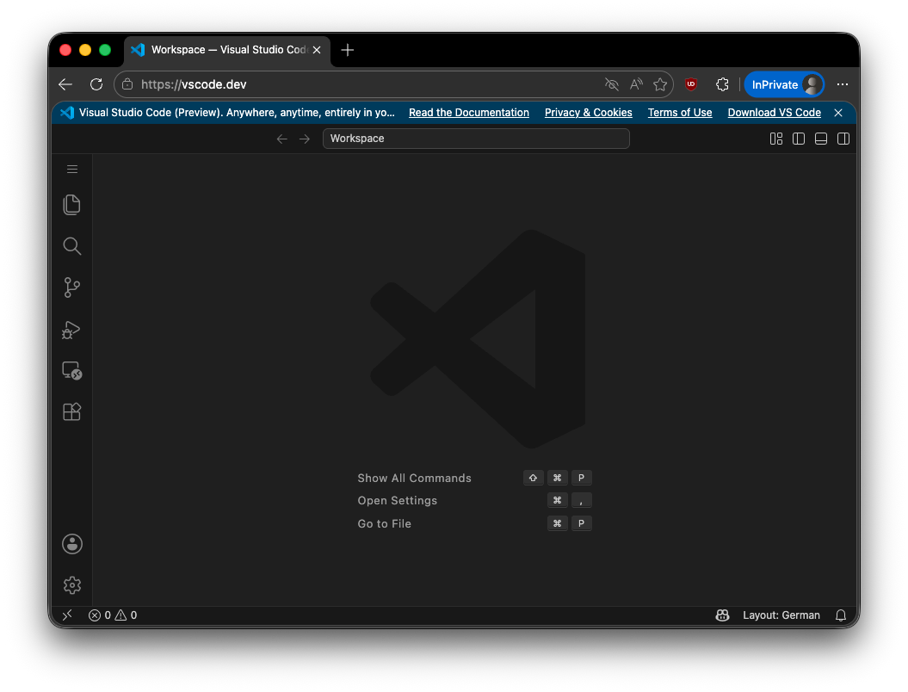
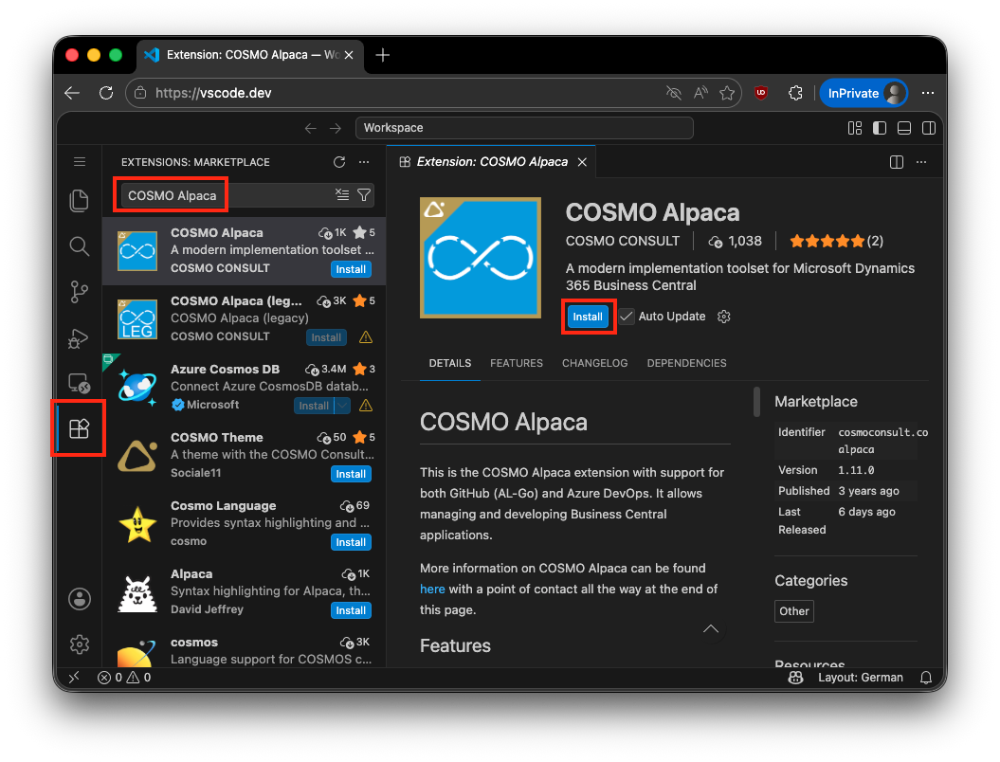
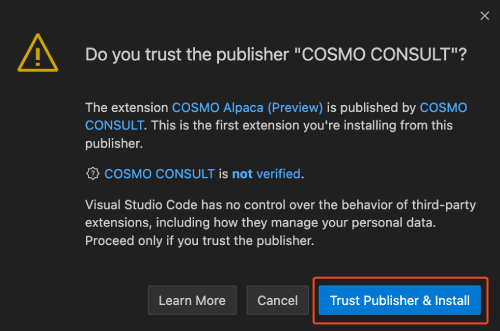
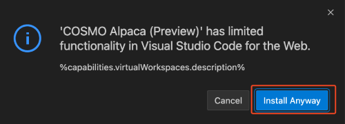
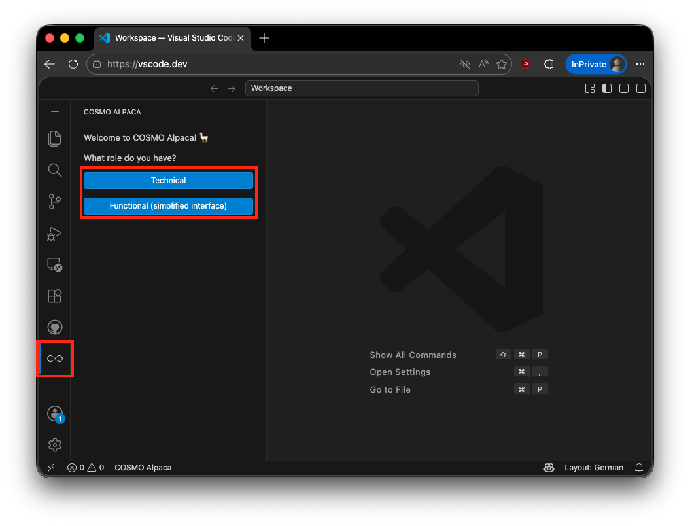
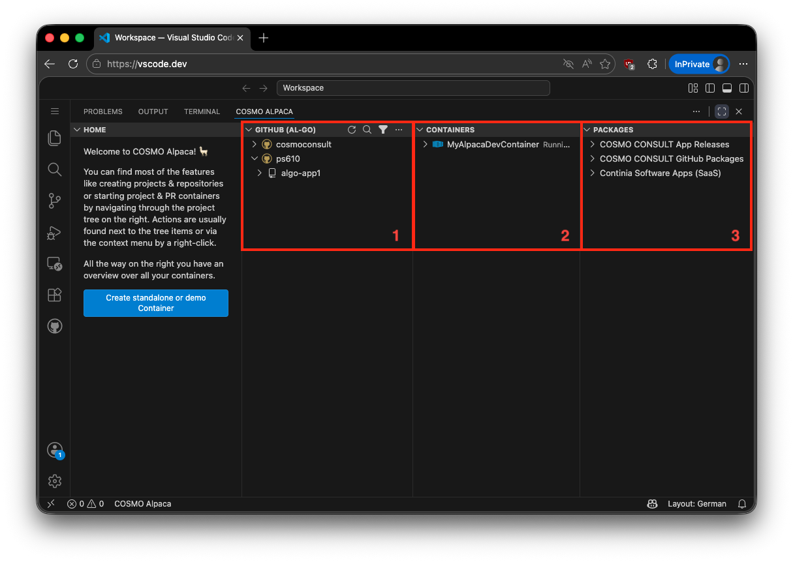
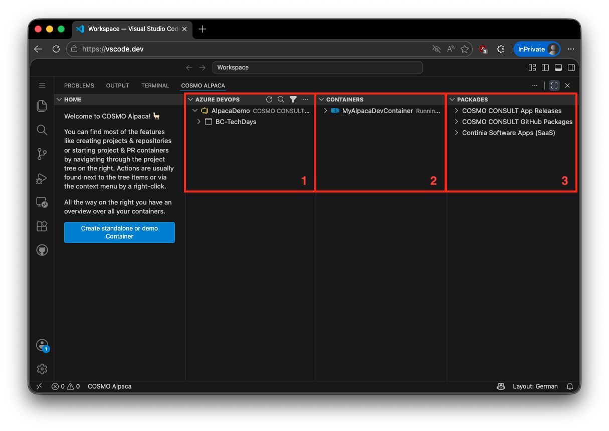

# COSMO Alpaca – Browser Edition

With the **browser-based version** of Visual Studio Code available at [vscode.dev](https://vscode.dev), you can use **COSMO Alpaca** without installing VS Code locally. This is particularly useful for:
- **Consultants** – no local setup required.
- **Project Managers** – focus on functionality without technical overhead.

For advanced development workflows, and full extension capabilities, we recommend using the local installation of VS Code. The browser edition is ideal for quick access and non-technical roles, but developers will benefit more from the local installation version.

> **New Features:** Most of the well-known **PowerApp functions** are now integrated into the extension. You can directly manage projects and **COSMO** entities in COSMO Alpaca: *Customize Project, Create Project, Assign Entity, Assign Customer Account*.
> This ensures both technical and non-technical users can work seamlessly in one tool.

## Installation

1. Open [**vscode.dev**](https://vscode.dev)
   

1. Go to the "Extensions" view in the activity bar, search and install the **COSMO Alpaca** extension
   

1. Trust the publisher and confirm installation

   
   

## First Use

To open the **COSMO Alpaca** extension, click the respective icon in the activity bar. On the first use you'll see welcome screen and before you can start, you'll be asked for your role. The extensions offers two view modes:
[!INCLUDE [View Mode List](../includes/view-mode-list.md)]

After selecting your role, you will be asked to select the platform you want to use COSMO Alpaca with: **GitHub (AL-Go)** or  **Azure DevOps**. Depending on what platform you choose you'll be asked to sign in with your GitHub or Microsoft account.

> [!TIP]
> You can [switch](switch-view.md) between platforms and views at any time.

Now you can make yourself familiar with the interface. The following section will focus on the **functional** view, if you want to see the technical view, please refer to the [VS Code Extension Setup](setup-vsce.md#first-use) guide.

### [**GitHub (AL-Go)**](#tab/github)

1. The **GitHub** view let's you navigate through your GitHub organizations, accounts, repositories and more.
1. The **Containers** view shows you all your containers across all your organizations and accounts along with their state and details.
1. The **Packages** view allows you to browse Business Central NuGet feeds and view package and version information.

### [**Azure DevOps**](#tab/azuredevops)

1. The **Azure DevOps** view let's you navigate through your Azure DevOps organizations, projects, repositories and more.
1. The **Containers** view shows you all your containers across all your organizations and accounts along with their state and details.
1. The **Packages** view allows you to browse Business Central NuGet feeds and view package and version information.

---

You now may want to get your first impressions of COSMO Alpaca:

- [Walkthrough GitHub](../github/walkthrough.md)
- [Walkthrough Azure DevOps](../azure-devops/walkthrough.md)