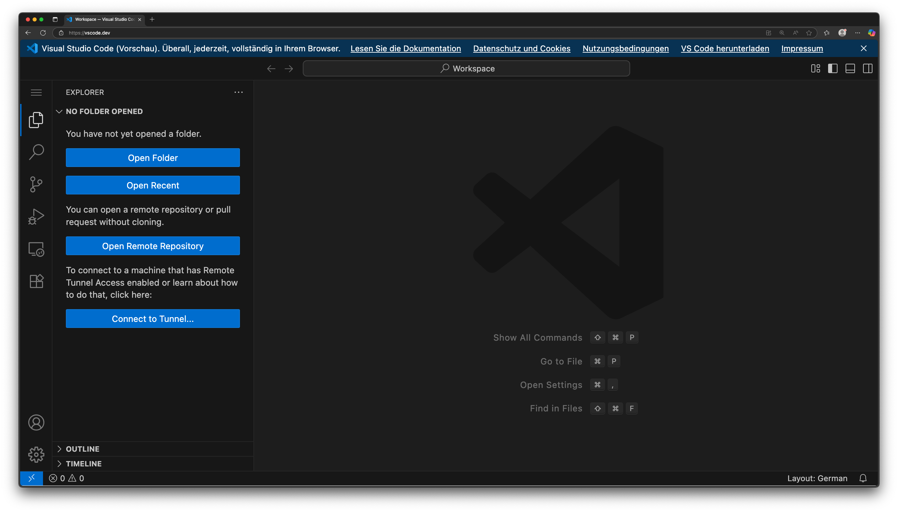
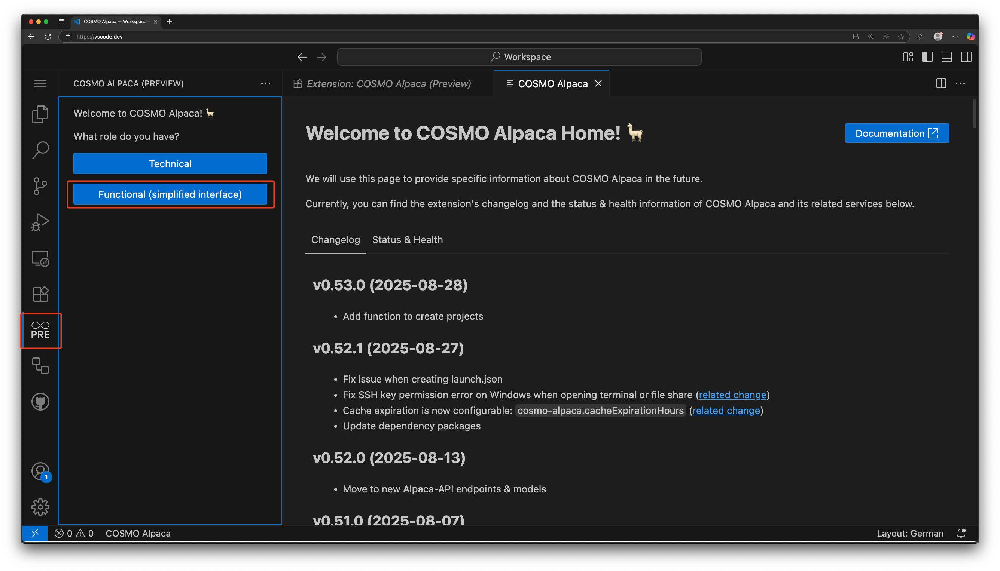
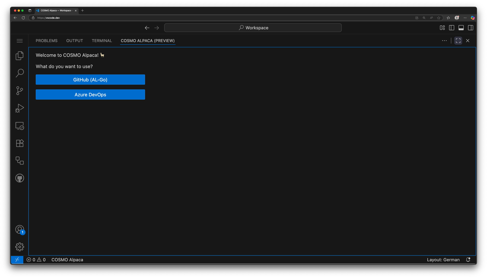
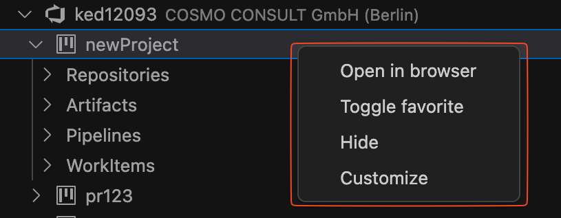

# COSMO Alpaca – Browser Edition

With the **browser-based version** of Visual Studio Code available at [vscode.dev](https://vscode.dev), you can use **COSMO Alpaca** without installing VS Code locally. This is particularly useful for:

1. **Consultants** – no local setup required.
2. **Project Managers** – focus on functionality without technical overhead.

For advanced development workflows, and full extension capabilities, we recommend using the local installation of Visual Studio Code. The browser edition is ideal for quick access and non-technical roles, but developers will benefit more form local installation version.

> **New Feature:** Most of the well-known **PowerApps functions** are now integrated into the extension. You can directly manage projects and entities in COSMO Alpaca: *Customize Project, Create Project, Assign Entity.*
> This ensures both technical and non-technical users can work seamlessly in one tool.

---

## Extension Setup

1. Open [**vscode.dev**](https://vscode.dev).
   

2. Install the **COSMO Alpaca Extension** from the Marketplace.
   

3. Trust the publisher and confirm installation.

   
   

4. Open the extension and choose your **role-based view**:

   * **Technical View** – the full integrated version of the existing VS Code extension.
   * **Functional View** – a simplified interface focused on the core features.

   

5. Select your working environment: **Azure DevOps** or **GitHub**.
   

6. Sign in to the selected environment (e.g., Azure DevOps).
   
   

---

## Functional View Overview

The **Functional View** is divided into two main sections: **Organizations** and **Containers**.

> **Tip:** Need to create a new organization? See our [Create organization guide](../getting-started/create-org.md) for instructions on setting up organizations in COSMO Alpaca.

* In the **Organizations** section, all organizations are listed.

  

* Right-click an organization to access available functions (e.g., *Create Project*, *Assign Entity*).

  

* Projects are listed under each organization. Right-clicking on a project displays its available functions.

  
