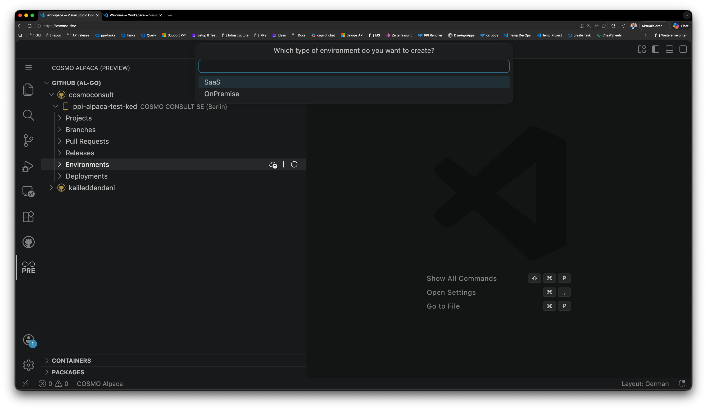
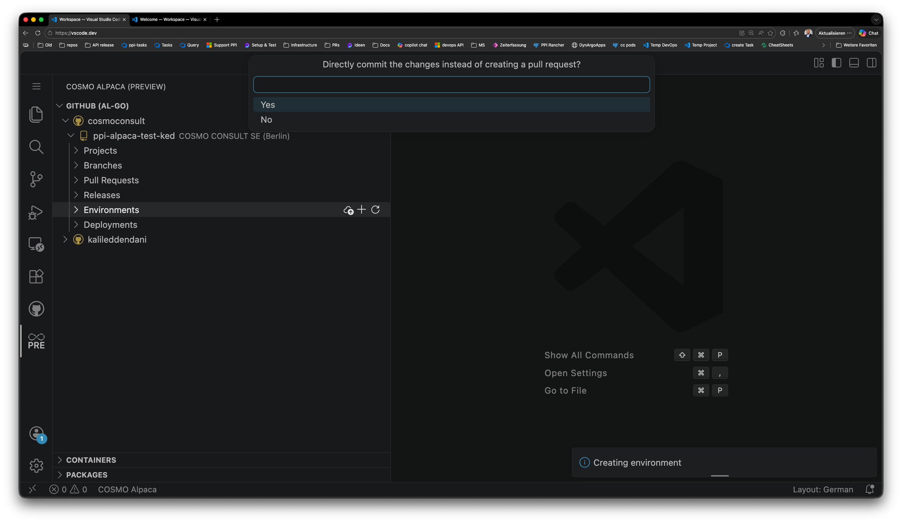
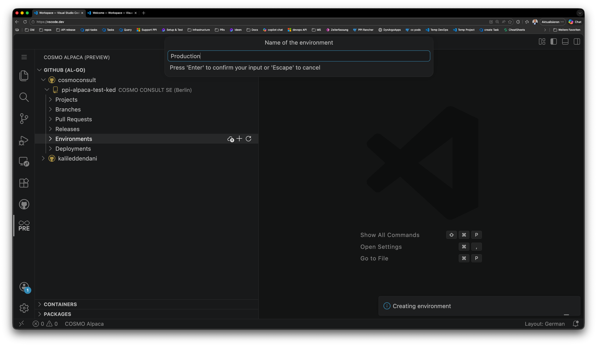
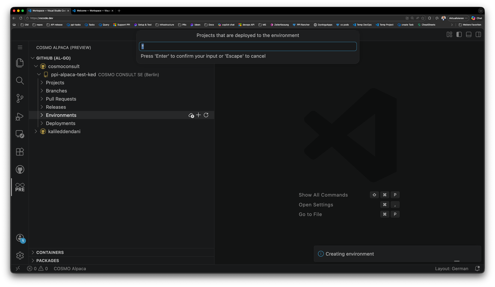
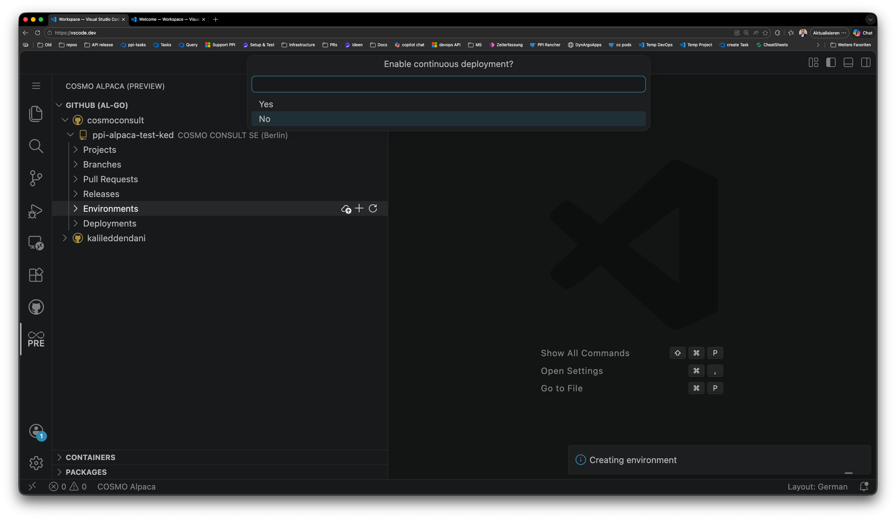
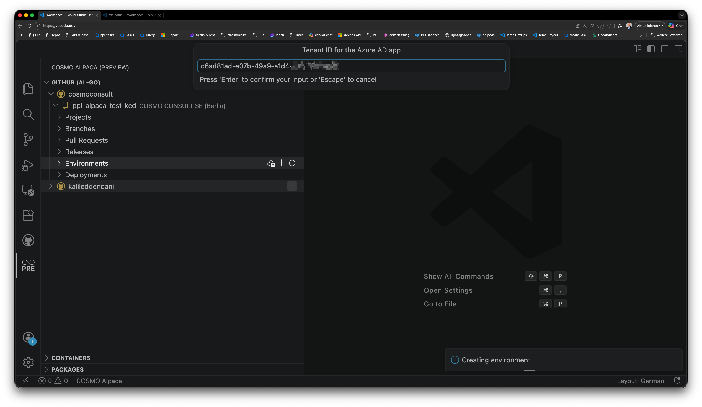
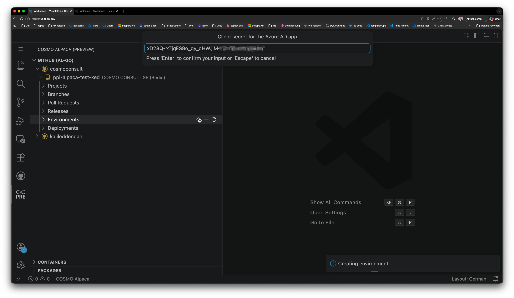

<script type="module">
    import mermaid from 'https://cdn.jsdelivr.net/npm/mermaid@10/dist/mermaid.esm.min.mjs';
    mermaid.initialize({ startOnLoad: true });
</script>

# Add Environment

Environments define where your AL-Go CI/CD pipelines deploy your app. COSMO Alpaca supports adding both **SaaS** (cloud) and **OnPremise** (self-hosted) Business Central environments.

## SaaS Environments

### Prerequisites: Microsoft Entra App Setup

Before you can configure a SaaS environment in the extension, you need to register a Microsoft Entra application in the customer tenant and grant it the required Business Central permissions.

[!INCLUDE [SaaS Entra Setup](../includes/saas-entra-setup.md)]

### Configure the SaaS environment in VS Code

Once the Microsoft Entra app is set up and you have the **ClientId**, **ClientSecret**, and **TenantId** at hand, proceed with the following steps in the COSMO Alpaca extension.

#### 1. Open the Environments section

In the COSMO Alpaca extension, expand your repository and navigate to **Environments**. Click the **+** button to start the environment wizard.

#### 2. Select the environment type

Choose the type of environment:

- **SaaS** — a Business Central online environment (cloud)
- **OnPremise** — a self-hosted Business Central environment



#### 3. Commit directly or create a pull request

Choose how the environment configuration should be committed:

- **Yes** — commits the environment settings directly to the branch
- **No** — opens a pull request for review before the settings are applied



#### 4. Enter the environment name

Enter the name that identifies this environment. This name is used as the AL-Go environment name and must match the Business Central environment name exactly.



#### 5. Select the projects

Select which AL-Go projects in the repository this environment applies to. In single-project repositories, only one project is listed.



#### 6. Enable Continuous Deployment

Decide whether this environment should be automatically deployed on every successful CI/CD run.

- **Yes** — enables CD so every successful build deploys to this environment automatically
- **No** — deployment must be triggered manually



#### 7. Enter the Tenant ID

Enter the **TenantId** of the customer's Microsoft Entra tenant. This is visible in the URL of the Business Central Admin Center, e.g. `https://businesscentral.dynamics.com/<TenantId>/admin`.



#### 8. Enter the Client ID

Enter the **ClientId** obtained in the [Create the app registration](#create-the-app-registration) step above.


#### 9. Enter the Client Secret

Enter the **ClientSecret** (the value copied from Certificates & secrets) obtained in the [Create the app registration](#create-the-app-registration) step above.



## OnPremise Environments

OnPremise deployments use the following components:

- [AL-Go OnPremise Deployer](https://github.com/akoniecki/AL-Go-OnPremise-Deployer)
- [ALOps External Deployer](https://github.com/HodorNV/ALOps-External-Deployer)

### Prerequisites: Prepare the target system

1. Enable API services on the target Business Central system.
   See [Enabling APIs for Dynamics NAV and Business Central](https://learn.microsoft.com/en-us/dynamics365/business-central/dev-itpro/api-reference/v2.0/enabling-apis-for-dynamics-nav).
1. Install the AL-Go OnPremise Deployer components.
   See [AL-Go OnPremise Deployer](https://github.com/akoniecki/AL-Go-OnPremise-Deployer).

> [!NOTE]
> Run the installation of ALOps-External-Deployer in **Windows PowerShell 5.x**, not in **PowerShell 7 (pwsh)**.

### Configure the environment in AL-Go for GitHub

#### Network architecture options

There are two common infrastructure options for OnPremise deployments. AL-Go communicates with the target system through a GitHub runner. That runner can either be hosted in the customer's infrastructure or provided by GitHub.

##### Self-hosted runner (customer infrastructure)

<pre class="mermaid">
%%{
  init: {
    'theme': 'base',
    'themeVariables': {
      'fontFamily': "Neptune Light",
      'lineColor': '#1B212E',
      'primaryColor': '#B39C4D',
      'primaryTextColor': '#FFFFFF',
      'primaryBorderColor': '#1B212E',
      'secondaryColor': '#006100',
      'tertiaryColor': '#fff'
    }
  }
}%%
flowchart LR
    gh[GitHub]
    subgraph customer1[Customer Infrastructure]
        runner[Runner\nSelf-hosted]
        bc[Business Central\nOnPremise]
    end

    runner -->|443 HTTPS| gh
    runner -->|7048 BC API Services| bc
</pre>

In this setup, the self-hosted runner is installed within the customer's infrastructure and has direct access to the Business Central system. This means the customer infrastructure only needs outbound connectivity to GitHub.

The runner must be able to reach GitHub on port `443`.
See [Requirements for communication with GitHub](https://docs.github.com/en/actions/reference/runners/self-hosted-runners#requirements-for-communication-with-github).

For details on installing and managing a self-hosted runner, see the [GitHub documentation](https://docs.github.com/en/actions/hosting-your-own-runners).

##### GitHub-hosted runner

<pre class="mermaid">
%%{
  init: {
    'theme': 'base',
    'themeVariables': {
      'fontFamily': "Neptune Light",
      'lineColor': '#1B212E',
      'primaryColor': '#B39C4D',
      'primaryTextColor': '#FFFFFF',
      'primaryBorderColor': '#1B212E',
      'secondaryColor': '#006100',
      'tertiaryColor': '#fff'
    }
  }
}%%
flowchart LR
    gh[GitHub]
    runner[Runner\nGitHub-hosted]
    subgraph customer2[Customer Infrastructure]
        bc[Business Central\nOnPremise]
    end

    runner -->|443 HTTPS| gh
    runner -->|7048 BC API Services| bc
</pre>

In this setup, a GitHub-hosted runner is used to deploy to the OnPremise Business Central system. This requires opening port `7048` by default on the customer's firewall to allow incoming connections from the GitHub-hosted runner to the Business Central API services.

### AL-Go configuration

1. Add the environment to `.github/AL-Go-Settings.json`.

```json
{
    "environments": [
        "OnPremTestSystem"
    ],
    "OnPremTestSystem": {
        "EnvironmentType": "OnPremise",
        "EnvironmentName": "BCTest",
        "runs-on": "windows-latest",
        "shell": "powershell"
    }
}
```

Use `windows-latest` for a GitHub-hosted runner or specify the label of your self-hosted runner instead.

2. Create a GitHub Actions secret named `OnPremTestSystem_AUTHCONTEXT` with the connection information.

```json
{
    "Username": "<bc-username>",
    "Password": "<webservice-access-key>",
    "apiBaseUrl": "https://yourOnPremBcServer.westeurope.cloudapp.azure.com"
}
```

Use the public URL when the deployment is executed from a GitHub-hosted runner. If you use a self-hosted runner inside the same network, you can also use an internal address.

For OnPremise deployments, you can also use authentication through a service principal (requires a correspondingly configured Business Central server). In that case, you need to create a Microsoft Entra app registration. For detailed setup and additional configuration options, see the [AL-Go OnPremise Deployer README](https://github.com/akoniecki/AL-Go-OnPremise-Deployer/blob/main/README.md).

## What happens next

After confirming, the COSMO Alpaca extension creates the necessary GitHub environment and secrets in your repository. The CI/CD workflow will use this environment for deployments on the next successful build (if CD is enabled) or when triggered manually.

## See also

- [Setup AL-Go Settings](setup-al-go-settings.md)
- [Create Release](create-release.md)
