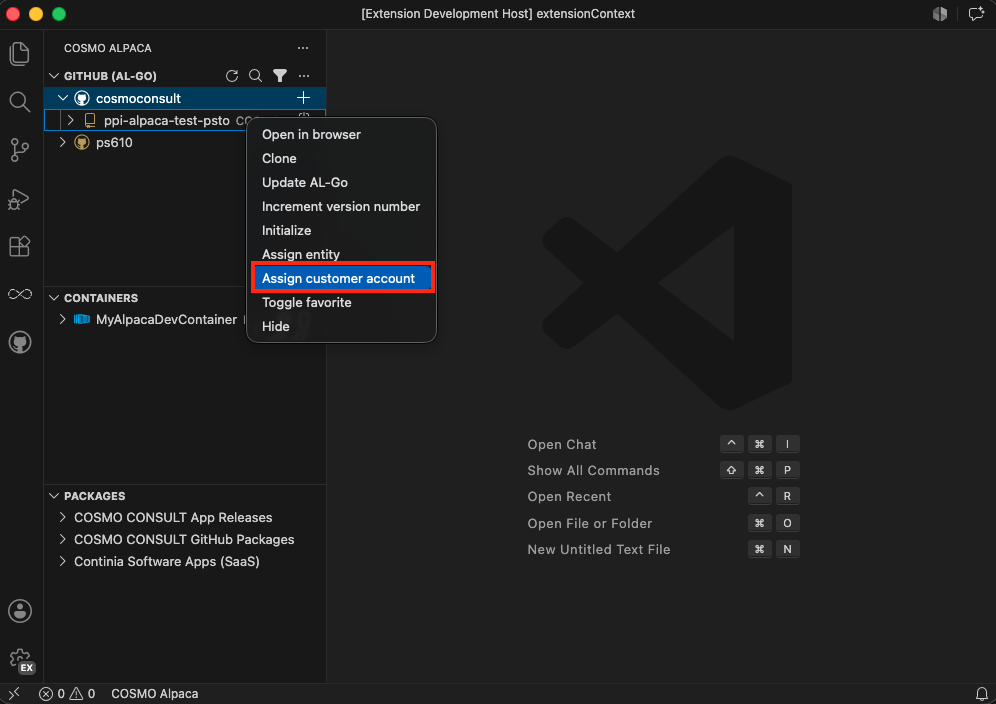

# Assign Repository to Customer

> [!IMPORTANT]
> This is currently only available for **COSMO**

It is important to assign a repository to its COSMO customer in order to be able to establish a connection between the GitHub repository and the customer's data, which is processed/used by other COSMO services.

To assign a repository to a customer:
1. Right-click on the repository and select **Assign customer account**
1. Select the customer to which the repository should be assigned from the list of customers shown
1. Wait until the assignment is successful and the repository list reloads showing the newly assigned customer next to the repository

