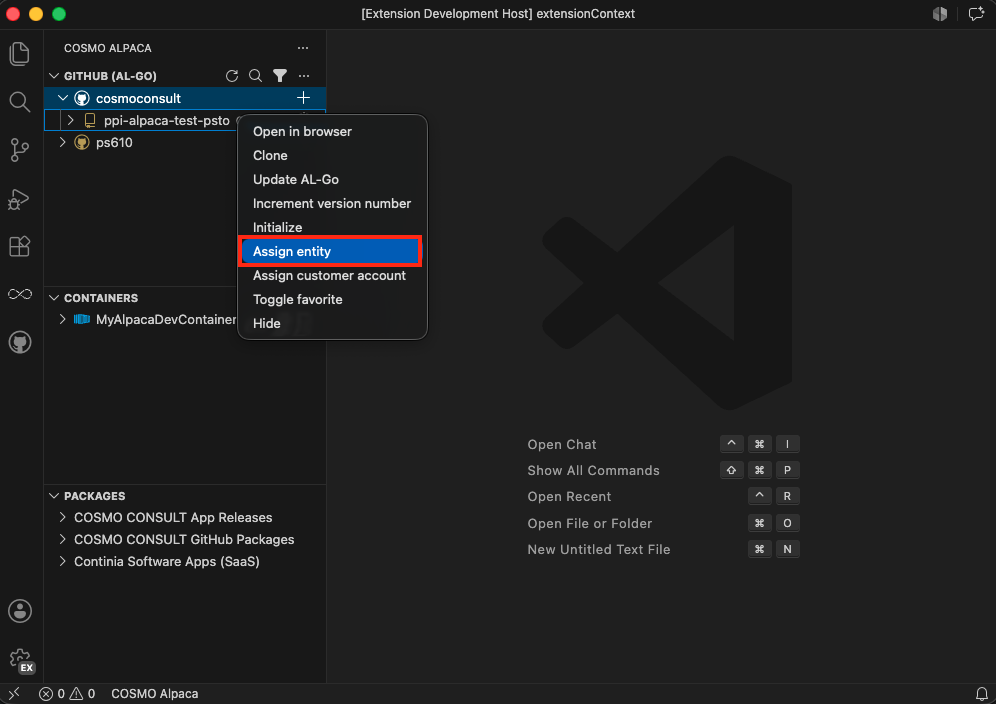

# Assign Repository to Entity

> [!IMPORTANT]
> This is currently only available for **COSMO**

To know which entity a GitHub repository belongs, we need to assign a COSMO entity to all repositories.

To assign a repository to an entity:
1. Right-click on the repository and select **Assign entity**
1. Select the entity to which the repository should be assigned from the list of entities shown
1. Wait until the assignment is successful and the repository list reloads showing the newly assigned entity next to the repository

