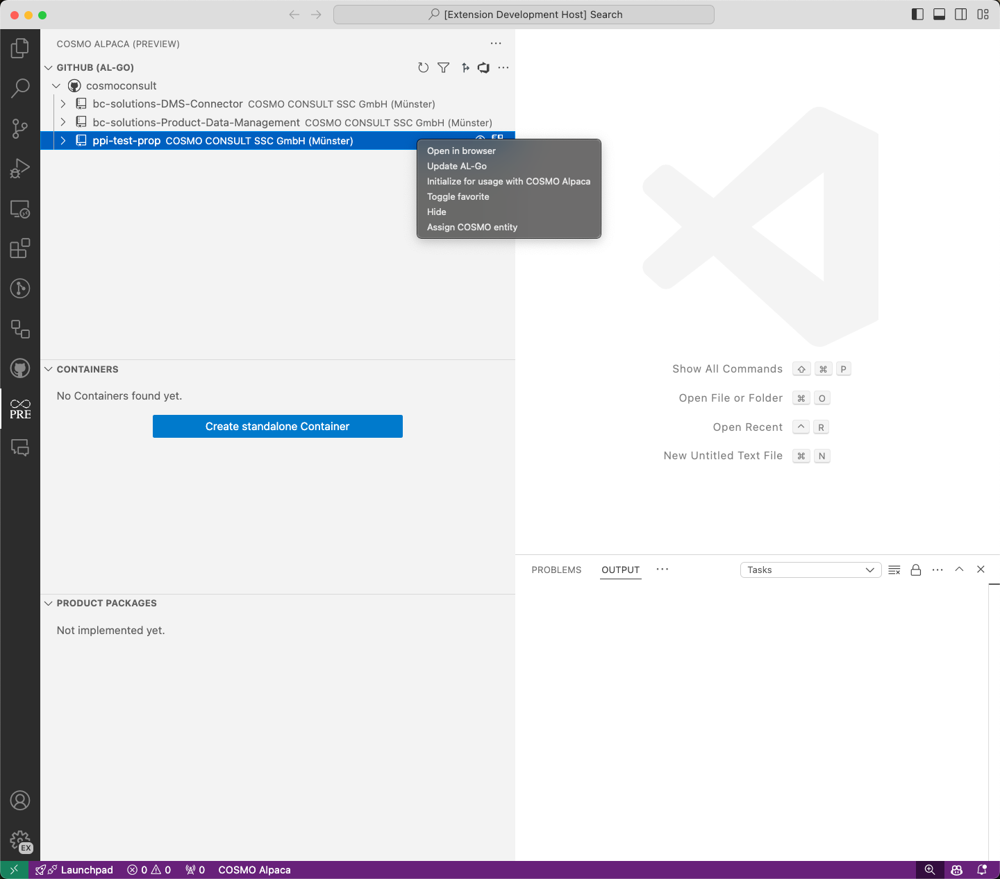
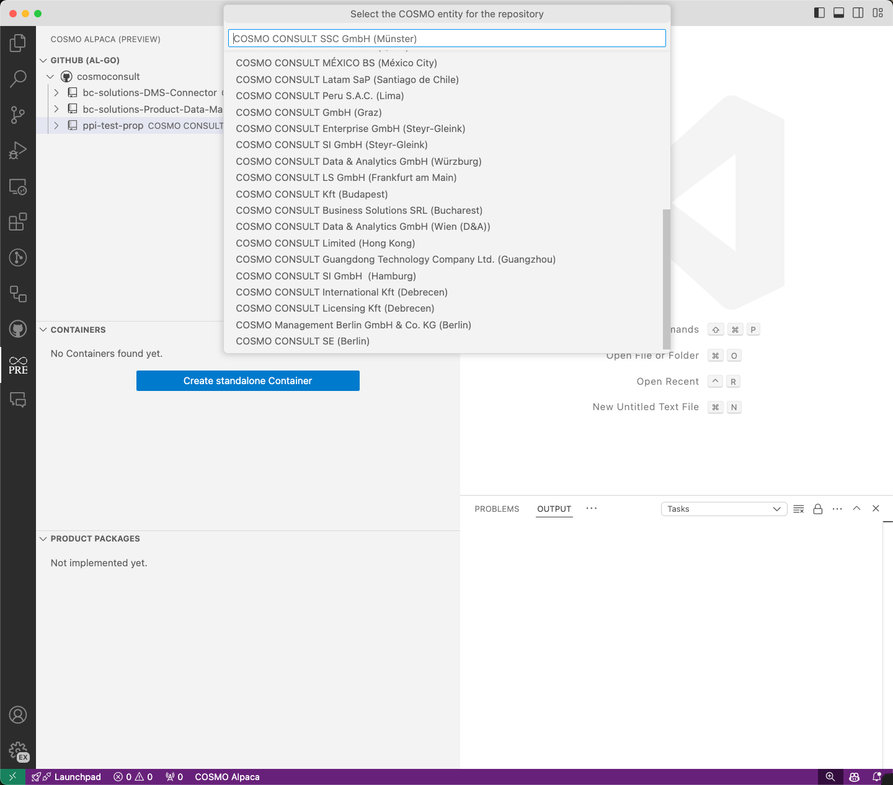
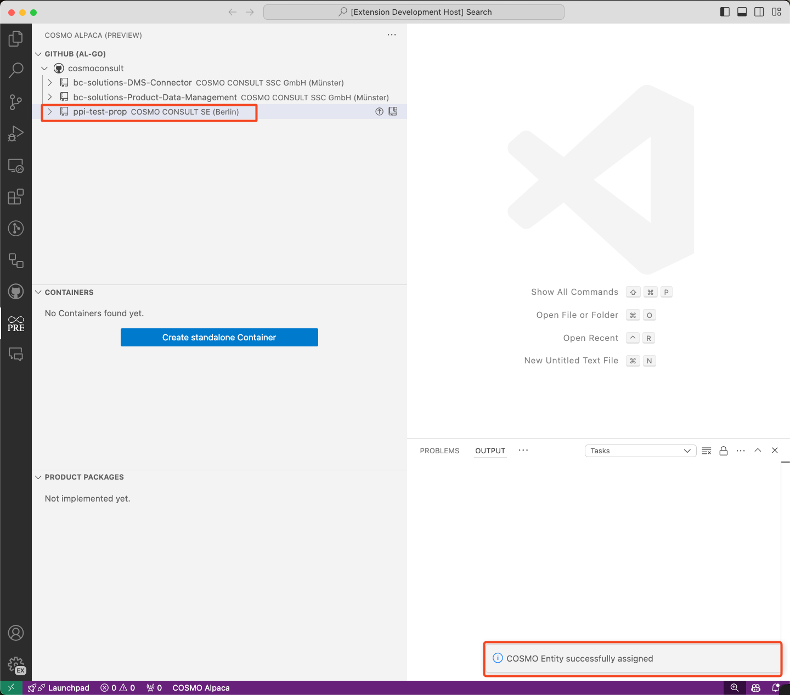

# Assign Organization/Repository to Entity
_This is only available for COSMO CONSULT_

To know which entity a GitHub repository belongs, we need to assign a COSMO entity to all repositories.

To assign a repository to an entity, right-click on the repository and select **Assign COSMO entity**. 

A list of the COSMO entities will be displayed. By clicking on the COSMO entity, it will be assigned to the selected repository.

If the COSMO entity is successfully assigned, it will appear in the repository view.

