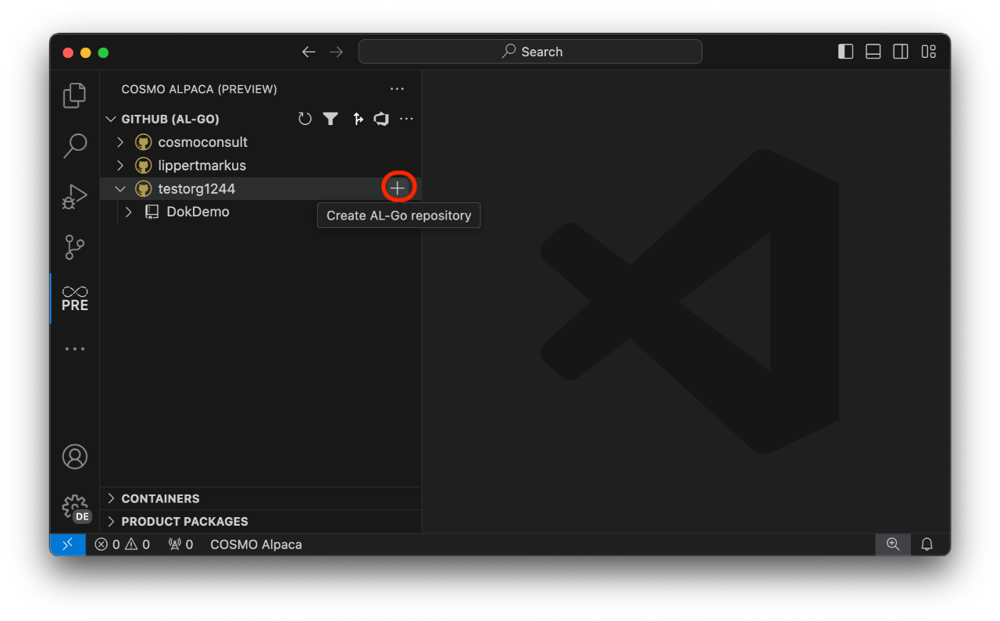
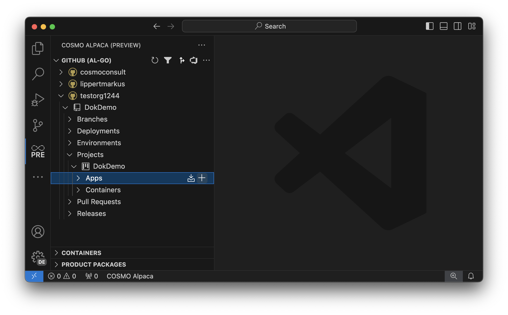

# Create Repository & App

We recommend to use an [organization][create-org] for your repositories. One repository can contain one or many [projects][create-project] that can contain one or many apps. 

## Create Repository

To create a repository use the `+` action next to your GitHub organization or account:

Now follow the wizard:
1. Enter the type of the new repository. Here you can choose between the PTE or AppSource Templates from Microsoft or the respective Alpaca templates (recommended). The Alpaca templates are using Alpaca's container infrastructure for the AL-Go pipelines which can then run much faster.
1. Enter the name of the new repository
1. Select if the new repository should be private.

With that a single-project repository will be created based on the selected template. If defined, your [GitHub Repo Standards](../admin/index.md#github-repo-standards) are applied to the new repo. The new repository will contain all needed workflows and configurations.

## Create App

To create an app within your repository, select your repository and navigate the tree to `Projects > [project] > Apps` and click the `+` action:

Now follow the wizard:
1. Select the type (App, TestApp or PerformanceTestApp) of the new app
1. Enter the name of the new app
1. Enter the publisher name of the new app
1. Enter the ID range of the new app

Now a workflow will run to create the new app and add all necessary files to the repository.

[create-org]: create-org.md
[create-project]: create-project.md
