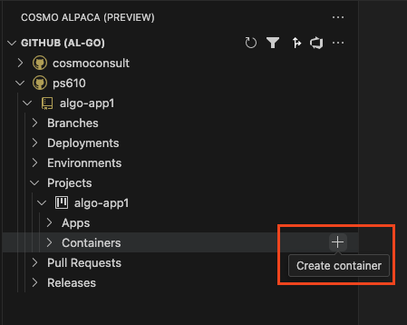
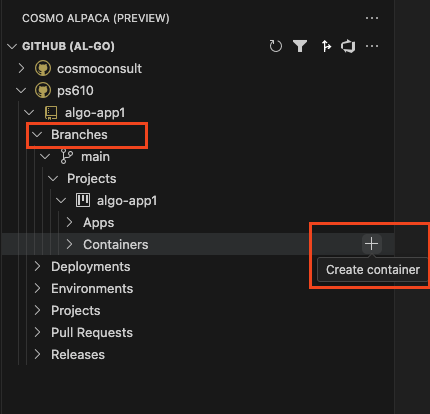

# Create Container

[!INCLUDE [Create Container Intro](../includes/create-container-intro.md)]

1. In the Visual Studio Code extension click on the **+** icon on the **Containers** node under the Project of your Repository.
1. Enter a name for your new container.
1. Wait until the container was created and is shown in the list. If someone else already used a similar container, this just takes a few seconds. Else this might take up to 20 minutes the first time.
1. After your container was created, the color of the icon shows the status of the container. The red icon indicates that the container is starting. As soon as the icon turns blue, the container is ready to access it.
1. You will now want to [create a configuration in your launch.json](../shared/create-launch-json.md) or [open the Web Client, terminal, file share or log](../azure-devops/open-container.md) of your container.

## Create a container with configuration from a specific branch

To test out a change in the [AL-Go settings](setup-al-go-settings.md) without affecting other users, you can create a container and use the configuration from a specific branch:

1. In the Visual Studio Code extension click on the **+** icon on the **Containers** node under the Branches and the Project of your Repository.
1. Enter a name for your new container and hit Enter.

Similar as when [creating a container the default way](create-container.md#create-container) you need to wait until the container is created and ready.

## Select a specific container configuration when creating a new container

<!-- TODO: Add content for the Preview extension -->
