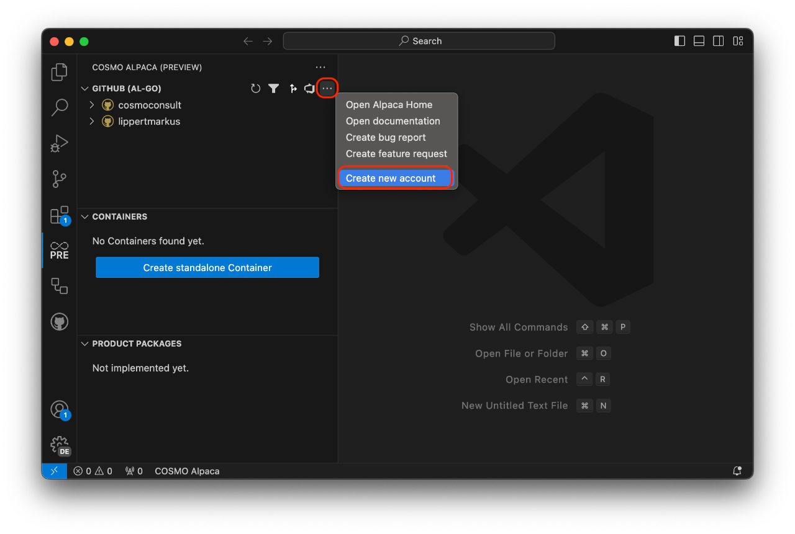

# Create GitHub Organization

If you haven't already, please [sign up for a GitHub account](https://github.com/join). Afterwards you can [sign in to the Alpaca VSC extension](../getting-started/setup-vsce.md).

We recommend that you use a GitHub organization to group all your repositories together. If you don't have an organization yet, you can use the action in COSMO Alpaca to create one or alternatively click [here](https://github.com/organizations/plan).

The free plan is sufficient to use COSMO Alpaca.

After setting up the GitHub organization, it should be visible within the VS Code extension after reloading the list. You can now continue and [create a repository and an app](create-app.md).
