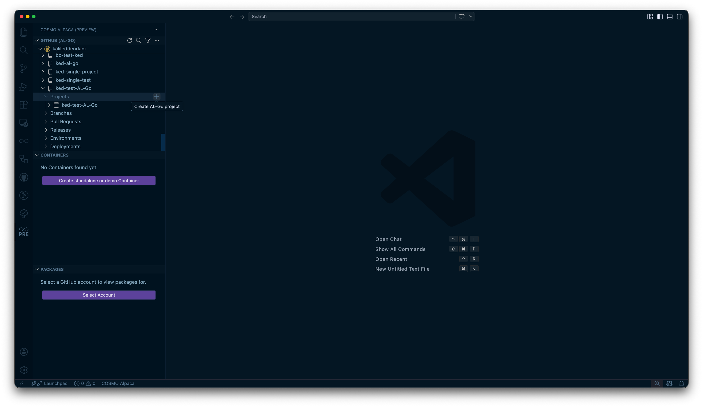

# Create AL-Go Project

In GitHub (AL-Go) you can cluster multiple apps into *projects*. *Projects* are just subfolders within your repository with one or many AL app directories. All apps within a project are usually shipped together. When [creating a new repository and app](create-app.md) the AL app folders by default are within the root of a repository. This is called a *single-project repository*.

In the Alpaca VSC extension the projects are listed underneath the repository:

Single-project repositories only have one project listed there that by default has the same name as the repository.

You can create a new project by clicking the **+** button on the *Projects* level. However, a popup will appear with the message: **"You need to create at least one app to create a new project. Please follow the wizard to create the app."**

This means you must first create an app and specify a new project name that doesn't exist yet. When [creating a new app](create-app.md) from within a project, that project will automatically be preselected.

[create-org]: ../getting-started/create-org-github.md
