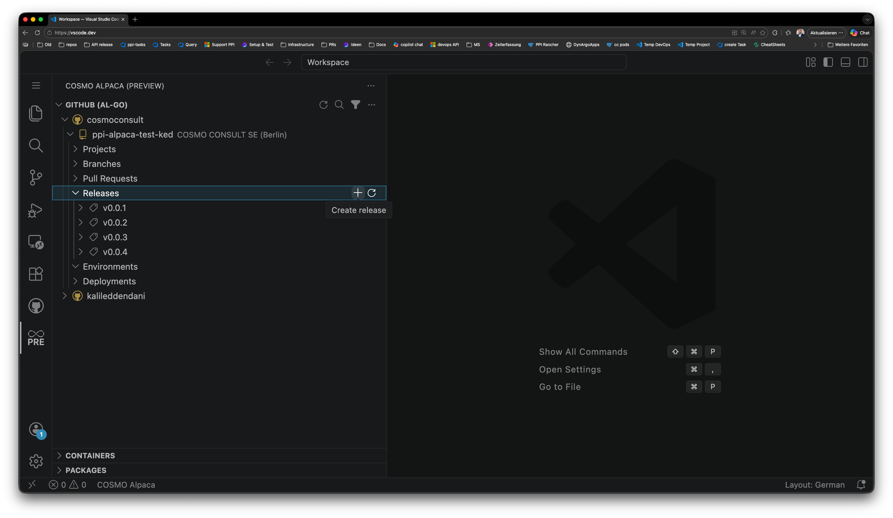
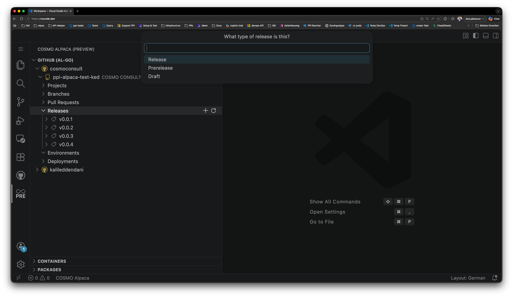
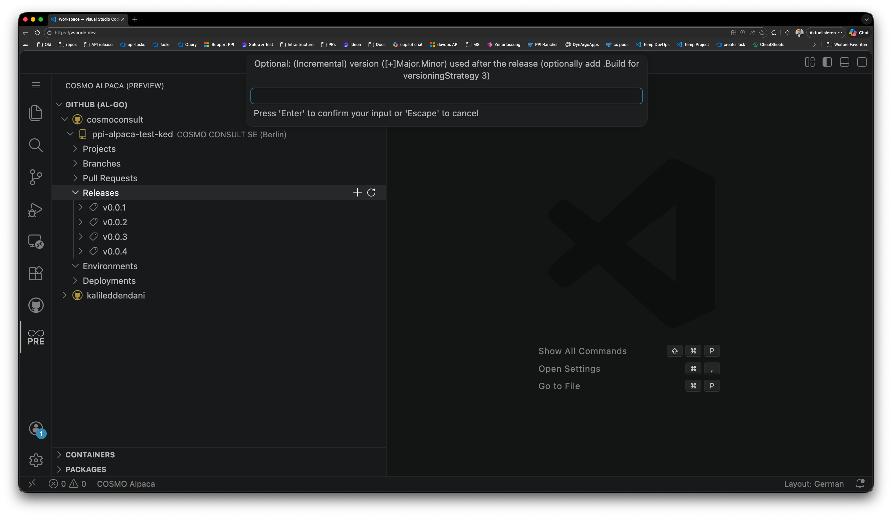
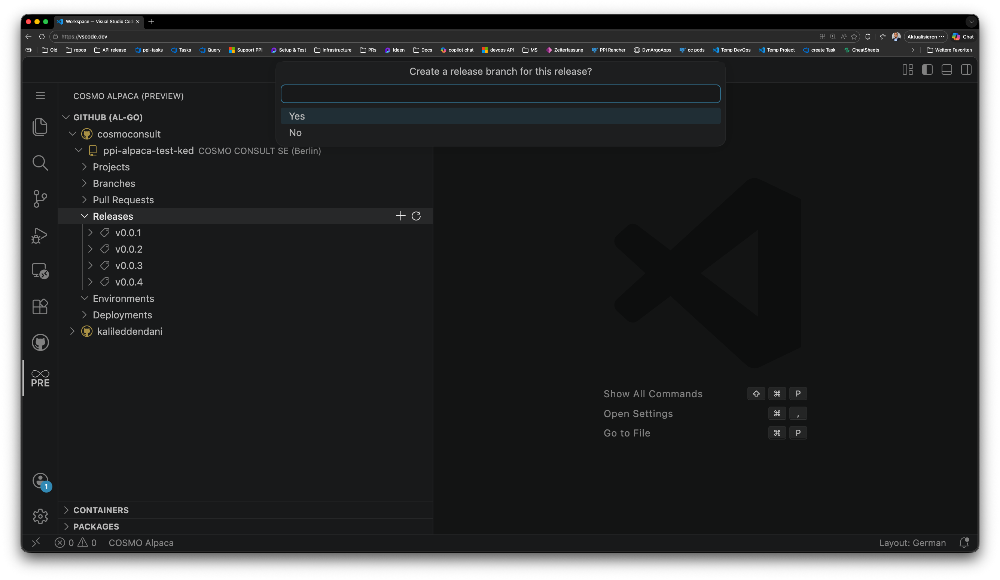
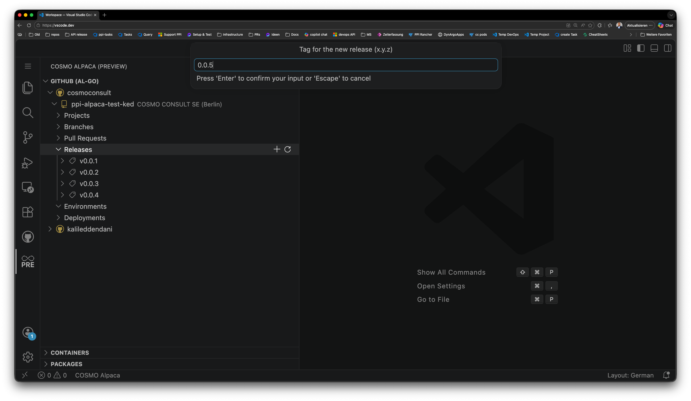
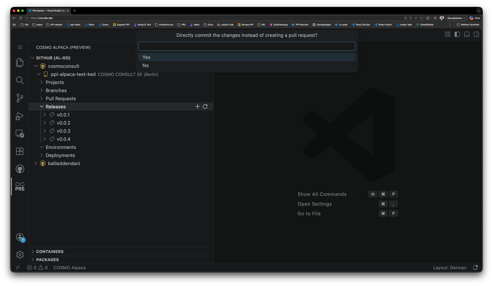

# Create Release

In COSMO Alpaca GitHub projects, releases are managed directly from the Visual Studio Code extension. A release triggers the AL-Go **Create Release** workflow, which builds and publishes a versioned artifact for the selected tag.

## How to create a release

### 1. Open the Releases section

In the COSMO Alpaca extension, expand your repository and navigate to **Releases**. Click the **+** button to start the release wizard.

### 2. Select the release type

Choose the type of release:

- **Release** — a standard production release
- **Prerelease** — marks the release as a pre-release (e.g. for beta versions)
- **Draft** — saves the release without publishing it

### 3. Review the versioning strategy

The wizard shows the versioning strategy currently configured for the repository. The tag format must match the strategy in use. See [Versioning Strategies](versioning-strategies.md) for details.

### 4. Create a release branch

Decide whether to create a dedicated release branch for this release. A release branch allows you to apply hotfixes after the release without affecting the main development branch.

- Select **Yes** to create a branch (e.g. `release/0.0.5`)
- Select **No** to release directly from the current branch

### 5. Enter the release tag

Enter the version tag for the release in `x.y.z` format. The tag will be created in the repository and used to identify this release.

### 6. Commit directly or create a pull request

Choose how the release changes should be committed:

- **Yes** — commits directly to the branch
- **No** — opens a pull request for review before the release is finalized

## What happens next

After confirming, the COSMO Alpaca extension triggers the AL-Go **Create Release** workflow in GitHub Actions. You can monitor the workflow run in the GitHub Actions tab of your repository.

Once the workflow completes successfully, the release appears under **Releases** in the extension and on GitHub.

## See also

- [Versioning Strategies](versioning-strategies.md)
- [Setup AL-Go Settings](setup-al-go-settings.md)
- [AL-Go Create Release workflow](https://github.com/microsoft/AL-Go/blob/main/Scenarios/CreateRelease.md)
