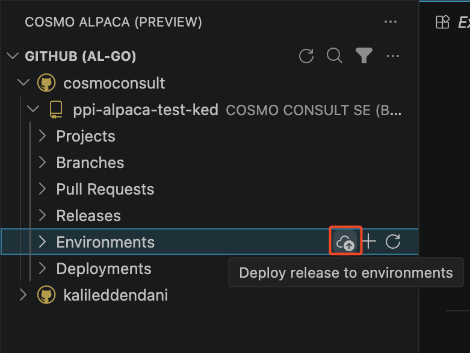
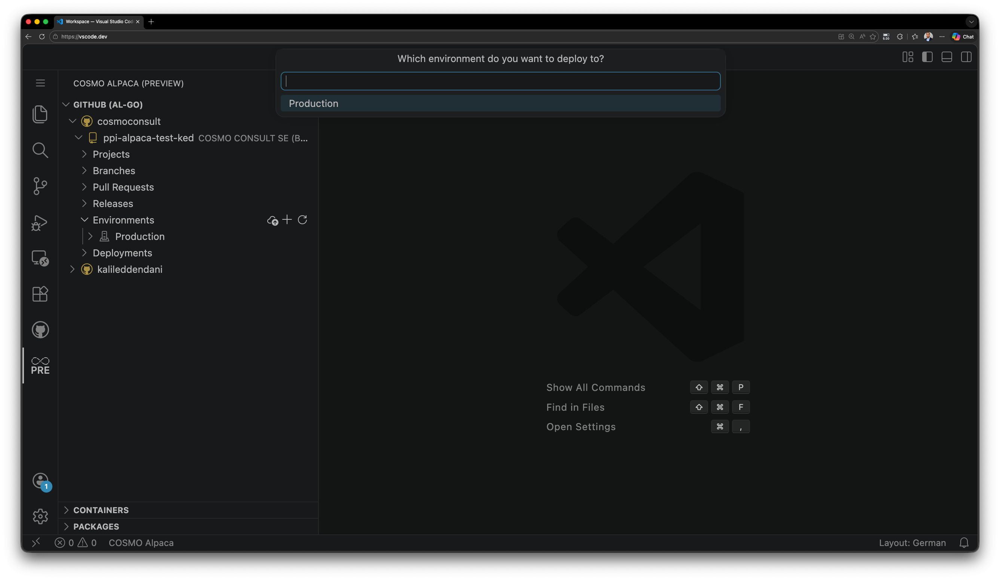
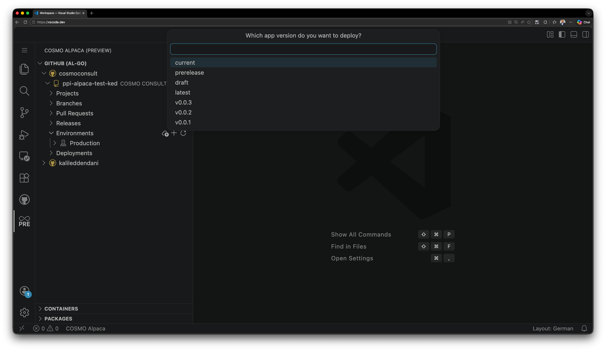
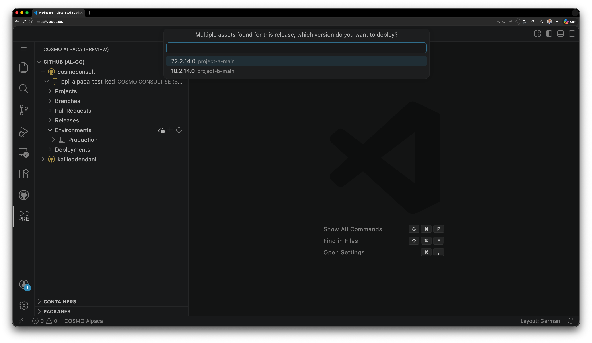

# Deploy App

After you [create a release](create-release.md) and [add at least one environment](add-environment.md), you can deploy a released app version to a specific target environment directly from the COSMO Alpaca extension.

## Prerequisites

- A GitHub repository configured for AL-Go
- At least one deployable source available in the repository (**Current**, **Prerelease**, **Draft**, **Latest**, or a specific release version)
- At least one configured deployment environment

## Important: Release assets, versions, and dependency order

In GitHub releases, artifacts are grouped by version.

For **single-project repositories**, this typically results in one selectable version per release.

For **multi-project repositories**, you can define `repoVersion` on project level (project AL-Go settings). In this case, one release can contain multiple asset versions. The deployment wizard in the COSMO Alpaca extension automatically groups projects by version and lets you select which project version you want to deploy.

To understand this setting in more detail, see:

- [AL-Go setting `repoVersion`](https://aka.ms/algosettings#repoversion)
- [Recommendations](recommendations.md#use-repository-version)

> [!IMPORTANT]
> Pay attention to deployment order when assets depend on each other. Deploy foundational or shared assets first, then dependent assets.

## Start deployment from VS Code

You can start the deployment wizard from two places in the extension:

- **Environments** (deploy directly to a selected environment, or let the wizard ask which environment to use)
- **Deployments** (start from the deployments view)

## Deployment wizard steps (from a specific environment)

### 1. Select the target environment

Choose the environment where the selected released version should be deployed.

### 2. Select the release

Choose the source you want to deploy:

- **Current**
- **Prerelease**
- **Draft**
- **Latest** (deploys the most recent successful CI/CD build)
- A specific GitHub release version (for example `v1.2.3`)

### 3. Select the asset version

If the selected release contains multiple asset versions (for example in a multi-project setup), select the version you want to deploy.

This step reflects the version grouping done by the extension.

## What happens next

After confirmation, the COSMO Alpaca extension triggers the AL-Go deployment workflow for the selected release asset and environment.

You can monitor the run in GitHub Actions. On success, the selected released version is installed in the target environment.

## See also

- [Create Release](create-release.md)
- [Add Environment](add-environment.md)
- [Versioning Strategies](versioning-strategies.md)
- [Setup AL-Go Settings](setup-al-go-settings.md)
