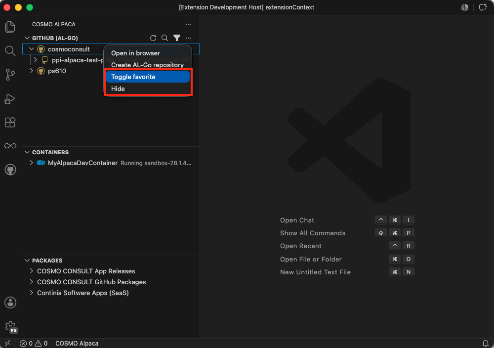
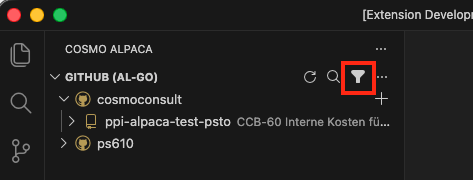

# Favorite or Hide Organizations & Repositories

In the list of organizations and repositories, you may over time see a lot of them and not all are relevant in your daily work anymore. To help with that, you can mark relevant ones as favorites or hide irrelevant ones. Favorites will have golden icons and hidden items will not be shown in the list, but you can always switch back to showing them.

If you want to favorite or hide an organization or repository, you can do that directly in the UI by right-clicking the organization or repository and selecting **Toggle favorite** or **Hide**:



This will add the organization or repository to the list of favorites or hidden items in the extension settings. If you want to edit the settings directly, you can do that in the extension settings as well:

1. Open the extension settings
2. Find the relevant setting under **COSMO Alpaca** and click on **Edit in settings.json** (as the settings are arrays, they need to be configured manually in the settings file)
   - **Visibility › GitHub › Accounts: Favorites**
   - **Visibility › GitHub › Repositories: Favorites**
   - **Visibility › GitHub › Accounts: Hidden**
   - **Visibility › GitHub › Repositories: Hidden**

## Setting Examples

```json
    "cosmo-alpaca.visibility.github.accounts.favorites": [
        "AlpacaDemoOrg1",
        "AlpacaDemoOrg2"
    ]
```

```json
    "cosmo-alpaca.visibility.github.repositories.favorites": [
        "AlpacaDemoRepo1",
        "AlpacaDemoRepo2"
    ]
```

```json
    "cosmo-alpaca.visibility.github.accounts.hidden": [
        "AlpacaDemoHidden"
    ]
```

```json
    "cosmo-alpaca.visibility.github.repositories.hidden": [
        "AlpacaDemoHiddenRepo"
    ]
```

You can additionally configure that only your favorites are visible. To do that either toggle the filter icon above the list view or configure the setting **COSMO Alpaca: Visibility › GitHub › Accounts: Only Show Favorites** accordingly.



```json
    "cosmo-alpaca.visibility.github.accounts.onlyShowFavorites": true
```

> [!NOTE]
> This will also affect the visibility of repositories, if you have configured favorite repositories then only those will be shown as well, otherwise all repositories will be shown.

If you change the settings manually, make sure to reload the window to see the changes reflected in the UI.