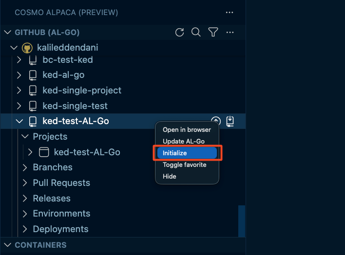

# Initialize Repository

Use **Initialize** on repository level to align an existing GitHub AL-Go repository with COSMO Alpaca requirements.

This is especially useful after onboarding existing repositories or after manual configuration changes.

## What Initialize does on repository level

When you run Initialize from the VS Code extension on a GitHub repository, this performs repository-level setup checks and applies configured standards.

## How to run Initialize

1. Open the repository in VS Code.
1. Right-click the target GitHub repository.

1. Select **Initialize**.
