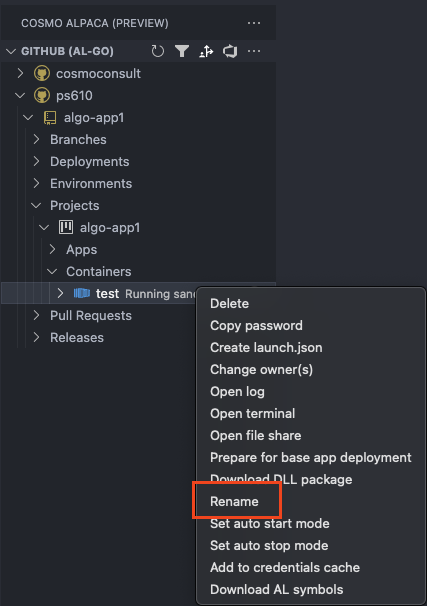

# Rename Container

If you want to rename a container, you can take the following steps:

> [!IMPORTANT]
> Renaming a container will restart the container if it runs.

1. Right-click on the container you want to rename
2. Select **Rename**
3. Confirm that you want to rename the container which will **restart a running container**.
4. Enter the new container name
5. The container is renamed and automatically restarted so the change is applied

