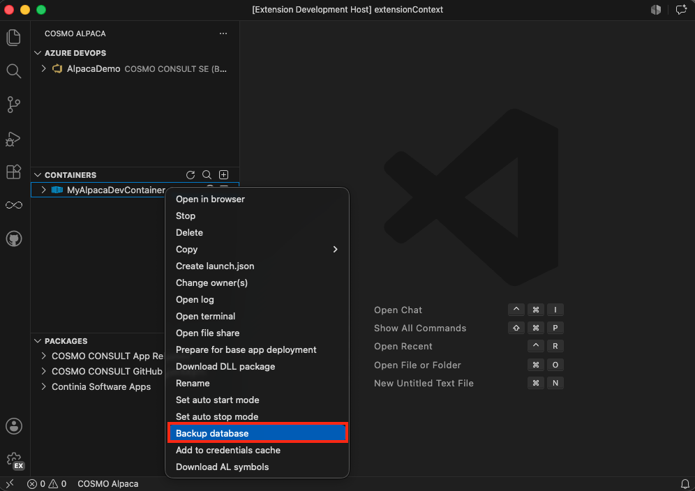

You can easily create backups of the one (single-tenant) or multiple (multi-tenant) databases in a container. You have to take the following steps to do that:

1. Right-click on the container and select **Backup database**
1. Enter the folder where the backup file(s) should be generated. Note that the folder path must start with `C:\azurefileshare\` and that the path will be created if it doesn't exist
1. Wait until the backup has finished.

You can then use your usual way to access the fileshare and work with the backup. _On Azure DevOps_ you can also use it to create a new container by specifying it as backup file (see [Setup Database Backup](../azure-devops/setup-bak.md)).

