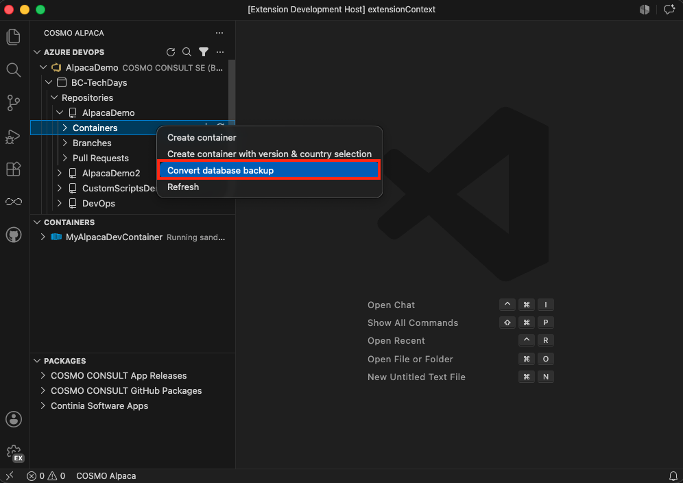

1. Upload the file to the Azure Fileshare directly in the root folder or in a subfolder (e.g. in a subfolder "backups" and the name of the file is "database-backup.bacpac")
1. Go to an organization, project and repository of your choosing. The conversion is not actually connected to the repository, but the container will appear below that repository.
1. Do a right-click on the **Containers** item and select **Convert database backup**
1. Enter the display name for the conversion container, e.g. "Backup Conversion"
1. Enter the path to your `.bacpac` file on the Azure Fileshare (e.g. `/fileshare/backups/database-backup.bacpac` or `C:\azurefileshare\backups\database-backup.bacpac`)
1. Optionally enter a company name if you want to remove all companies except that one during the conversion
1. When the container was created, you can do a right-click on it and select **Open log**
1. You can ignore the first couple of lines until you see "SQL Server ready"
1. Wait until you can see in the log that the SQL server is stopped again. Note that the conversion will take a couple of minutes even for smaller databases and can take hours for medium or large databases
1. You will find a file with the same filename, but extension `.bak` in the same folder as the original `.bacpac` file
1. Delete the conversion container
  
