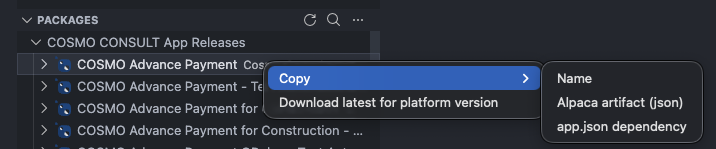
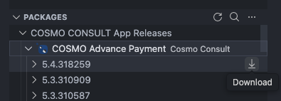

- Package level:
  - Download for platform: Download the latest package build compatible with a specific BC platform version.
  - Copy:
    - Package name
    - Alpaca artifact JSON *(snippet for [AL-Go configurations](../../github/setup-artifacts.md#nuget-feed) or [`cosmo.json`](../../azure-devops/setup-artifacts.md#nuget-feed))*
    - app.json dependency *(snippet for app.json dependencies)*
- Version level:
  - Download: Save the specific version
  - Download to AL package cache *(technical view)*: Extract directly into the AL package cache directory to make it available for immediate use in AL development, eliminating the need to download symbols.
  - Copy:
    - Package name
    - Alpaca artifact JSON *(snippet for [AL-Go configurations](../../github/setup-artifacts.md#nuget-feed) or [`cosmo.json`](../../azure-devops/setup-artifacts.md#nuget-feed))*
    - app.json dependency *(snippet for app.json dependencies)*

