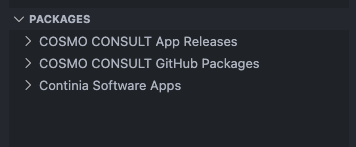

The Packages view allows you to browse Business Central NuGet feeds and view package and version information.

The feeds shown are configured in the backend. For example, for our COSMO users, we have feeds for our product and asset releases. We have also integrated the public feed from Continia.

> [!NOTE]
> If you would like to set up dedicated feeds for your users, please get in touch.
