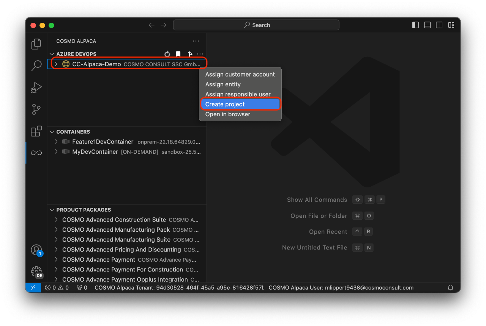

# Create Project

When working with Azure DevOps, you need an organization (see [create org][create-org]) and a project. To create a project, you need to take the following steps:

1. Right-click on the organization where you want to create a project and select **Create project**
1. Enter a name for the new project

With that, the new project will be created. It has all the basic setup and preparation needed to start working on a Business Central project including e.g. a repository for the CI/CD automation. In the background the following extensions will be installed in the Organization:

- [Code Search](https://marketplace.visualstudio.com/items?itemName=ms.vss-code-search)
- [Pull Request Merge Conflict Extension](https://marketplace.visualstudio.com/items?itemName=ms-devlabs.conflicts-tab)
- [Generic Connection Viewer](https://marketplace.visualstudio.com/items?itemName=achermyanin.credentials-viewer)
- [AL Language Syntax Highlights](https://marketplace.visualstudio.com/items?itemName=ms-dynamics-smb.allanghighlights)

You're now ready to [create a repository with an AL app](create-app.md).

[create-org]: ../../getting-started/create-org.md
