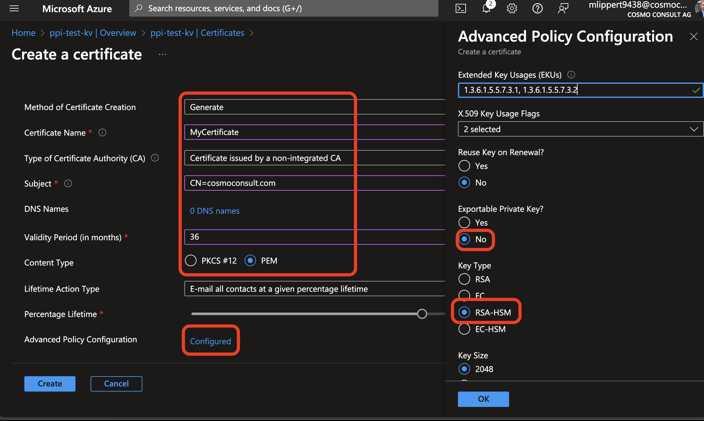
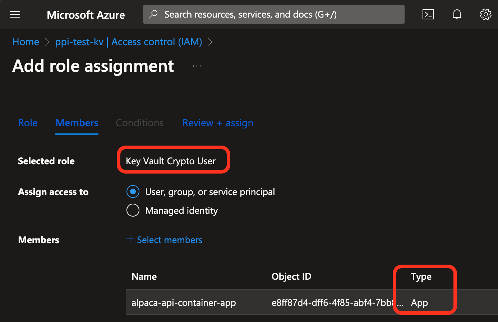

# Setup App Signing

# [**GitHub (AL-Go)**](#tab/github)
WIP

# [**Azure DevOps**](#tab/azdevops)

Alpaca supports code signing of the app package within the pipeline. For this you need to use the new HSM certificates in combination with an Azure KeyVault.

## Setting up the certificate with Azure KeyVault
1. Order a code signing certificate with HSM implementation to support Azure KeyVault (e.g. from [GlobalSign](https://support.globalsign.com/digital-certificates/digital-certificates-life-cycle/how-order-new-client-certificate)) and go through the verification process.
1. Create an Azure KeyVault with Premium Tier (which supports HSM certificates) and note the *Vault URI* and *Directory ID*
1. In the Azure KeyVault generate a new certificate. Fill out all the fields and make sure that under *Advanced Policy Configuration* you set the Key as non-exportable and the *Key Type* to "RSA-HSM":
    
1. Click the notification popping up, and download the CSR (certificate signing request)
1. Use the CSR at your certificate provider to get the signed certificate and upload it to the Azure KeyVault with the *Merge Signed Request* action.

## Accessing the certificate in the pipeline

1. Register a new Azure AAD Application and add a client secret to it. Note the application ID and the client secret.
1. On the Azure KeyVault, add a role assignment to the AAD Application with the role "Key Vault Crypto User": 
    
1. Go to the Azure DevOps Project where you want to use code signing and under *Pipelines > Library > CI Build Agent* add the following variables:
    - `SignApp.KvTenantId`: The Tenant/Directory ID of the Azure AD
    - `SignApp.KvUrl`: The URL of the Azure KeyVault (`https://<name>.vault.azure.net/`)
    - `SignApp.KvCertificate`: The name of the certificate in the Azure KeyVault
    - `SignApp.KvClientId`: The Application ID of the AAD Application
    - `SignApp.KvClientSecret`: The client secret of the AAD Application

---