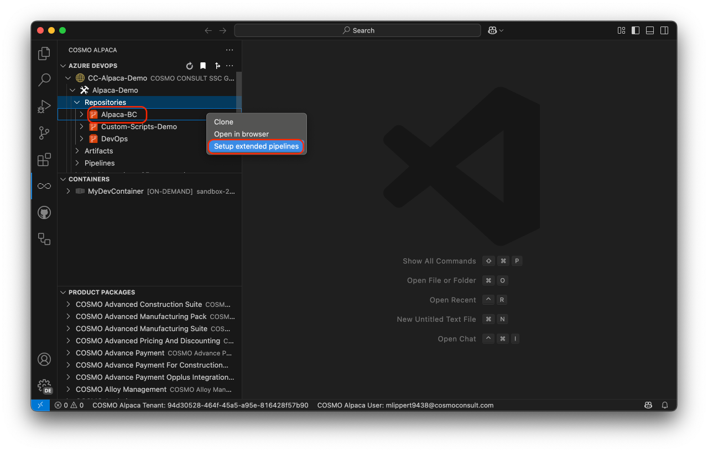
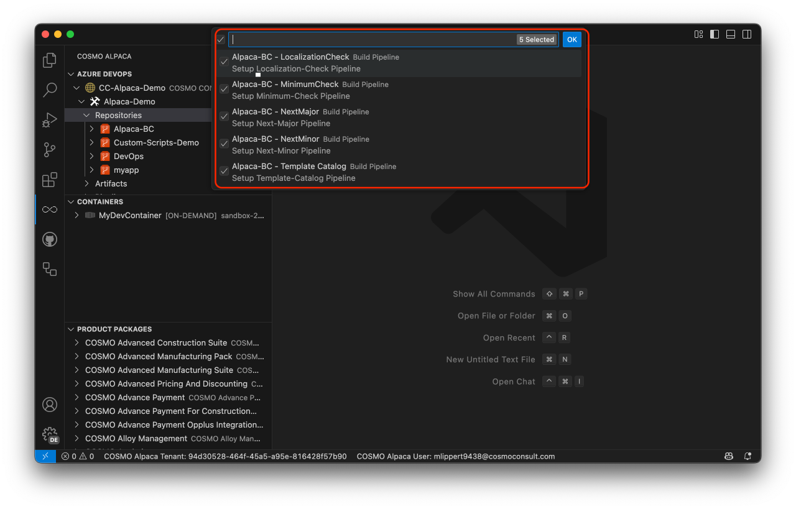

# Setup Next Major/-Minor, Localization, Minimum & other Pipelines/Workflows

# [**GitHub (AL-Go)**](#tab/github)
WIP

# [**Azure DevOps**](#tab/azdevops)

When setting up Next Minor, Next Major, Localization, Minimum or other Pipelines using VS Code and Azure DevOps, you need an organization (see [create org][create-org]), a project (see [create project][create-project]) and an app repository see [create app][create-app]. To create the pipeline(s), you need to take the following steps:

1. Right-click on the app-repository where you want to create the pipeline(s) and select "Setup extended pipelines"

    

1. Select the pipelines that you want to create and press "OK"

    

With that, the selected pipeline(s) will be created.

## Template Catalog pipeline

The template catalog pipeline can upload the content of a directory within your repository to an Azure Blob Storage container.

After setting up the pipeline you need to configure some more settings before the pipeline will run:

1. In your app repository under `.devops/azure-pipeline-template-catalog.yml` verify if `TemplateCatalog.SourcePath` and `TemplateCatalog.TargetBaseUrl` are correct and add a value for `TemplateCatalog.AppId` which will be appended to the path in `TemplateCatalog.TargetBaseUrl`.

1. In the variable group `CI Build Agent` add a secret variable `TemplateCatalog.SasToken` with a [SAS Token](https://learn.microsoft.com/en-us/azure/ai-services/translator/document-translation/how-to-guides/create-sas-tokens?tabs=Containers) (`sp=...`) for the Blob Storage container you set up in `TemplateCatalog.TargetBaseUrl`. The SAS token needs the following permissions:
    - Read
    - Add
    - Create
    - Write
    - Delete
    - List

With this now every change on the `main` branch will trigger the Template Catalog Pipeline and uploads the contents of `TemplateCatalog.SourcePath` to your Blob storage container.

---

[create-org]: ../getting-started/create-org.md
[create-project]: ../vsc-extension/create-project.md
[create-app]: ../vsc-extension/create-app.md
