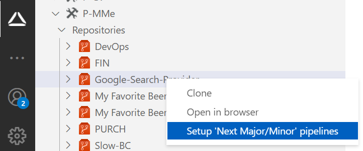
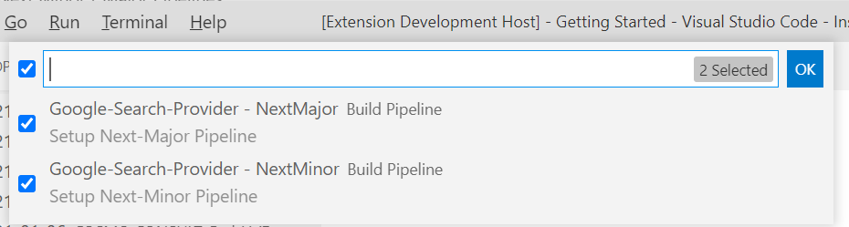

# Setup Next Major/-Minor, Localization & Minimum Pipelines/Workflows

# [**GitHub (AL-Go)**](#tab/github)
WIP

# [**Azure DevOps**](#tab/azdevops)

When creating a Setup Next Minor / Next Major / Localization / Minimum Pipelines using VS Code and Azure DevOps, you need an organization (see [create org][create-org]), a project (see [create project][create-project]) and an app repository see [create app][create-app]. To create the pipeline(s), you need to take the following steps:

1. Right-click on the app-repository where you want to create the pipeline(s) and select "Setup extended pipelines"

    

1. Select the pipelines that you want to create and press "OK"

    

With that, the pipelines files are added to your app-repository and the selected pipeline(s) will be created.

<video width="1280px" height="720px" controls>
  <source src="../media/vscode/vsce-setup-next-major-minor-pipelines.webm" type='video/webm; codecs="vp8, vorbis"'>
  Your browser does not support the video tag.
</video>

---

[create-org]: ../getting-started/create-org.md
[create-project]: ../vsc-extension/create-project.md
[create-app]: ../vsc-extension/create-app.md
