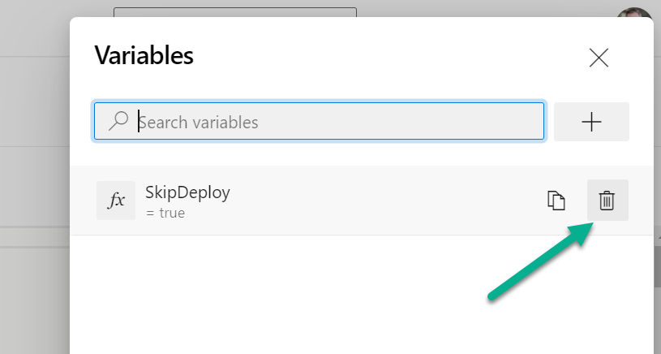

# Pipeline Variables

The Azure DevOps pipeline templates uses primary the settings from [`.devops/cosmo.json`][cosmo-json] in the respective source branch of your repository. These variables can be overruled by:

1. Variables in your **`CI Build Agent`** (Project-Scope) variable group (Azure DevOps Project | Pipelines | Library). Note: This variable group is included in each **Business Central** pipeline of the project, base on COSMO Templates.

1. Variables in your pipeline **`YAML` file** (Pipeline-Scope) (`.devops/azure-pipeline.yml`) in your app repository.

1. **Variables at your pipeline** (Pipeline-Scope):

    

    Variables at your pipeline are often used to change the pipeline behavior for a particular build. These variables should be removed immediately afterwards by:

    

These variables can change the default behavior the **build, test & deployment** of your Apps:

- Change the [BC Artifacts](#bc-artifacts) and [Additional Setup](#additional-setup)
- Change the behavior of the [Deployment Test](#deployment-test)
- Variables used during [Compile App](#compile-app) or for [Hybrid Development](#hybrid-development)
- Modify the [Test App](#test-app) behavior
- Variables to [Publish App](#publish-app), [Sign App](#sign-app), and run the [Deployment](#deployment) of your App

There are also some topics which might be relevant:

- Change the behavior of a [Build Job](#build-job)
- Collection of [Telemetry](#telemetry) information
- Variables used during container setup for [Container Application Insights](#container-application-insights)

## Container Environment

The variables to start/stop Build Agents at Container environment for the Build Pipeline are:

| Name | Default Value | Description |
|-|:-:|-|
|DockerSwarmURL||The URL for docker automation API.<br />**Note: Secret value is not supported**|
|DockerSwarmVersion|`0.11`|The current version of docker automation API.|

**Note:** Ensure your used container environment support the right version.

## BC Artifacts

The used BC-Artifacts are defined as [Artifacts][artifact] from [`cosmo.json`][cosmo-json]. The used [`cosmo.json`][cosmo-json] configuration is defined by variable `BC-Artifacts` direct in the pipeline yaml file (`.devops/azure-pipeline.yml`).

| Name | cosmo.json | Default Value | Description |
|-|-|:-:|-|
|**BC-Artifacts**  ||`current`              |The used BC-Artifact configuration version.|
|sas-bcinsider     ||                       |The this name to add a secret SaS-Token to access the MSFT BC-Insider Artifacts. The storage should be `bcinsider`.|
|sas-cosmoartifacts||                       |The this name to add a secret SaS-Token to access the COSMO Artifacts. The storage should be `cosmoartifacts`.|

## Additional Setup

[Artifacts][artifact] from [`cosmo.json`][cosmo-json] are downloaded and installed during container setup. Here are some variables to overrule the default behavior:

| Name | cosmo.json | Default Value | Description |
|-|-|:-:|-|
|AZURE-DEVOPS-PAT                  ||`$(System.AccessToken)`|The Personal Access Token with READ permission to Artifact Feed, used for Artifact Download from Artifact-Feed. Furthermore, the PAT is also used for authentication at the service to add/remove Build Agents.|
|ImportArtifacts.AppImportSyncMode |`appImportSyncMode`||The default (global) parameter for **Mode (NavAppSyncMode)** for [**Sync-NavApp**](https://docs.microsoft.com/en-us/powershell/module/microsoft.dynamics.nav.apps.management/sync-navapp) when an App-Artifact is imported by `AdditionalSetup` during `Docker Start` tasks. <br/>Values are: `Add`, `ForceSync`, ...|
|ImportArtifacts.AppImportScope    |`appImportScope`   ||The default (global) parameter for **Scope (NavAppScope)** for [**Publish-NavApp**](https://docs.microsoft.com/en-us/powershell/module/microsoft.dynamics.nav.apps.management/publish-navapp) when an App-Artifact is imported by `AdditionalSetup` during `Docker Start` tasks.<br/>Values are: `Global` or `Tenant`. |
|ImportArtifacts.SuppressWarnings  |`appImportSuppressWarnings`   ||The match string to suppress warnings during additional setup and log the message as an information. |
|ImportArtifacts.SuppressErrors    |`appImportSuppressErrors`   ||The match string to suppress errors during additional setup and log the message as an information. |

**Note:**
Suppress warning or error uses PowerShell to identify a suppressed message from logging. You can evaluate your variable content by modifying and using this PowerSell snippet: `"The log message" -match "$suppressWarnings"`.

Per example the variable `ImportArtifacts.SuppressWarnings` with value `license is not compatible|The package has been built on a server with a different` suppress these warnings:

- This license is not compatible with this version of Business Central.
- The package has been built on a server with a different version than the current server version.

## Deployment Test

The deployment test were introduced to detect breaking changes in pull requests. In case you need to change this behavior, add these variable(s) **temporary** as **Pipeline Variable**:


| Name | cosmo.json | Default Value | Description |
|-|-|:-:|-|
|DownloadArtifact.SkipLatest|   |`false`|`true` to skip download and install of the last D365BC artifact from target branch|

**Note:** Please do not forget to remove these **temporary** variable(s) after successful pull request!

Remove **Pipeline Variable** by:


## Compile App

| Name | cosmo.json | Default Value | Description |
|-|-|:-:|-|
|Compile.FailOnWarning       |                      |`false`|`true` to force builds without warnings|
|Compile.CreateTranslations  |`createTranslations`  |`false`|`true` to enable generation of translation files (.xlf) based on .g.xlf using [xliff-sync](https://www.powershellgallery.com/packages/XliffSync/1.8.0.0)|
|Compile.TranslationLanguages|`translationLanguages`|`de-DE`|Comma-separated list of language tags for which the translation files are to be generated (e.g. `de-DE,de-AT`)|

## Test App

| Name | cosmo.json | Default Value | Description |
|-|-|:-:|-|
|Test.ImportAction           |`testImportAction`           |`overwrite`   |(Only C/AL Hybrid) Specifies if the Testtoolkit ist overwriten during the run|
|Test.TestFilter             |                             |`50000..99000`|Specify the used test Codeunit IDs|
|Test.TestSuite              |`testSuite`                  |`DEFAULT`     |Allow to set the test suite that have to be run during the test process|
|Test.FailAction             |`testFailAction`             |`Warning`     |Allow to set the test fail action of the test process. `Warning` : your pipeline will only show warning on failed test, `Error` : If any of your test failed, the entire pipeline will failed.|
|Test.FailPublishOnFailedTest|`testFailPublishOnFailedTest`|`true`        |**Fail the task `Publish Test Results` if there are any test failures**. Check this option to fail the task if test failures are detected in the result files.|
|Test.RunAlways              |                             |`false`       |`true` to run tests regardless of the build reason|

## Publish App

These variable can change the *Publish App* behavior of your pipeline:

| Name | cosmo.json | Default Value | Description |
|-|-|:-:|-|
|Publish.Scope       |                      |`Global`     |The scope for publishing all apps: `Global` or `Tenant`|
|Publish.Tenant      |                      |`default`    |The tenant to publish the app.|
|CustomerLicense     |`customerLicense`     |             |The customer specific license (ignored, when empty)|
|CustomerLicenseScope|`customerLicenseScope`|`NavDatabase`|The license scope for customer license (`Default`, `NavDatabase`, `Master`, `Tenant`).|

## Deployment

The deployment is handled by default in a build on the **master** or **release** (e.g. `releases/r1`) branch. To change the behavior of deployment use:

| Name | cosmo.json | Default Value | Description |
|-|-|:-:|-|
|SkipDeploy                 |   |`false`|`true` to skip the artifact deployment to the Artifact Store|

### Artifact Feed

The COSMO pipeline templates uses the *Universal Package* artifact feed in Azure DevOps. You can overrule the default information used for *Artifact Upload* by setup these variables:

| Name | cosmo.json | Default Value | Description |
|-|-|:-:|-|
|Artifacts.Scope      |`artifactsScope` |`project`     |The scope of the artifact feed. (`organization` or `project`)|
|Artifacts.Feed       |`artifactsFeed`  |`$(System.TeamProject)` *project name* |The name of the artifact feed.|
|Artifacts.OrgFeed    |                 |              |The id of the organization scoped feed to publish artifacts to organization feeds.|
|ArtifactName.App     |                 |`Dynamics 365`|The name of the App-Artifact produced |
|ArtifactName.Sources |                 |              |The name of the Sources-Artifact, when source code should be published as Artifact. If empty, than no sources are published. |

***Note:** This might be necessary in manually projects when the naming convention does not fit to our COSMO defaults.*

### Publish Artifact Information

**Note:** If you want to disable this feature for **DSGVO** reasons, add **DisablePublishArtifactInformation = true** at Azure DevOps project level to your `CI Build Agent` variable group!

| Name | Default Value | Description |
|-|:-:|-|
|DisablePublishArtifactInformation||`true` to disable the pipeline from publishing the artifact information to a central endpoint.|

## Sign App

You can overrule the variables, used during *Signing the App* by using:

| Name | cosmo.json | Default Value | Description |
|-|-|:-:|-|
|SignApp.AppFilter           |                  |`*.app`        |(Only C/AL Hybrid) Specifies if the Testtoolkit ist overwriten during the run|
|SignApp.PfxPath             |                  |               |Path or Url of the PFX file. Recommended to use Azure-KeyVault secrets & Azure Blob Storage e.g. `https://azure.blob.com/myFile.pfx?sign=ada23...`|
|SignApp.TimeStampUri        |                  |`http://timestamp.comodoca.com/authenticode`|Uri of the timestamp service used during signing.|
|SignApp.PfxPassword         |                  |               |Password for the PFX File. Recommended to use Azure-KeyVault secrets.|

## Other Variables

### Build Job

Use this variables, when your build pipeline fails because the job limit is reached:

| Name | Default Value | Description |
|-|:-:|-|
|Build.TimeoutInMinutes|`60`|Build job timeout in minutes. Consider [**limitations**](https://docs.microsoft.com/en-us/azure/devops/pipelines/process/phases?view=azure-devops&tabs=yaml#timeouts).|

### Telemetry

The monitoring of our pipelines uses Application Insights. We collect information about the organization, project, BC-version, errors, and we measure the durations of tasks to improve our pipeline templates continuously.

**Note:** If you want to disable the monitoring for **DSGVO** reasons, add **DisableAppInsights = true** at Azure DevOps project level to your `CI Build Agent` variable group!

| Name | Default Value | Description |
|-|:-:|-|
|DisableAppInsights||`true` to disable the pipeline from COSMO monitoring.|
|PPI_MONITORING_PAT||Add a Personal Access Token with READ permission to your Azure DevOps to help PPI to get telemetry information from your pipeline / project|

### Container Application Insights

**Note:** BC15+ required

| Name | Default Value | Description |
|-|:-:|-|
|AppInsights.InstrumentationKey||InstrumentationKey to monitor your test with AppInsights|
|AppInsights.SqlLongRunningThreshold|`100`|Long Running Query threshold |

## Overruling by COSMO.json

When the configuration file `<App-Repo>/.devops/cosmo.json` exists, the following **variables are always overruled** during the pipeline run:

| Name | Description |
|-|-|
|LicenseFile      |URL to the license file. **Value like `$(devlic-bc16-de)` with reference to a [secret](../admin/index.md).** |
|CustomerLicense  |URL to the customer specific license file. **Value like `$(customer-lic)` with reference to a secret variable in a referenced variable groups is possible.** |
|Docker.Parameters|Parameters for the Build-Container|
|Artifacts.Feed   |Define the used artifact feed during **Publish Artifacts**.<br />The value is either `<project-name>/>feed-name>` (Project-Scoped-Feed) or `<feed-name>` (organization-Scoped-Feed) |

More information about `cosmo.json` ar [here][cosmo-json].

## Pipeline Setup Hooks

You can add optional pipeline tasks to the **main yaml-file** (`.devops/azure-pipeline.yml`) of your project. These added tasks will be included in the generated pipeline and placed after task `Setup Variables` and before task `Create Docker Container`.

Follow this example to add your Setup Build / Deployment tasks to `.devops/azure-pipeline.yml`:

```yaml
# ...
# --- Parameters to Extend the pipeline template -------------------------------------------------------------------------------------------------------
extends:
  template:             ${{ format('template.ci-build.pipeline.yaml{0}',       variables['template.repo.suffix']) }}
  parameters:
    BuildJobs:          ${{ format('template.jobs.build{0}.yaml',              variables['template.suffix']) }}
    DeploymentTestJobs: ${{ format('template.jobs.test-deployment{0}.yaml',    variables['template.suffix']) }}
    AgentPool:          ${{ variables['AgentPool'] }}
    StartStopAgentVM:   ${{ variables['StartStopAgentVM'] }}
    SkipTests:          ${{ variables['SkipTests'] }}
    DockerConnection:   ${{ variables['DockerConnection'] }}
    
    ### Additional Tasks for 'Setup Build':
    OnSetupBuildTasks:
      - script: |
          echo "On Setup Build"
        displayName: On Setup Build
    
    ### Additional Tasks for 'Setup Deployment':
    OnSetupDeploymentTasks:
      - script: |
          echo "On Setup Deployment"
        displayName: On Setup Deployment

    # ...
```

[cosmo-json]:      ../containers/setup-cosmo-json.md
[artifact]:        ../containers/setup-cosmo-json.md#artifact
[artifact-target]: ../containers/setup-cosmo-json.md#artifact-target
