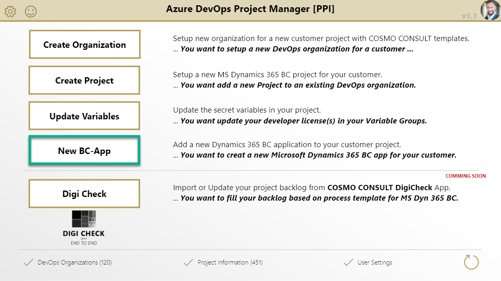
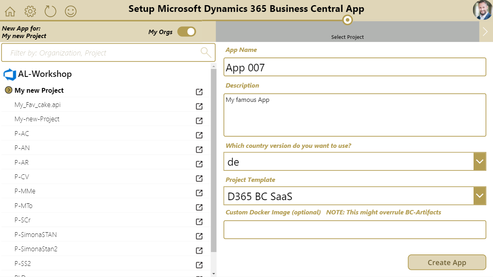

# Create App

Open the PowerApp and navigate to the "New BC-App" page.

1. Select your organization and project *Note: you can toggle on/off the "my Orgs" filter*
1. Enter a name for your new app *(Avoid special characters)*
1. Enter a description for your new project *optional*
1. Select the country version (e.g. `us`, `de`, ...)
1. Select the project template (SaaS, BC16 OnPrem, AMP, ...)
1. Specify an custom container image *(optional)*
1. Create the App by pressing **"Create App"**

The result is shown after execution.

You can watch a walkthrough here:

<video width="1280px" height="720px" controls>
  <source src="../media/powerapps/create-app.webm" type='video/webm; codecs="vp8, vorbis"'>
  Your browser does not support the video tag.
</video>

**Note:**

* The app name supports only with these characters: `a-z`, `A-Z`, `0-9`, `_`, `-`, `.`, and spaces
* The app name must be between 1..35 characters
