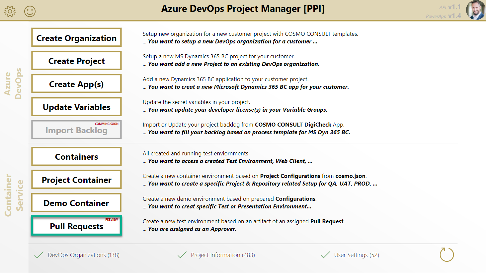
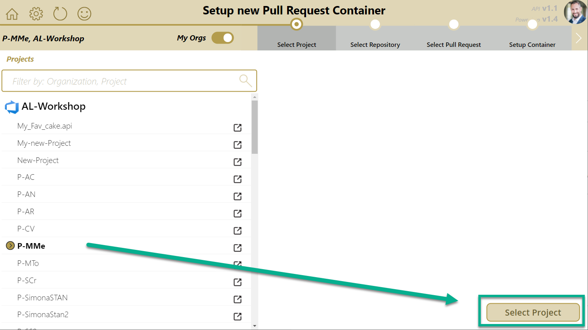
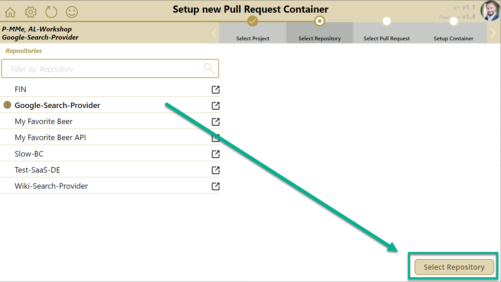
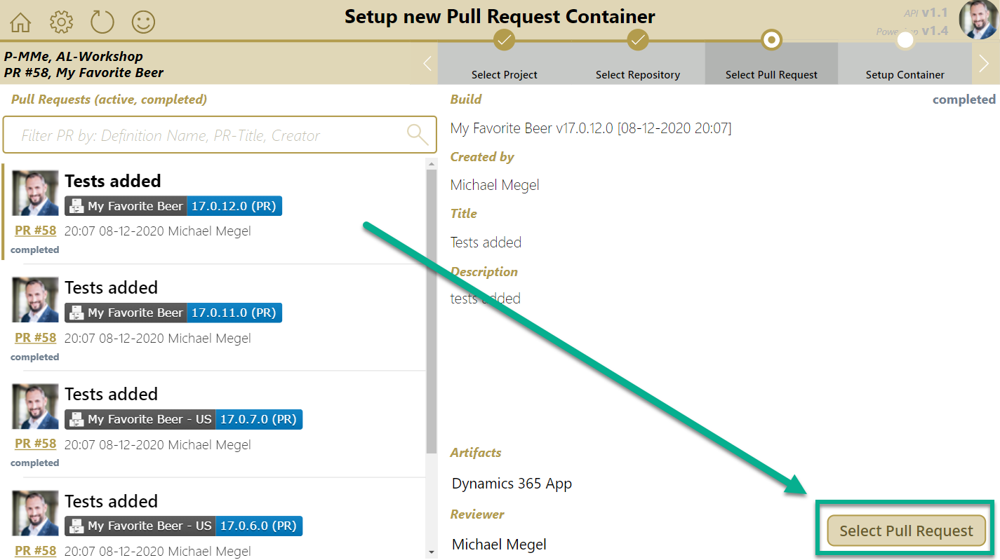
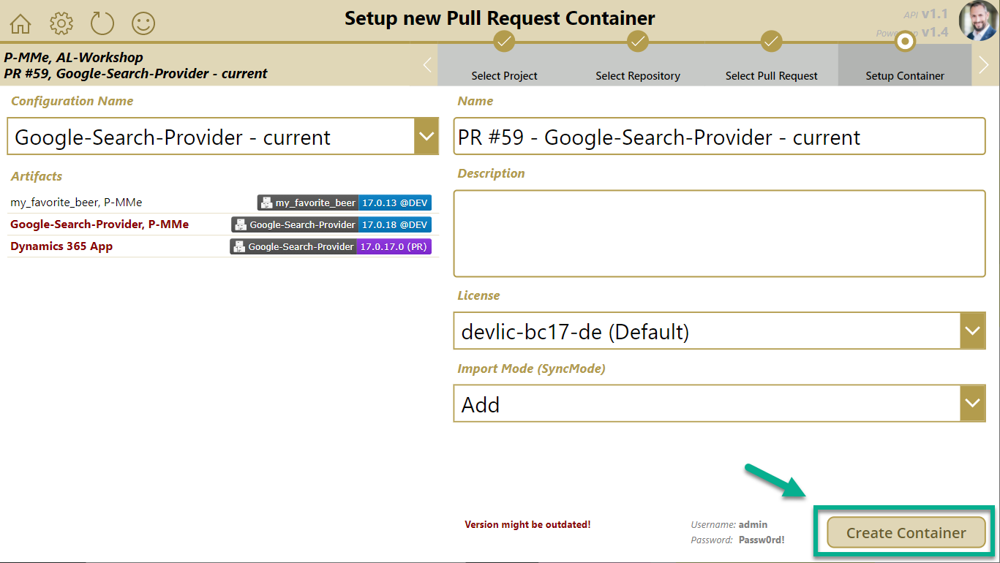
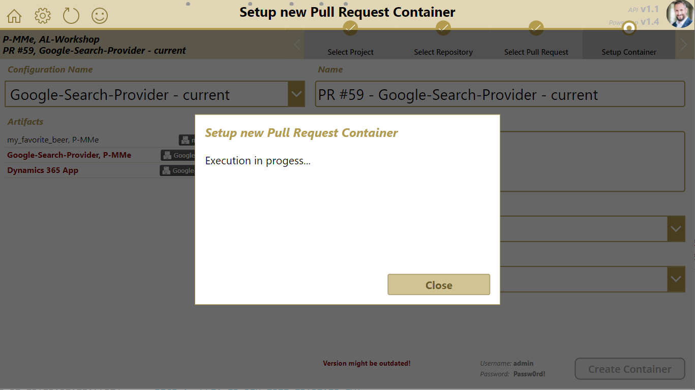
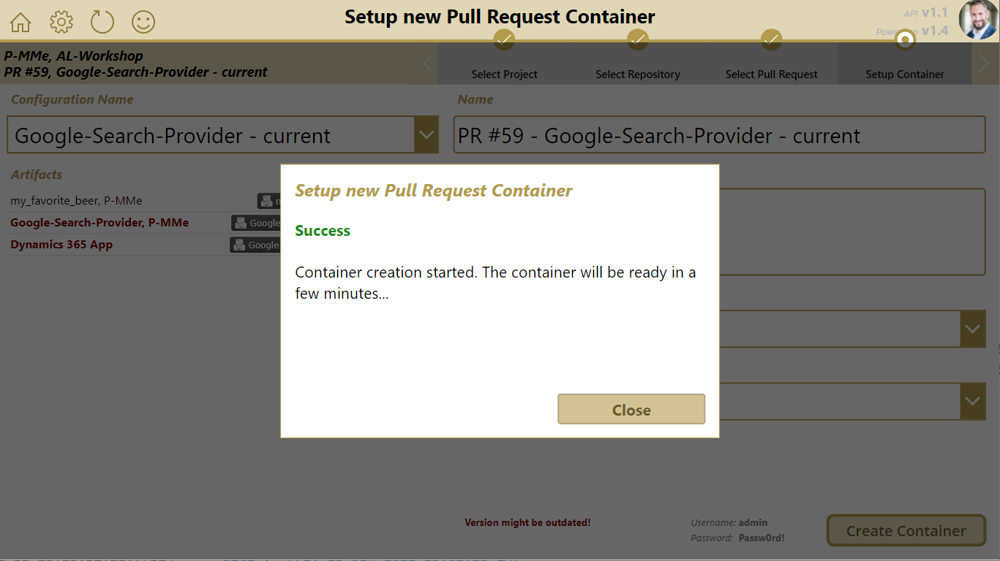

# Create Pull Request Test Environment

1. Open the PowerApp and navigate to the "Pull Request" page.
   

1. Select your organization and project *Note: you can toggle on/off the "my Orgs" filter ("my Orgs" are configured in "Settings")*
   

1. Select your App repository
   

1. Select your Pull Request ***Note:**
      * If your list is empty, please check your `Settings` to modify your **Pull Request Filter**.
      * The list shows **all** available **Pull Request builds** from all build pipelines of the selected repository.
   

1. Select and modify the container service configuration
   * Select your container configuration
   * Modify the name *(Avoid special characters)* *optional*
   * Modify the description *optional*
   * Change the license file *optional*
   * Change the Import Mode (SyncMode) *optional* *Note: This option effects currently the whole artifact as global option*

   

1. Create a new container service (The Organization / Entity specific environment is used)
   

1. The result is shown after execution.
   

You can watch a walkthrough here:

<video width="1280px" height="720px" controls>
  <source src="../media/powerapps/create-pr-container.webm" type='video/webm; codecs="vp8, vorbis"'>
  Your browser does not support the video tag.
</video>

**Note:**

* The container service name should be unique
* The container service configuration is based on:
  * [`cosmo.json`][cosmo-json] information from respective project repository
* Option `Import Mode (SyncMode)` effects currently all app-artifacts as global option for import

[cosmo-json]: ../containers/setup-artifacts.md#cosmojson
[artifact]: ../containers/setup-artifacts.md#artifact
[artifact-target]: ../containers/setup-artifacts.md#artifact-target
