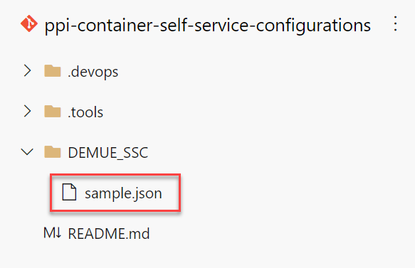
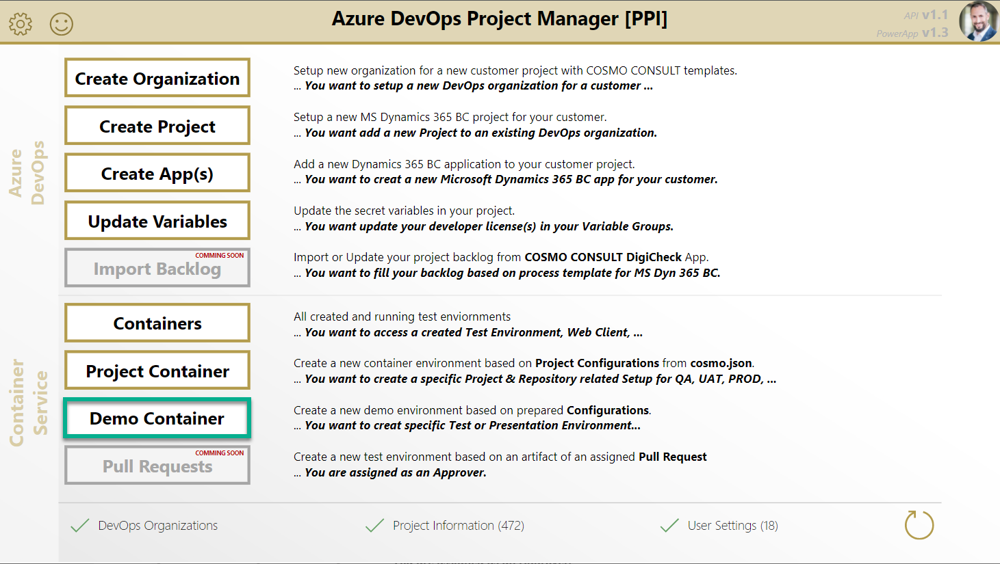
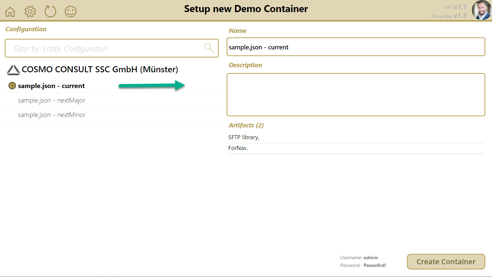
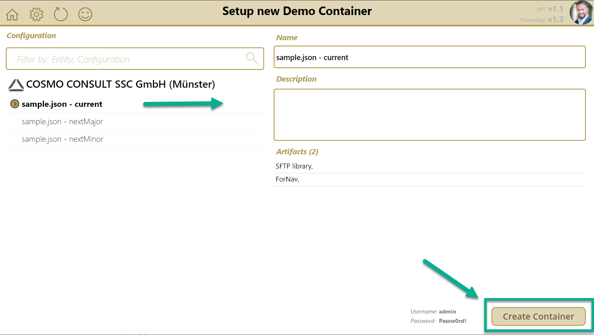
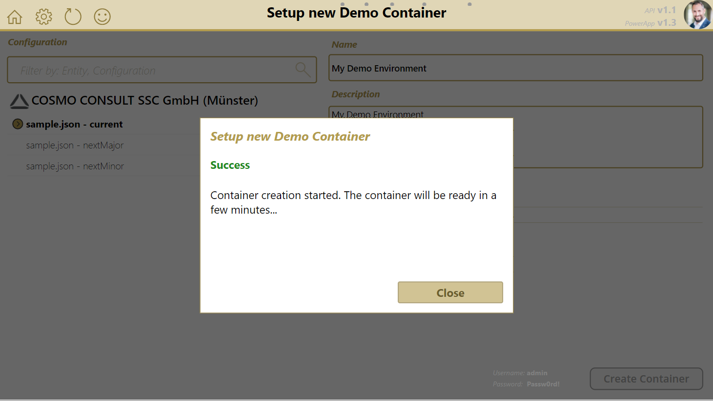

# Predefined Configurations for Demo Environments

Predefined container environment configuration are used for:

* Demo-Environment
* Trainings-Environment
* Test of new releases (Business Central, Products, ...)

This environments are based an a special setup of well known artifacts or database backups. Predefined Configurations are independent to Azure DevOps Organizations and Projects.

The configuration files are stored in the Git repository: [https://dev.azure.com/cc-ppi/General/_git/ppi-container-self-service-configurations](https://dev.azure.com/cc-ppi/General/_git/ppi-container-self-service-configurations)

## Add Predefined Configurations

Add a new Predefined Configuration to [https://dev.azure.com/cc-ppi/General/_git/ppi-container-self-service-configurations](https://dev.azure.com/cc-ppi/General/_git/ppi-container-self-service-configurations).

**Follow the instructions in [Readme](https://dev.azure.com/cc-ppi/General/_git/ppi-container-self-service-configurations?path=%2FREADME.md)**.

An example is shown here:



```json
{
    "name": "Demo Environment",
    "description": "My Demo Configuration with Amazing Apps",
    "dockerMemoryGb": 6,
    "licenseFile": "$(devlic-bc16-de)",
    "licenseScope": "NavDatabase",
    "artifacts": [
        // See at cosmo.json documentation
    ],
    "devopsArtifacts": [
        // See at cosmo.json documentation
    ],

    "bcArtifacts": {
        "BC 16": {
            "version": "16",
            "type":    "onprem",
            "country": "de",
            "storageAccount": "bcartifacts",
            "sasToken": "",

            "artifacts": [
                // See at cosmo.json documentation
            ],
            "devopsArtifacts": [
                // See at cosmo.json documentation
            ]    
        }
    }
}
```

**Note:**

* The environment configuration files are `json-format` and based on [**`cosmo.json`**][cosmo-json] definition.
* The directory of a configuration file define the used default environment.
* Each configuration file can result in multiple Predefined Configurations because, each item in `bcArtifacts` is one container configuration. You can use this to setup a specific demo for different Business Central versions like BC16, BC17, ...
* Supported Variables are:
  * License File variable notation like `$(devlic-bc16-de)`

### Naming Example

The following configuration snippet shows an example:

```json
{
    // ...
    "name": "Demo Environment",
    "entityCode": "DEBER_GMBH",
    // ...
    "bcArtifacts": {
        "BC 15": {
            "version": "15",
            "type":    "onprem",
            // ...
        },

        "BC 16": {
            "version": "16",
            "type":    "onprem",
            // ...                
        }
    },
    // ...
}

```

This file contains 2 configurations (`"entityCode": "DEBER_GMBH"`) for COSMO entity "COSMO CONSULT GmbH (Berlin)":

* "Demo Environment - BC15" because `"name": "Demo Environment"` and `"bcArtifacts": { "BC 15": { ... } }`
* "Demo Environment - BC16" because `"name": "Demo Environment"` and `"bcArtifacts": { "BC 16": { ... } }`

## Create a Demo Environment

1. Open the PowerApp and navigate to the "Demo Container" page.
   

1. Select your container service configuration
   * Select your container configuration
   * Modify the name *(Avoid special characters)* *optional*
   * Modify the description *optional*

   

1. Create a new container service (The Organization / Entity specific Self-Service Environment is used)
   

1. The result is shown after execution.
   

You can watch a walkthrough here:

<video width="1280px" height="720px" controls>
  <source src="../media/powerapps/create-demo-container.webm" type='video/webm; codecs="vp8, vorbis"'>
  Your browser does not support the video tag.
</video>

___

**Note:**

* The container service name should be unique
* The container service configuration is based on:
  * [`cosmo.json`][cosmo-json] information from respective project repository

[cosmo-json]:      ../containers/setup-cosmo-json.md
[artifact]:        ../containers/setup-cosmo-json.md#artifact
[artifact-target]: ../containers/setup-cosmo-json.md#artifact-target
