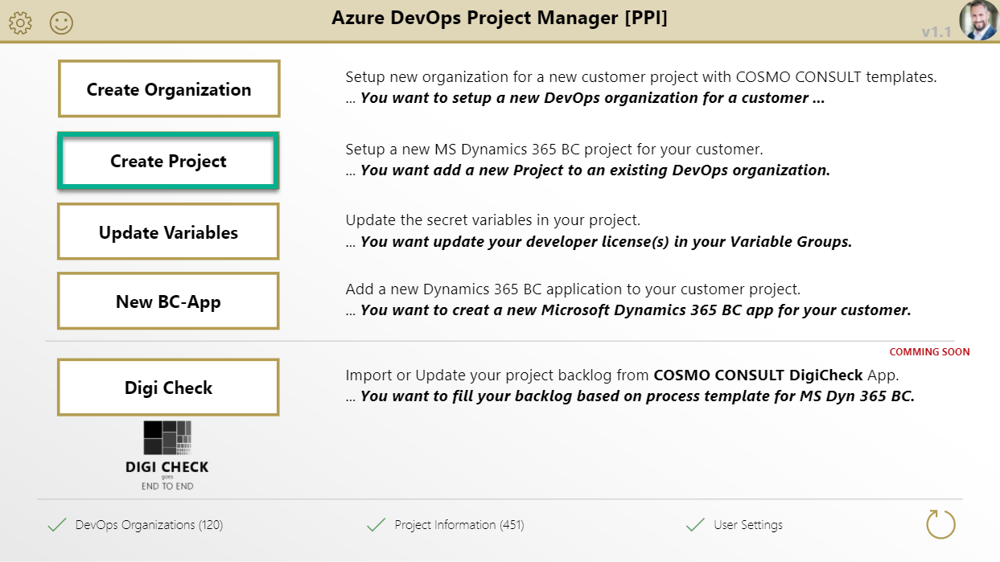
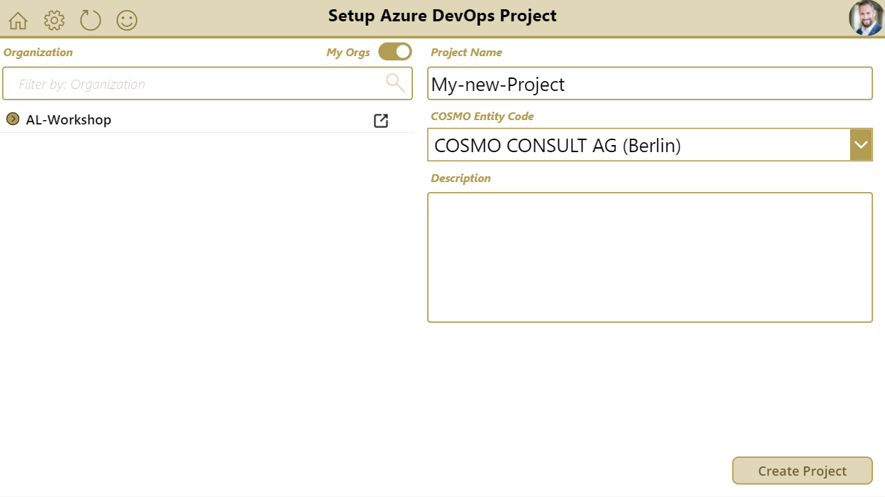

# Create Project

Open the PowerApp and navigate to the "Create Project" page.

1. Select your organization *Note: you can toggle on/off the "my Orgs" filter*
1. Enter a name for your new project *(Avoid special characters)*
1. Select the COSMO Entity (This define the Self-Service Enwironment, where this Build Automation will run)
1. Enter a description for your new project *optional*
1. Create the project by pressing **"Create Project"**

The result is shown after execution.

You can watch a walkthrough here:

<video width="1280px" height="720px" controls>
  <source src="../media/powerapps/create-project.webm" type='video/webm; codecs="vp8, vorbis"'>
  Your browser does not support the video tag.
</video>

**Note:**

* The project name supports only with these characters: `a-z`, `A-Z`, `0-9`, `_`, `-`, `.`
