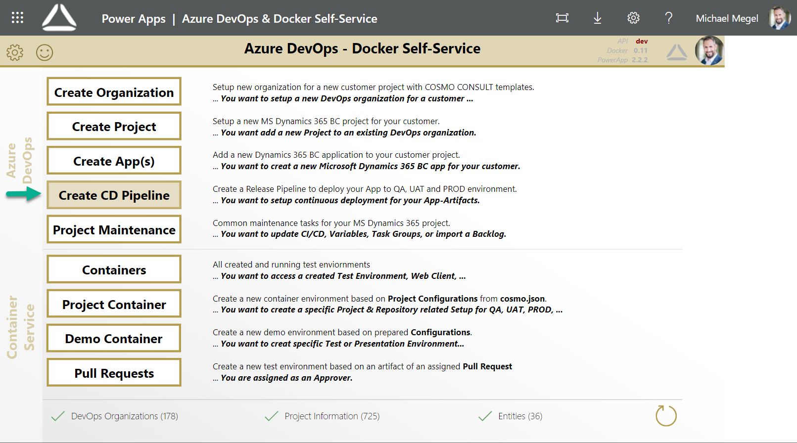
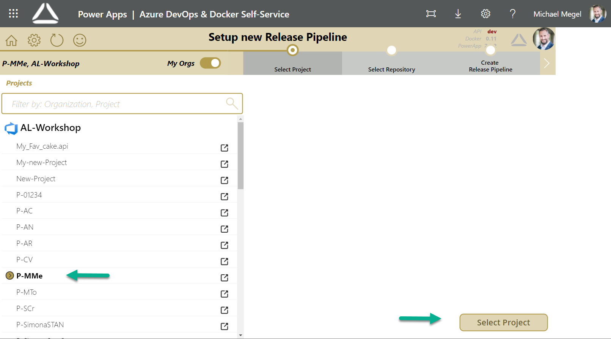
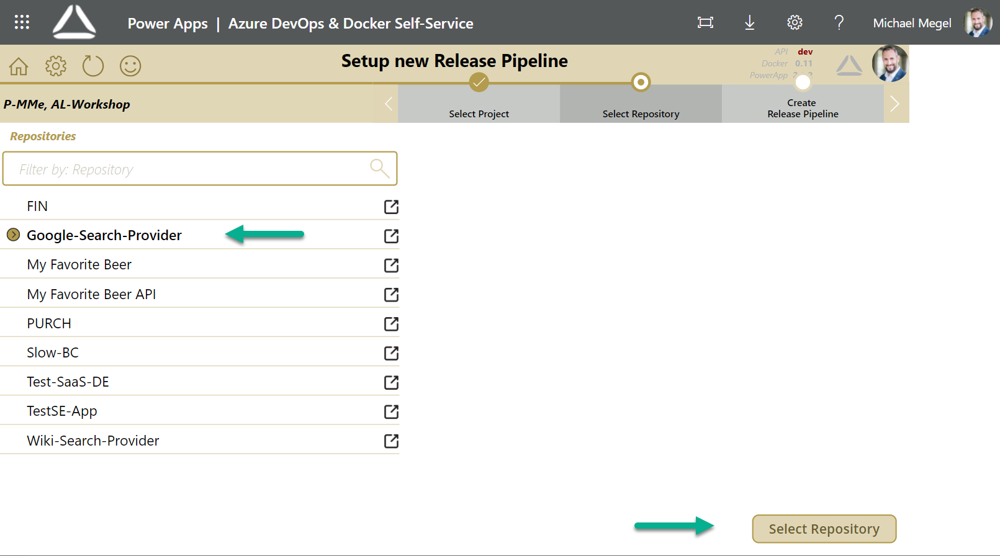
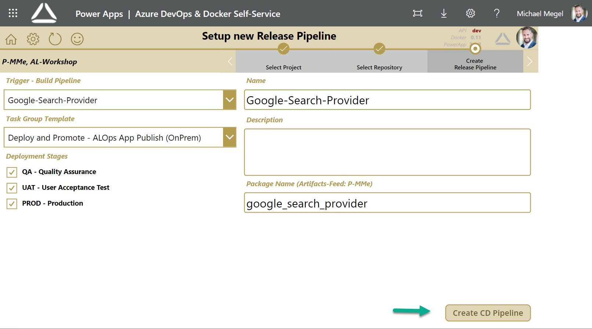

# Create a release pipeline for your app

When creating a release pipeline for your app using COSMO Alpaca, you need an organization (see [create org][create-org]), a project (see [create project][create-project]), an app repository (see [create app][create-app]) and the imported task groups (see [update task groups][update-task-groups]). To create a release pipeline for your app, you need to take the following steps:

1. In COSMO Alpaca click on **Create CD Pipeline**.

    

1. Select the project that you want to use

    

1. Select the app repository that you want to use

    

1. Configure pipeline your release pipeline
    * Select the trigger pipeline of your app that you want to use
    * Select the task group template that you want to use to deploy your app
    * Select the release stages that you want to use
    * Enter a name for your release pipeline
    * Add a description for your release pipeline
    * Enter the name of the package (artifact) that you want to use
    * Click on **Create CD Pipeline**

    

With that, a new release pipeline will be created. It has all the basic setup and preparation needed to setup the deployment for your app.

<video width="1280px" height="720px" controls>
  <source src="../media/powerapps/create-release-pipeline.webm" type='video/webm; codecs="vp8, vorbis"'>
  Your browser does not support the video tag.
</video>

[create-org]: ../getting-started/create-org.md
[create-project]: create-project.md
[create-app]: create-app.md
[update-task-groups]: update-task-groups.md
