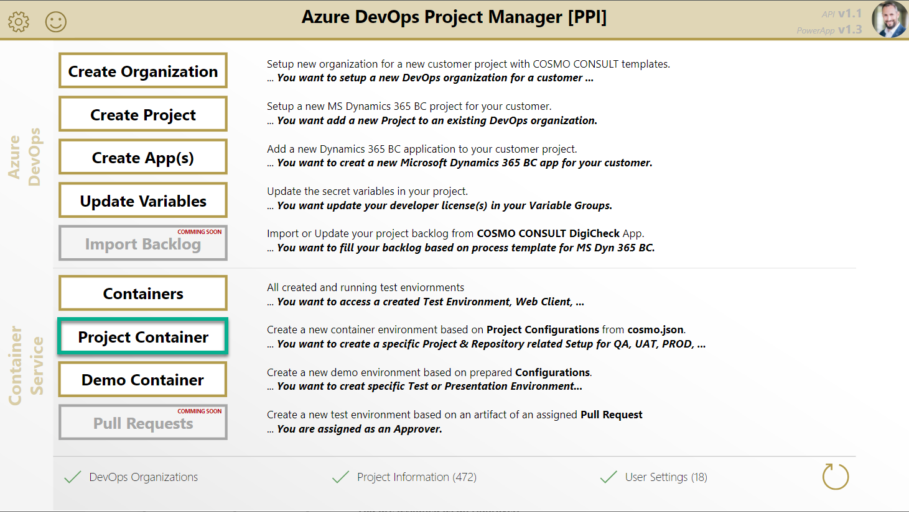
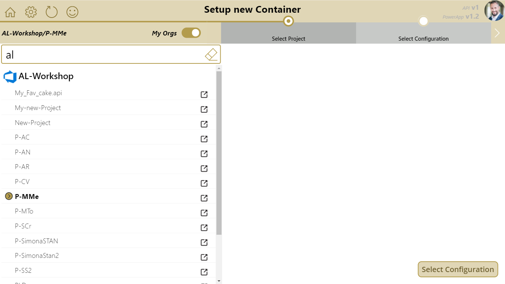
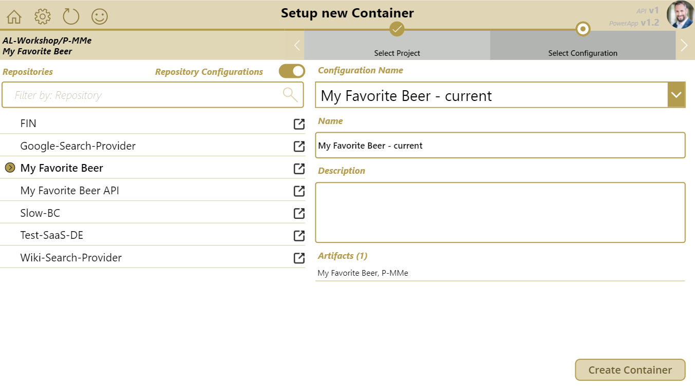
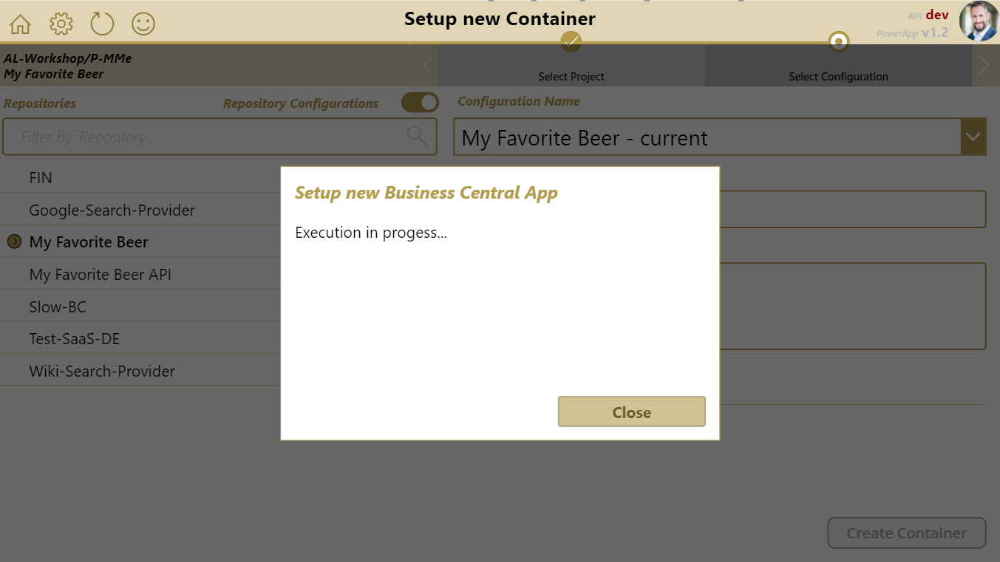
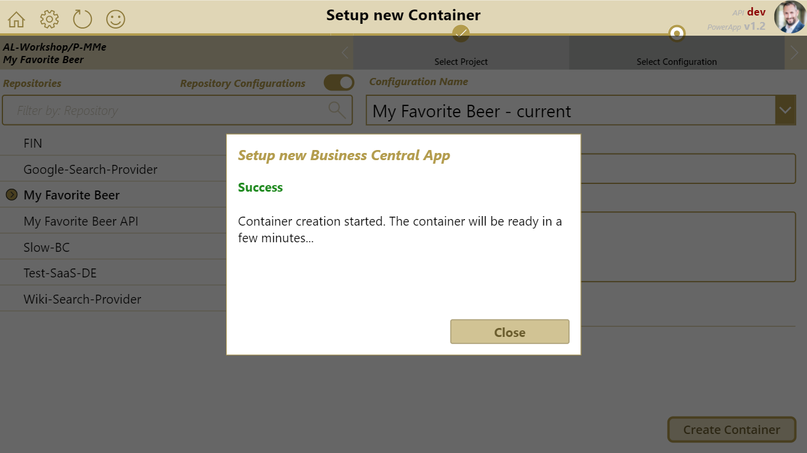

# Project Container Environment

A Project Container Environment is used for Project related test scenarios. You can create containers for testing based on the **`cosmo.json`** setup in your App-Repositories of your Azure DevOps Project.

Each App-Repository provide a specific App related configuration in the **`.devops/cosmo.json`** file as follows:

```json
{
    "name": "Demo Environment",
    "description": "My Demo Configuration with Amazing Apps",
    "dockerMemoryGb": 6,
    "licenseFile": "$(devlic-bc16-de)",
    "licenseScope": "NavDatabase",
    "artifacts": [
        // See at cosmo.json documentation
    ],
    "devopsArtifacts": [
        // See at cosmo.json documentation
    ],

    "bcArtifacts": {
        "BC 16": {
            "version": "16",
            "type":    "onprem",
            "country": "de",
            "storageAccount": "bcartifacts",
            "sasToken": "",

            "artifacts": [
                // See at cosmo.json documentation
            ],
            "devopsArtifacts": [
                // See at cosmo.json documentation
            ]    
        }
    }
}
```

`bcArtifact` contains multiple container configurations for test scenarios. Common configurations are:

* **current** is the specification of the current development target. This environment **is used for the Build Environment** as well.
* **nextMinor** is the specification of the *next minor* release (Insider Preview) of Business Central to **detect breaking changes** in optional nightly/weekly builds.
* **nextMajor** is the specification of the *next major* release (Insider Preview) of Business Central to **detect breaking changes** in optional nightly/weekly builds.

You can also add own/additional container specifications to `bcArtifact` to provide other test environments by PowerApp.

## Create Project Test Environment

1. Open the PowerApp and navigate to the "Project Container" page.
   

1. Select your organization and project *Note: you can toggle on/off the "my Orgs" filter ("my Orgs" are configured in "Settings")*
   

1. Select and modify the container service configuration
   * Select a repository *optional*
   * Select your container configuration
   * Modify the name *(Avoid special characters)* *optional*
   * Modify the description *optional*

   

1. Create a new container service (The Organization / Entity specific Self-Service Environment is used)
   

1. The result is shown after execution.
   

You can watch a walkthrough here:

<video width="1280px" height="720px" controls>
  <source src="../media/powerapps/create-test-container.webm" type='video/webm; codecs="vp8, vorbis"'>
  Your browser does not support the video tag.
</video>

**Note:**

* The container service name should be unique
* The container service configuration is based on:
  * [`cosmo.json`][cosmo-json] information from respective project repository

[cosmo-json]:      ../containers/setup-cosmo-json.md
[artifact]:        ../containers/setup-cosmo-json.md#artifact
[artifact-target]: ../containers/setup-cosmo-json.md#artifact-target
