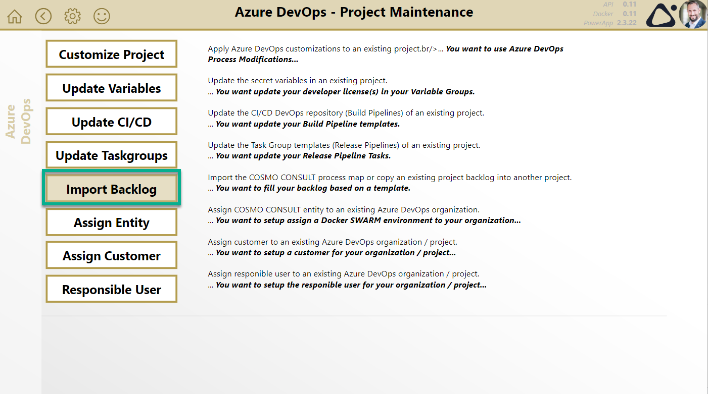
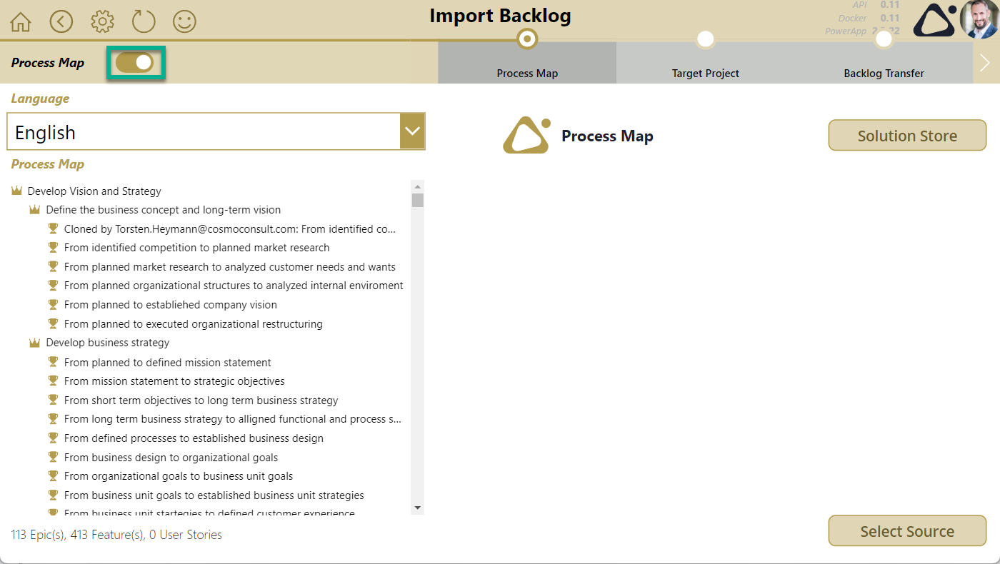
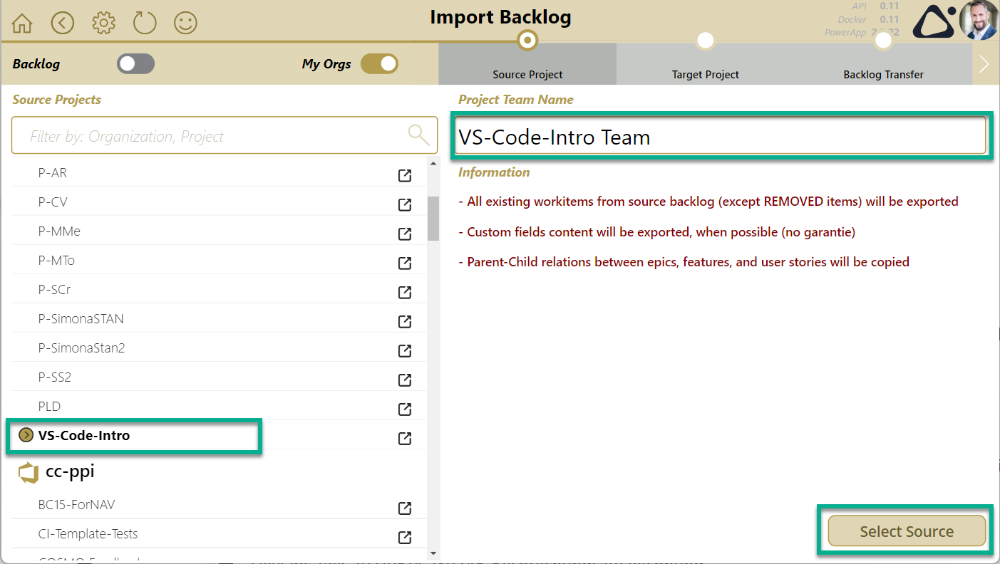
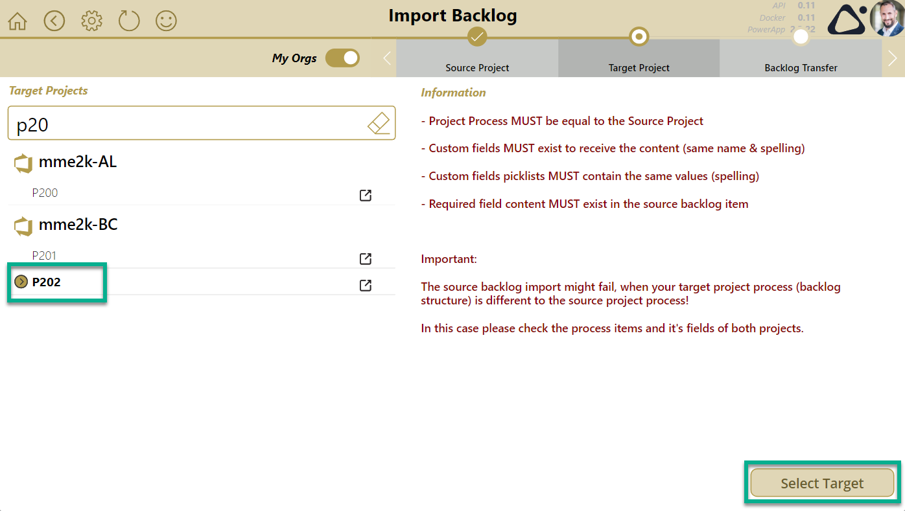
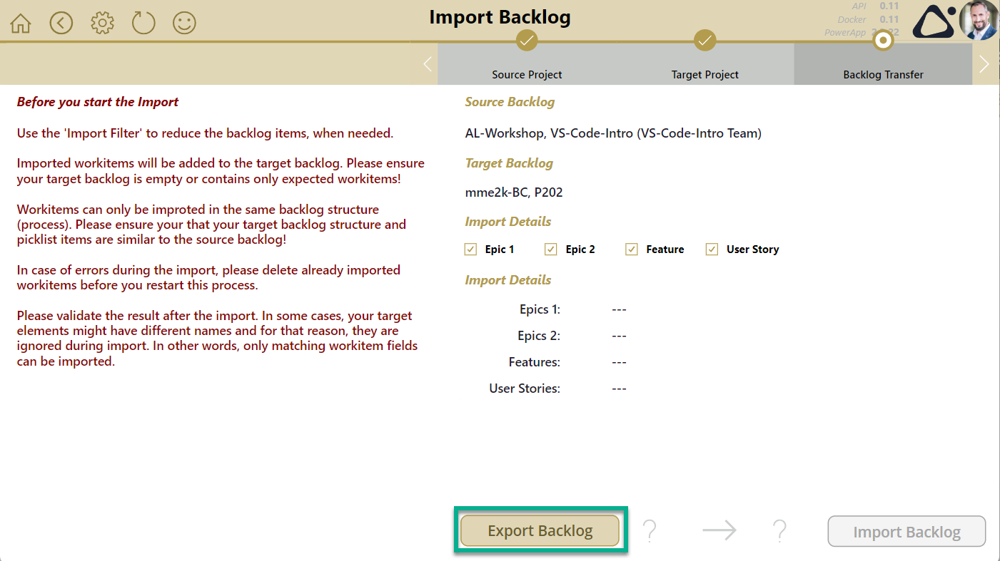
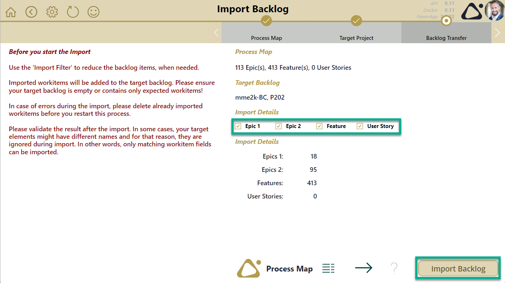
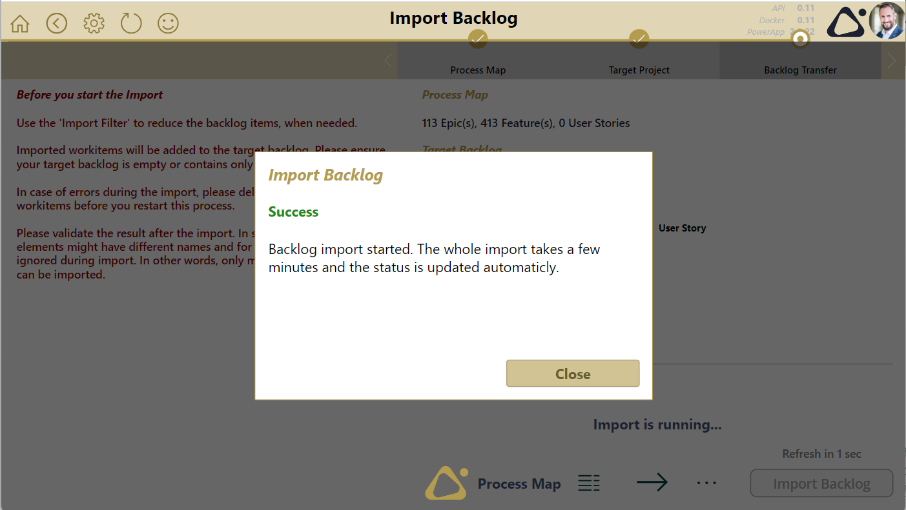
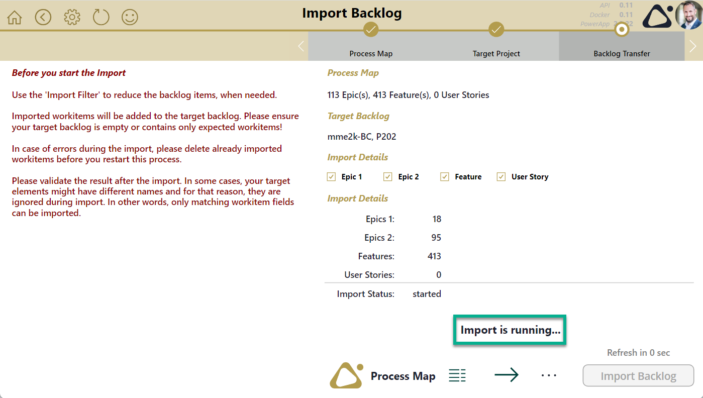
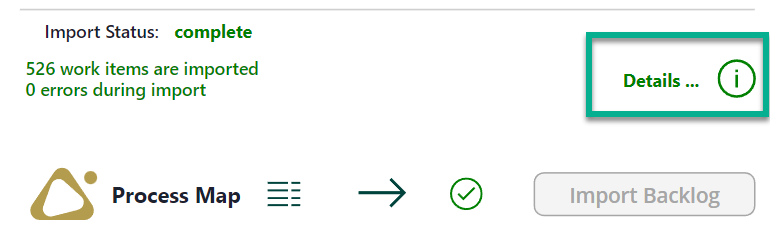
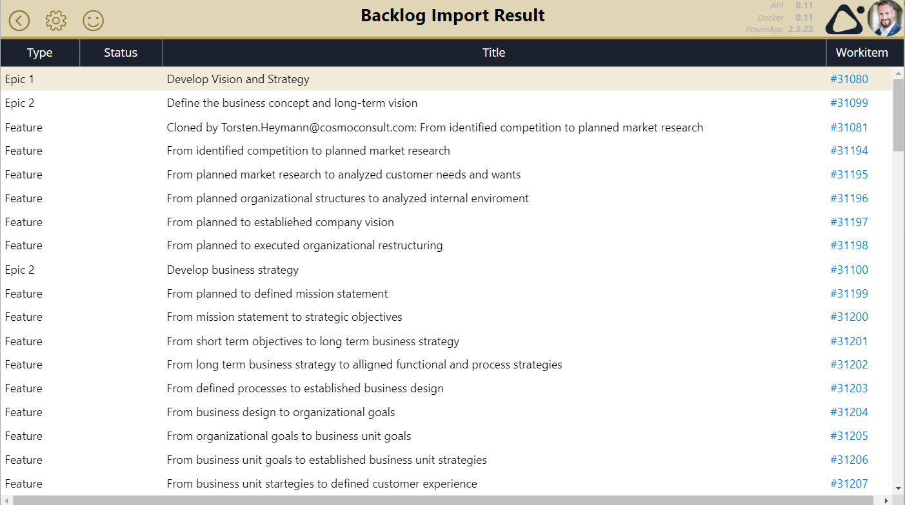

# Import Backlog

Open the PowerApp and navigate to the "Project Maintenance" and than to the "Import Backlog" page.

1. Select your import source:
    - [Process Map](./import-backlog.md#import-source---process-map) from COSMO Solution Store
    - [Backlog](./import-backlog.md#import-source---source-project-backlog) form a source project
1. Select your [target project](./import-backlog.md#select-target-project).
1. [Export the backlog](./import-backlog.md#export-source-backlog) from COSMO solution store or source project
1. [Start the import](./import-backlog.md#start-import-backlog) of selected work items (epics, features, ...) into your target project
1. [Wait until the import finish](./import-backlog.md#wait-for-completion). There is an automatic refresh until the import is succeeded or failed.
1. [Check the import result](./import-backlog.md#check-import-result).

You can watch a walk through here:

<video width="1280px" height="720px" controls>
  <source src="../media/powerapps/import-processmap.webm" type='video/webm; codecs="vp8, vorbis"'>
  Your browser does not support the video tag.
</video>

## Import Source - Process Map

Change the process map language and press "Select Source" to continue. You can also use the toggle button to switch to import from [Backlog](./import-backlog.md#import-source---source-project-backlog).

## Import Source - Source Project Backlog

Select the source project, change the source project team name and press "Select Source" to continue. You can also use the toggle button to switch to import from [Process Map](./import-backlog.md#import-source---process-map).

## Select Target Project

Select the target project and press "Select Target" to continue.

## Export Source Backlog

Start the export backlog (only needed, when source backlog was selected) by pressing "Export Backlog":

## Start Import Backlog

If needed Filter by work item types and start the backlog import by pressing "Import Backlog":

As result, the import starts:

## Wait for completion

Afterwards the import is running:

## Check Import Result

The whole import take approx. 5 minutes. A result is automatically checked every 5 seconds. When the import is completed please navigate to **"Details"**:

For example her is a correct import result:

