# Install Power App

## Setup app registration in Azure Portal

### Create an app registration

[Azure Portal](https://portal.azure.com/#view/Microsoft_AAD_RegisteredApps/ApplicationsListBlade)

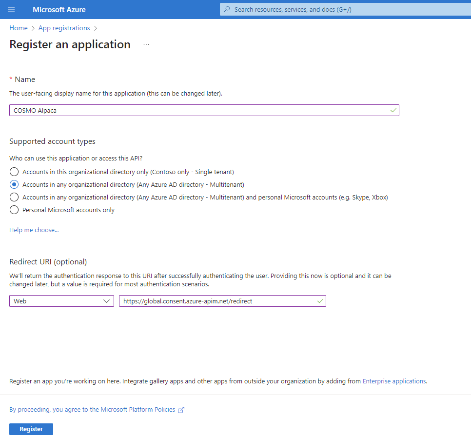

### Create Client Secret

**Save the client secret in a safe place. You will need it later.**

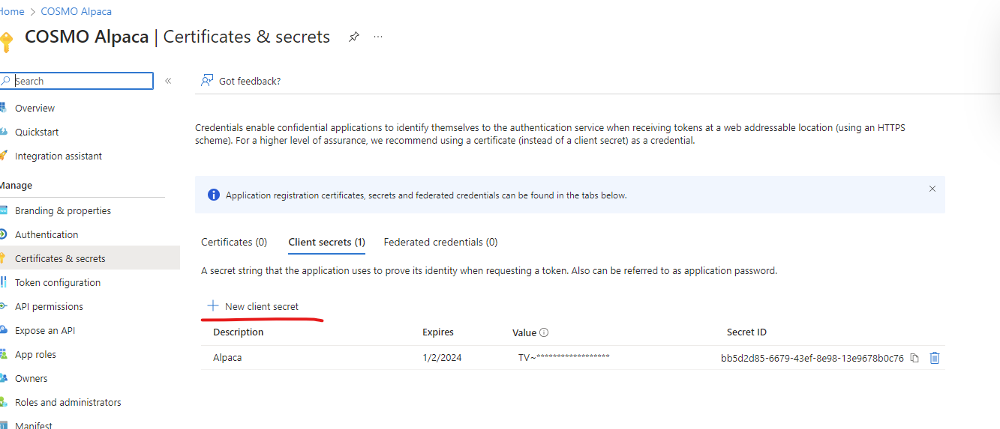

### Add API Permissions

Add the following API permissions and grant admin consent for organization:

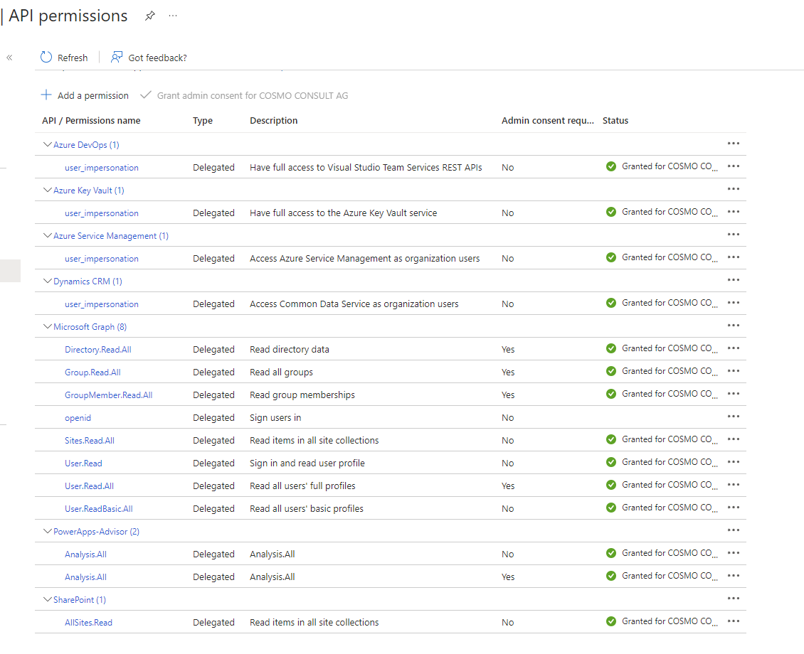

*PowerApps-Advisor is found under "APIs my organization uses"*

## Import solution and setup connections

### Import solution

Import the solution into your environment.

[Power Apps](https://make.powerapps.com/)

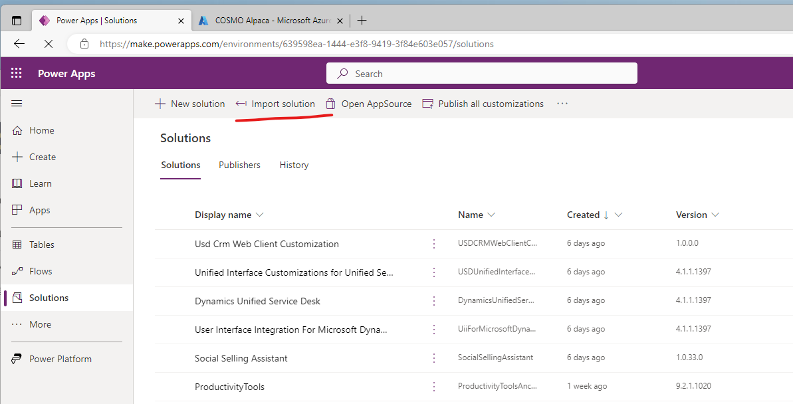

Select or create a connection for Office 365

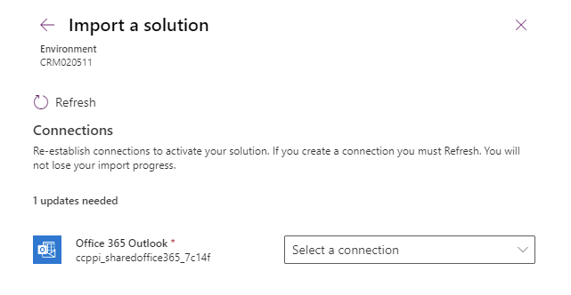

The import may take several minutes, a notification appears automatically when import is finished.

### Setup auth of custom connectors of the solution

Setup auth of custom connector "AzDevops-Advisor API"

Open the custom connector "AzDevops-Automation Core API" of the solution and setup the authentication.

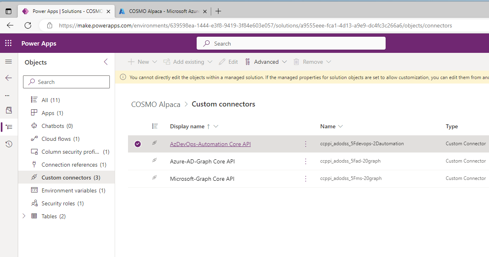

Click on the custom connector and select "Edit"

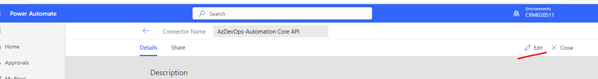

Use the following values:

* Select `OAuth 2.0` and `Azure Active Directory`

* Get `client ID` and `tenant ID` it from app registration - use the client secret created earlier.

* `Resource URL`: https://management.core.windows.net/

The setup should look as follows:

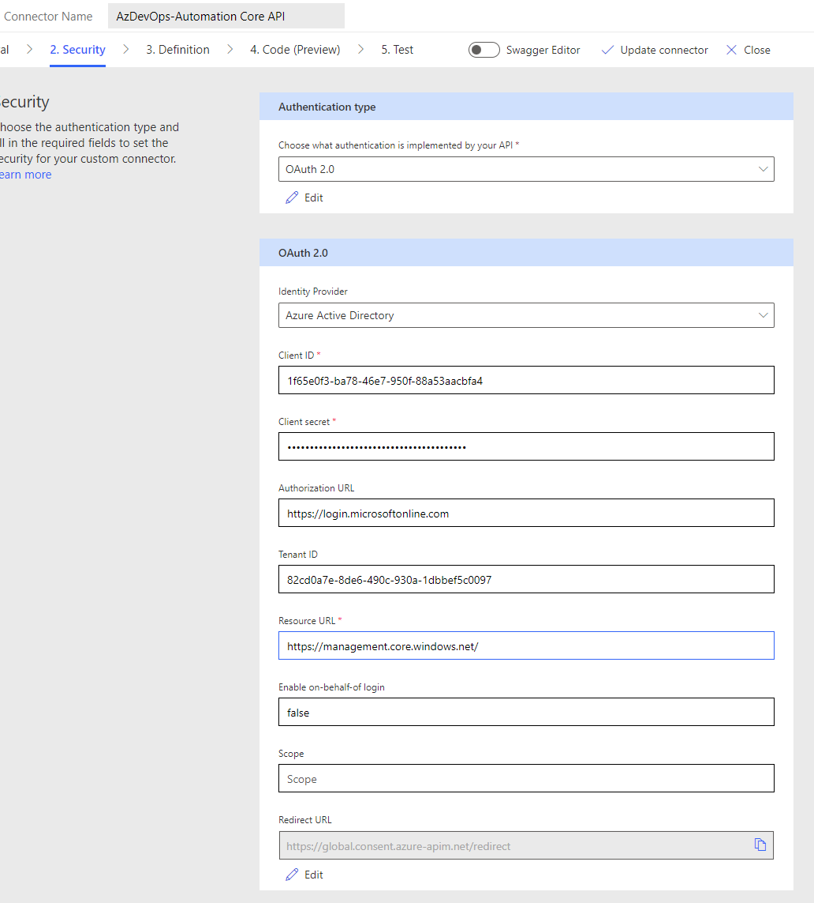

Click on "Update connector"

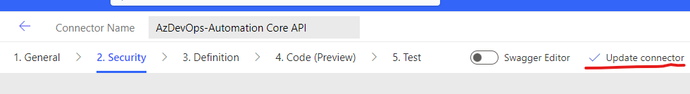

Create connection and test e.g. *GetSwarmUrl* with `entityAdCode` test

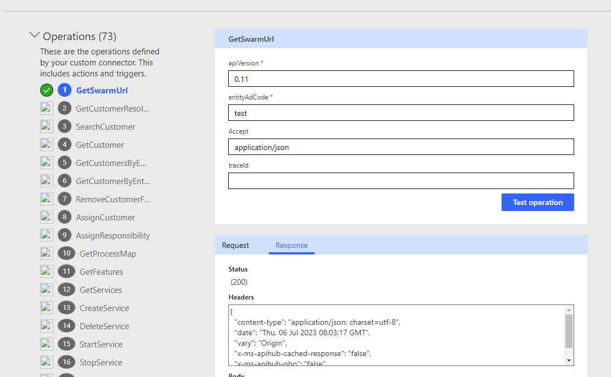

### Setup auth of custom connector "Azure-AD-Graph Core API"

Use values according to previus custom connector with the following differences:
* `Resource URL`: https://graph.windows.net
* `Tenant` is left to default "common"

The setup should look as follows:

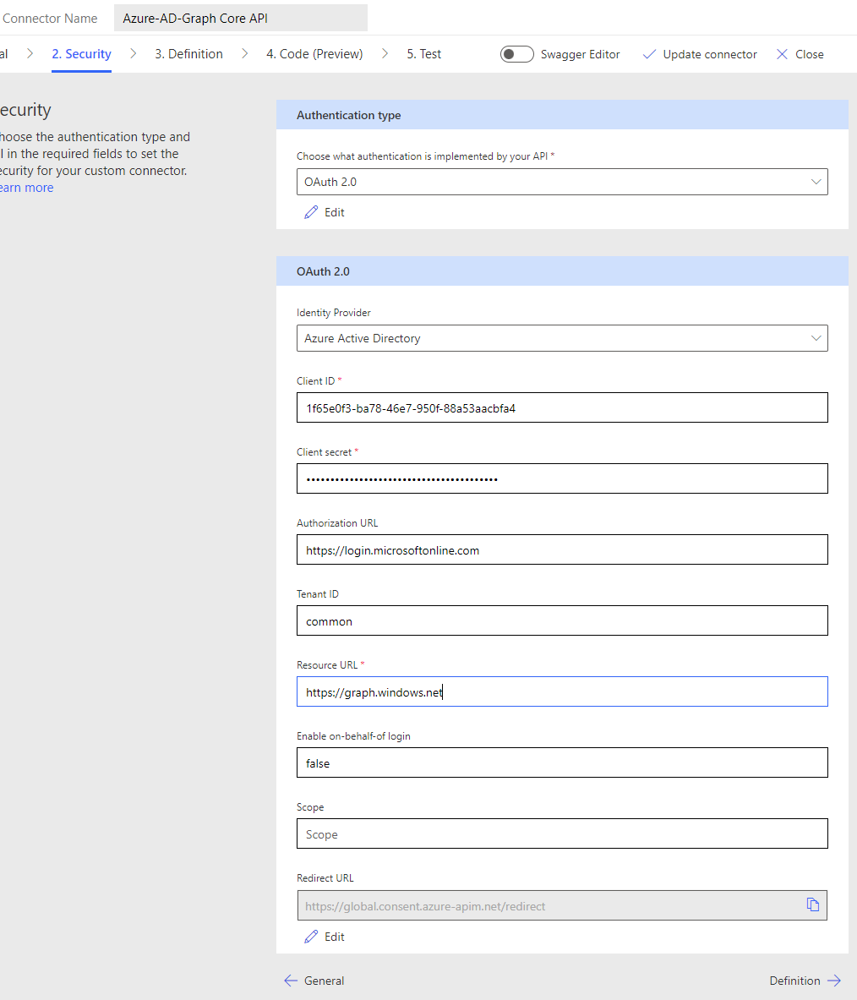

Update the connector, create a connection and test it:

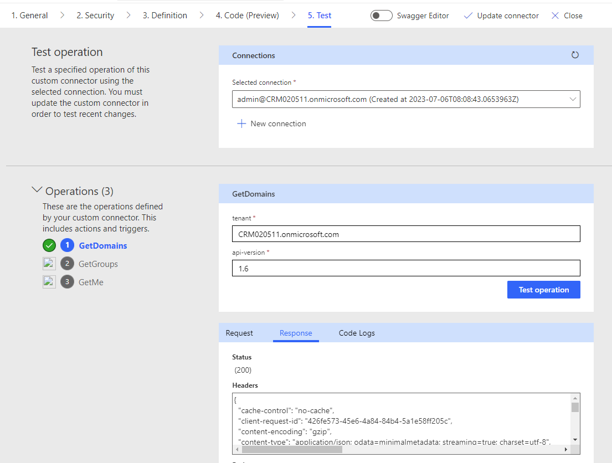

### Setup auth of custom connector "Microsoft-Graph Core API"

Use values according to previus custom connector with the following differences:
* `Resource URL`: https://graph.microsoft.com

The setup should look as follows:
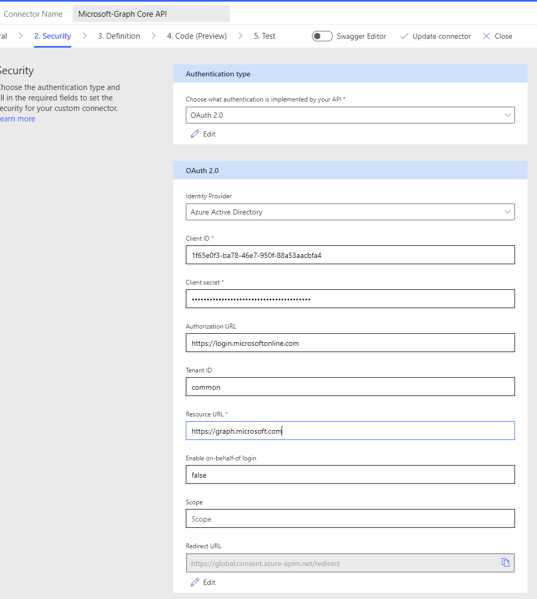

Update the connector, create a connection and test it:

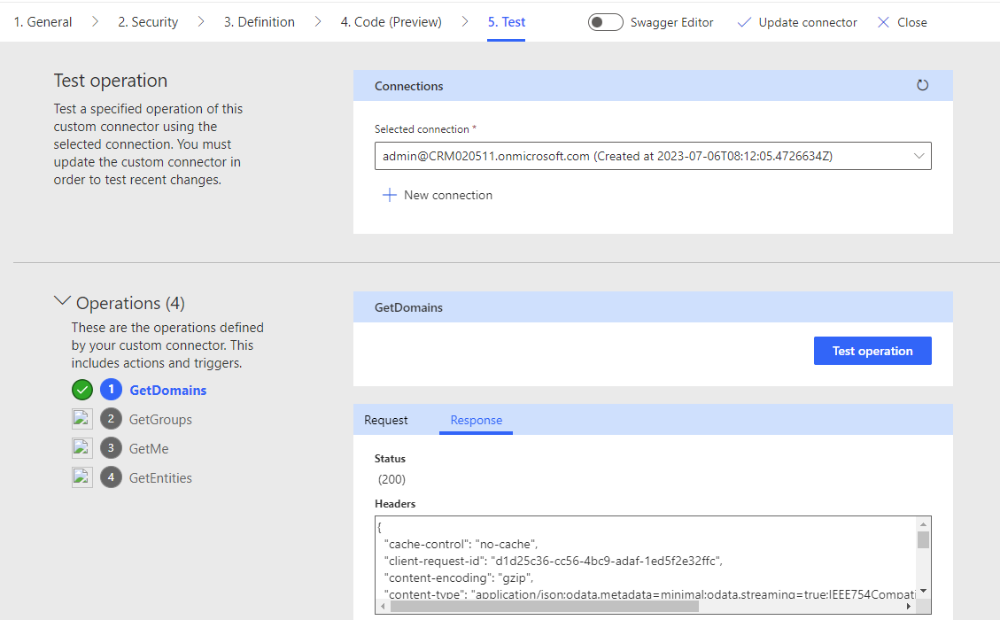

## Start the app

Click on Play in the solution overview to start the app.

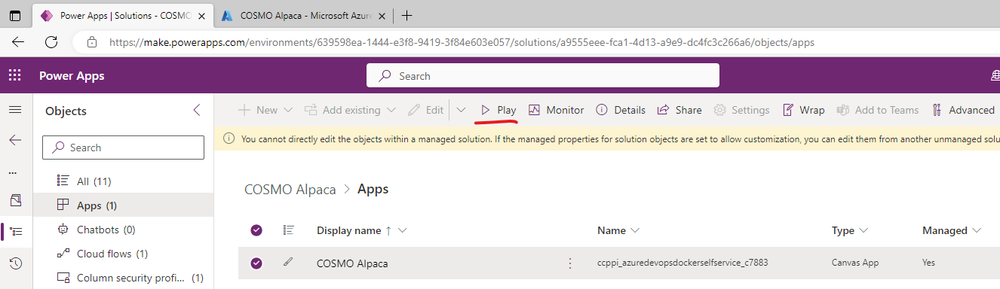

Allow permissions:

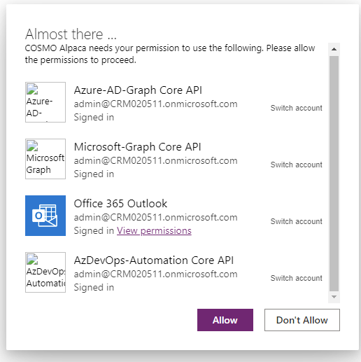

The app is ready to use.
