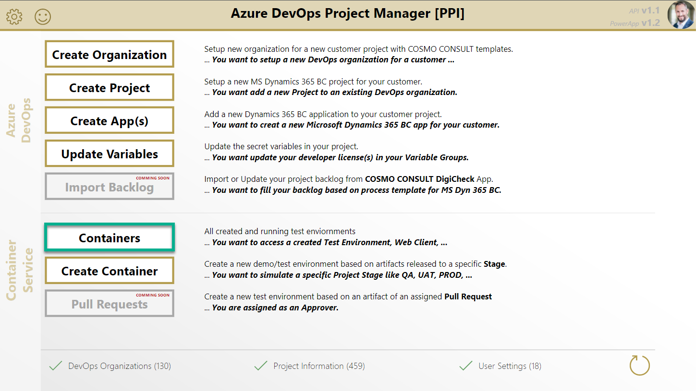
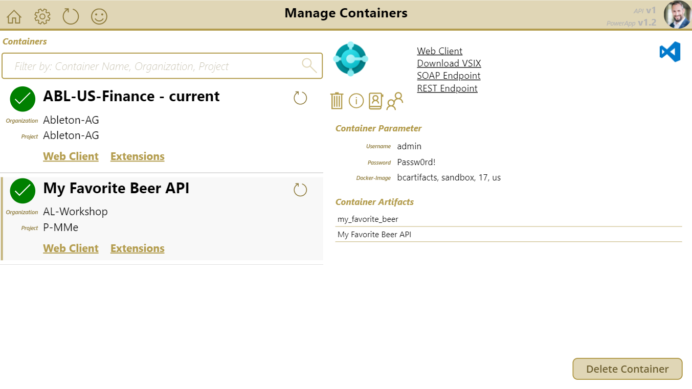
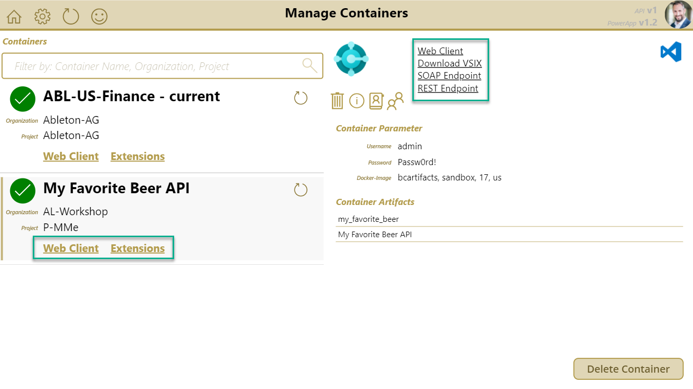
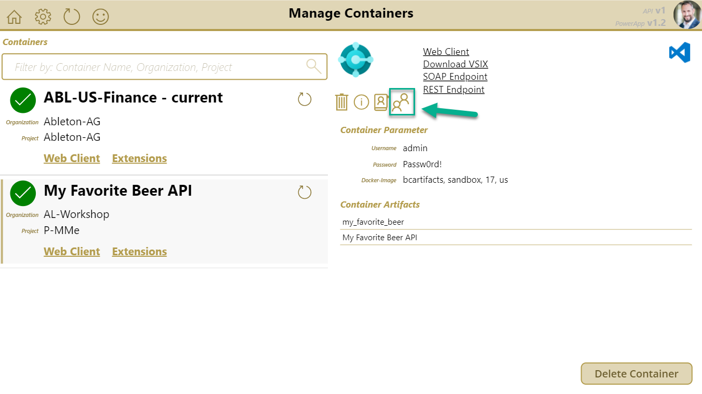
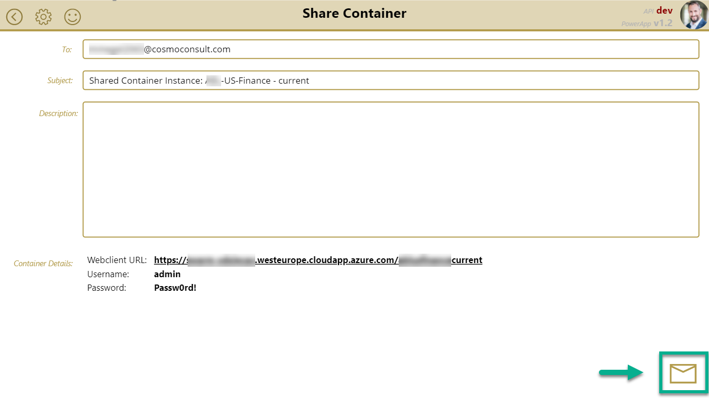
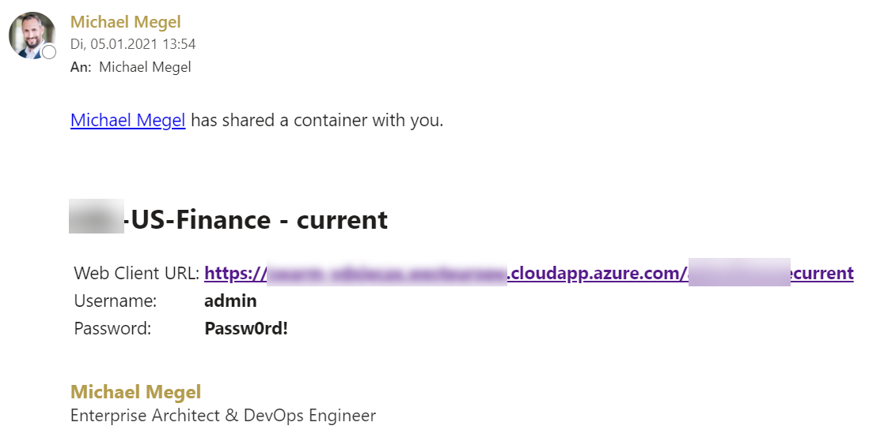
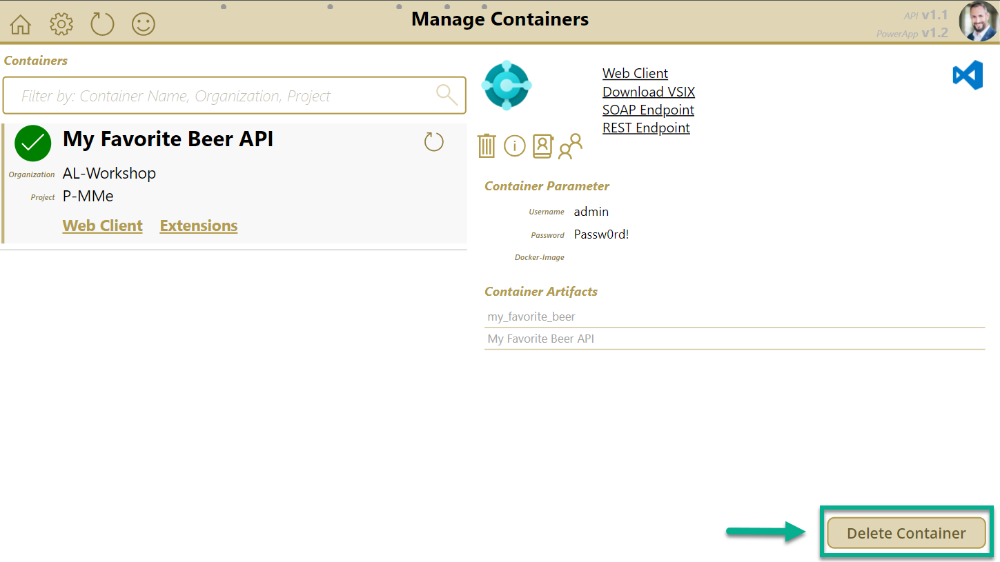
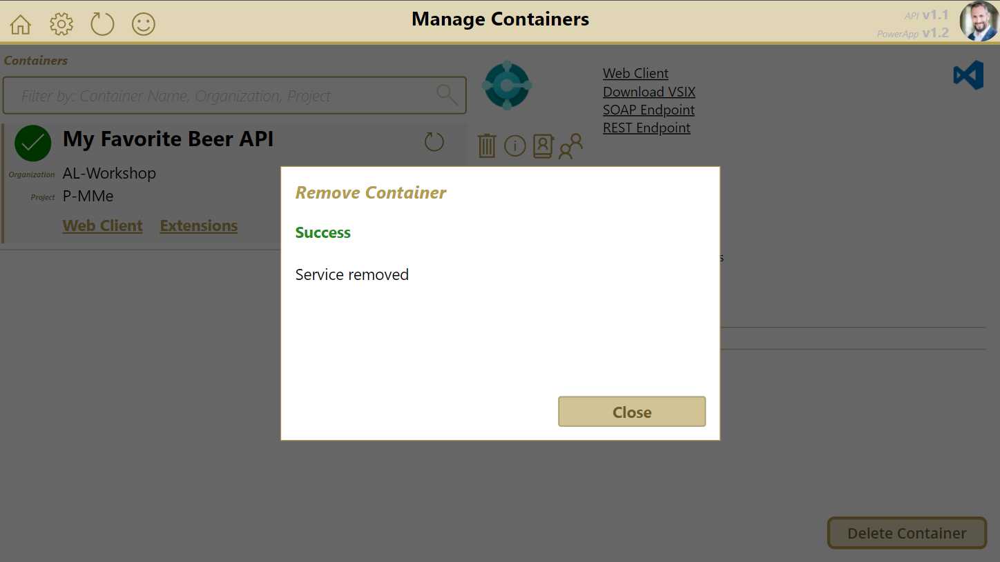

# Manage Environments

Open the PowerApp and navigate to the "Containers" page to manage existing test and demo containers:

As result, your containers are shown in a list:

**See more:**

* [Environment Information](#environment-information)
* [Share Environments](#share-environments)
* [Remove Environments](#remove-environments)

## Environment Information

Your selected container environment provide some links to:

* Open the WebClient
* Open the Extension Management Page

## Share Environments

You can share an existing container environment by:

1. Select your container environment

1. Use "Share Container" by clicking:
   

1. To share your container:
   * specify the email address(es) of your colleague(s) *(separated by semicolon)* or forward the mail from your inbox
   * modify the email subject
   * add a description to the mail
   * send the email by clicking:
   

As result the container URL as well as username and password are sent by mail:

You can watch a walkthrough here:

<video width="1280px" height="720px" controls>
  <source src="../media/powerapps/share-container.webm" type='video/webm; codecs="vp8, vorbis"'>
  Your browser does not support the video tag.
</video>

## Remove Environments

You can remove an existing container environment by:

1. Select your container environment
1. Press the "Delete" button:
   

As result the container environment is removed:

**Note: Your container will be removed immediately and all data may be lost**

You can watch a walkthrough here:

<video width="1280px" height="720px" controls>
  <source src="../media/powerapps/delete-container.webm" type='video/webm; codecs="vp8, vorbis"'>
  Your browser does not support the video tag.
</video>
