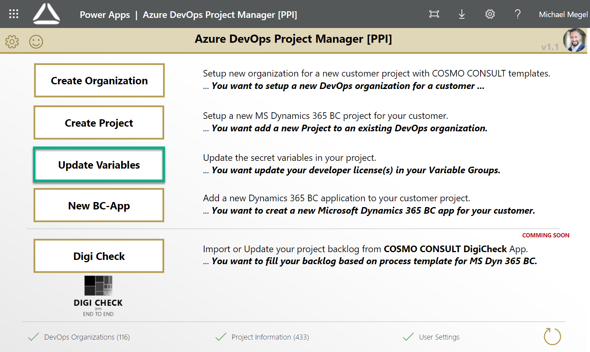
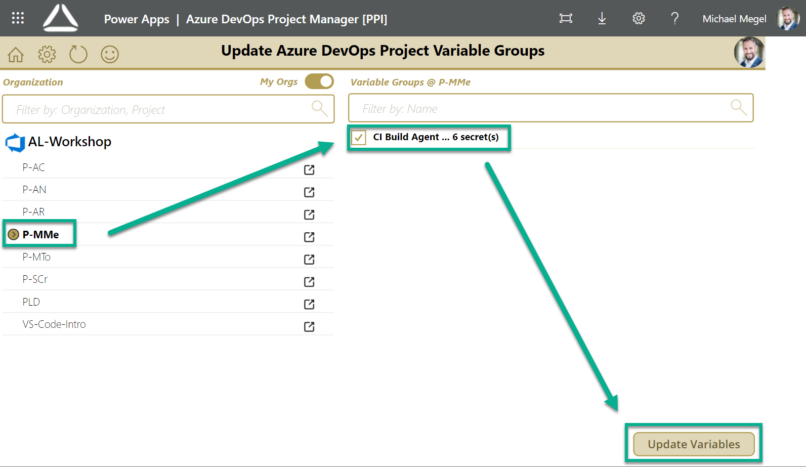
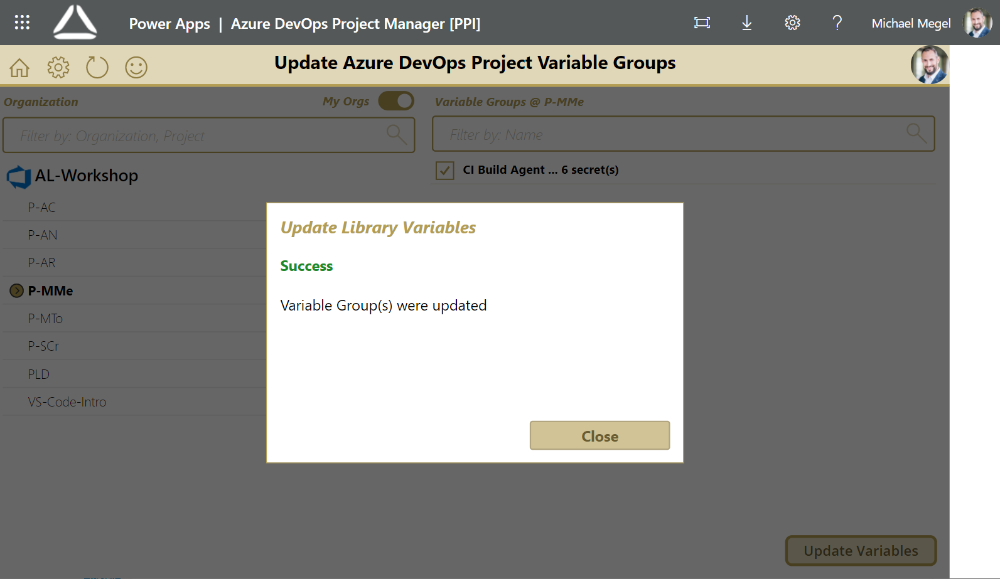

# Update Project Variables

Open the PowerApp and navigate to the "Update Variables" page.

1. Select your organization & project *Note: you can toggle on/off the "my Orgs" filter*
1. Select the preferred variable group
1. Update all secret variables in the selected groups by **"Update Variables"**

The result is shown after execution.

You can watch a walkthrough here:

<video width="1280px" height="720px" controls>
  <source src="../media/powerapps/update-variables.webm" type='video/webm; codecs="vp8, vorbis"'>
  Your browser does not support the video tag.
</video>

**Note:**

* Only variables, which are marked as a secret will be updated, when the variables is known.
* Know variables are:
  * Licenses: e.g. `devlic-nav2018-de`, `devlic-bc16-se`, `devlic-bc17-at`, ...
  * SaS-Token for Insider Preview `sas-bcinsider`
  * SaS-Token for COSMO Artifacts (AMP) `sas-cosmoartifacts`
  * URL for Additional Setup `azstorage-additional-setup`
