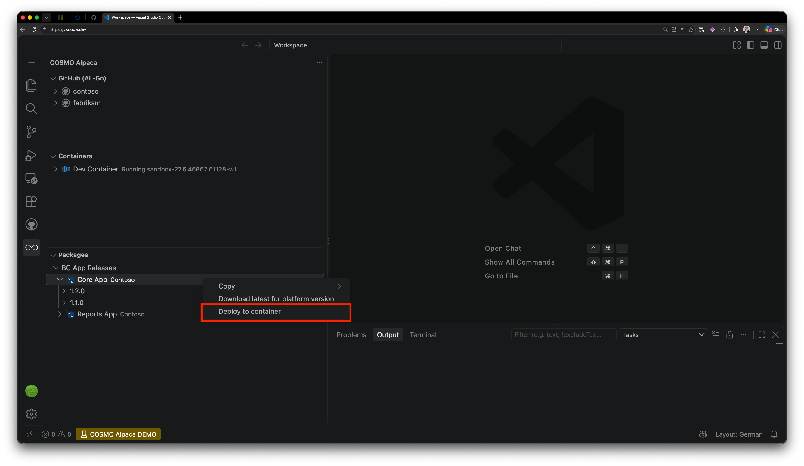

# Deploy Artifact to Container

You can deploy a NuGet package or an Azure DevOps Artifact directly to a running container from the **Packages View** in the COSMO Alpaca extension.

## Prerequisites

- The target container must be running and ready.
- You must have access to the feed that contains the artifact.
- The artifact must be compatible with the Business Central version in the target container.

## Deploy the latest version available or a specific version of the artifact

1. Open the **Packages View** in the COSMO Alpaca extension.
1. Right-click the package or the required version and select **Deploy to container**.
1. Select the target container.
1. Confirm the deployment.

The latest (if no specific version was selected) version of the artifact will be downloaded and installed.

The extension shows the deployment progress and refreshes the container after the operation completes.

