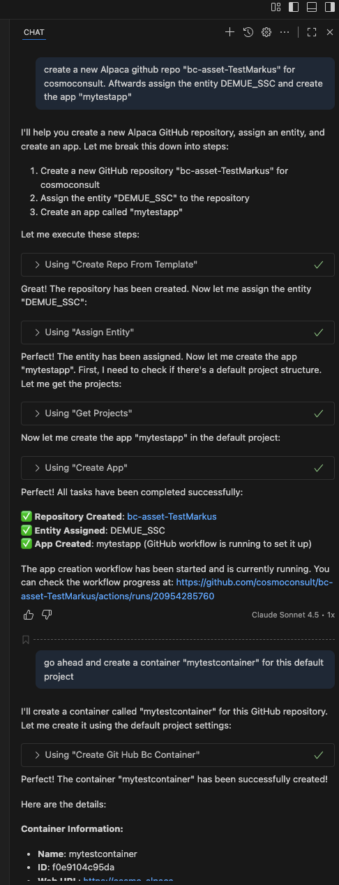
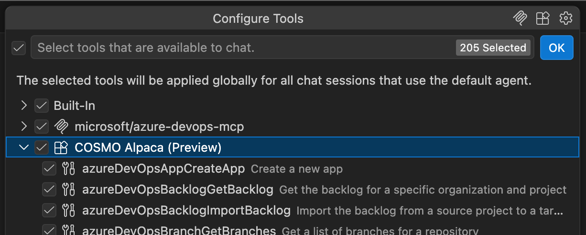

# MCP Tools for Alpaca

> [!NOTE]
>Alpaca's MCP tools are currently in beta and only available in the [COSMO Alpaca Preview extension](https://marketplace.visualstudio.com/items?itemName=cosmoconsult.cosmo-alpaca-preview).

The COSMO Alpaca VS Code extension ships with built-in [Model Context Protocol (MCP)](https://modelcontextprotocol.io/) tools that expose almost all COSMO Alpaca functionality directly to AI agents such as GitHub Copilot. This allows you to create projects, repositories, apps, and containers, manage CI/CD pipelines, work with requirements, and much more — all through natural language in agent chat.

The tools are part of the COSMO Alpaca VS Code extension and require no additional setup:

- No separate MCP server installation or configuration is needed.
- Whenever the extension is updated, the tools are updated automatically as well.
- All tools are available immediately in agent chat without any extra steps.

## Using the Tools in Agent Chat

Open GitHub Copilot Chat in agent mode and describe what you want to do. To help the agent pick the right tool, make sure to mention **Alpaca** together with the target platform (**Azure DevOps** or **GitHub**) in your (first) message. For example:

- *"Use Alpaca to create a new Azure DevOps project called MyProject"*
- *"With Alpaca, create a GitHub repository and app for our new extension"*
- *"Ask Alpaca to create a dev container for my Azure DevOps project"*

The agent will automatically select the appropriate COSMO Alpaca tool, execute the action, and report back the result. You can also let it do multiple things:

## Disabling Individual Tools

> [!NOTE]
>Modern AI agents handle large tool sets efficiently without polluting the context window, so having many tools available usually does not negatively affect the experience.

If you want to limit which tools are available to the agent, you can disable individual COSMO Alpaca tools via the **Configure Tools** option in agent chat. For more information, see [Agent tools in VS Code](https://code.visualstudio.com/docs/copilot/agents/agent-tools).

